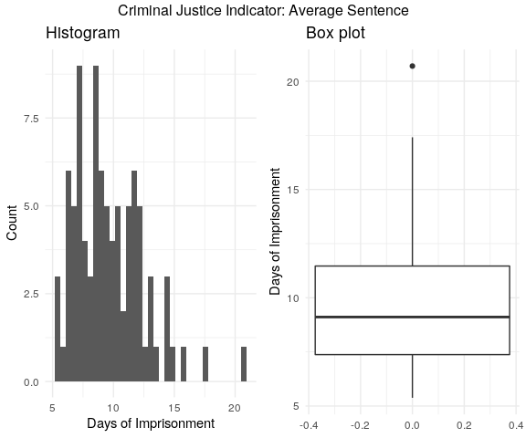

Lab 3: Draft Report
================
Priscilla Burity, Oscar Linares, Alissa Stover
3/31/2020

# Introduction

Which policies are most promising in reducing crime rate: those that
target punishing crimes (criminal justice policy) or reducing the need
to commit crimes (economic policy)? What is the influence of contextual
factors (e.g., characteristics of a population) on these relationships?

We have a cross-section of data on crime statistics and indicators that
can influence crime rates for a selection of counties in North Carolina.
Most of the data are from 1987, except for some demographic variables
derived from the 1980 Census. These indicators include local statistics
on the performance of the criminal justice system and economc variables
that a county administrator can act upon (directly or indirectly). Our
task is to examine the data to help a political campaign understand the
determinants of crime and generate policy suggestions that are
applicable to local government and as such we focus primarily on these
actionable variables.

We also include a range of contextual variables that help to control the
estimated impact of these policies for local characteristics that could
influence crime and the efficacy of these policies. In contrast to our
variables of main focus, these are generally not actionable for a local
government (for example, demographic and geographic indicators). We
produced a model robust to these, that can help guide policy decisions
and help reduce crime across these counties.

We found that acting on crime deterrants within the criminal justice
system (like arrests and convictions) is important when it comes to
preventing crime. In fact, for a 10% rise in the probability of arrests
and convictions individually, the negative impact on crime rate hovers
between 5-7% for arrests and between 4-5% for convictions.

Even though we could not find much support for the importance of
economic policy variables to prevent crimes, this could be due to the
lack of a good measure of this kind of policy available in the data.
Either way, we believe that improving living conditions locally should
not detract from efforts on the criminal justice system front. Targeting
economic development policies that can bring higher wages and improve
the quality of life in a region is likely important to deter crime as
well.

## Actionable Variables

### Criminal Justice Policy

These variables describe things we could affect with policy around the
criminal justice system. Many of these policies are used as deterrants
of crime, with the assumption being that people inherently understand
that these punishments exist and as such will be less likely to commit
crimes (in order to avoid the punishment).

Please note that the 3 variables below are dubbed “probabilities”.
However, this is a misnomer as these variables are truly ratios (e.g.,
the ratio of arrests to crimes reported). We interpret these as measures
of the assertiveness of the criminal justice system in a county.
Ideally, we would want to strike a balance between arresting enough
people to prevent criminal activity, and not arresting so many as to
abuse the populace.

*Probability of arrest*

If we find that the assertiveness of arrest is associated with crime
rate (with higher punishment associated with lower crime), we may
consider stricter policies around police practice that encourage more
arrests.

  - `prbarr`: number of convictions for every crime reported

*Probability of conviction*

If we find that the assertiveness of conviction is associated with crime
rate (with higher conviction rates associated with lower crime), we may
consider stricter policies around court practices so that more arrests
lead to convictions.

  - `prbconv`: number of convictions for every arrest made

*Probability of sentencing*

If we find that the assertiveness of sentencing is associated with crime
rate (with higher sentencing rates associted with lower crime), we may
consider stricter policies around judicial practices so that more
convictions lead to sentencing. However, whether or not a given
conviction carries a prison sentence depends on the severity of the
crime.

This variable may be more limited in its explanatory power than arrests
and convictions and will not be a prime candidate for our model.

  - `prbpris`: number of prison sentences for every conviction

*Severity of punishment*

If we find that the severity of punishment is associated with crime rate
(with greater severity associated with lower crime), we may consider
stricter policies around judicial practices so that people receive more
severe punishments if sentenced with a crime.

  - `avgsen`: average sentence in days

*Number of police officers per capita*

The number of police officers per capita (measured by the variable
`polpc`) is a very intuitive example of crime deterrant, as it in theory
increases the likelyhood of being caught in the act of the crime and is
also a measure of the capacity of the State to enforce the law.

As our job is to advise a policy maker, it’s very important that we feel
safe about the causal interpretation of our findings. After all, the
idea is to propose policies with a significant impact on people’s lives.
Thus, for statistical rigor, we need to make sure that causal effects go
one way (that we have reason to believe that our independent variables
have causal effects on our dependent variables, and not the reverse).

The cross-section of data available to us are limited in this respect,
as they do not allow us to link police presence to crime rates with a
causal interpretation. This is because one can expect the counties with
larger crime rates in a year *t* would consider necessary to have a
larger number of police officers on the streets in year *t*, which can
imply a positive correlation between presence of police and crime rates
that couldn’t be read as police presence leading to *higher* crime
rates. In fact, an increase in crime could result in an increase in the
number of police officers *and* an increase in police officers could
result in a decrease in crime.

Thus, in this exercise we opted not to include police per capita as a
candidate policy variable or covariate.

### Economic Policy

These variables describe things we could affect with economic policy and
speak to wages for different sectors. For example, if increased wages
are found to be related significantly to crime, our candidate could
consider strategies such as raising the minimum wage in an attempt to
lower crime. However, given that North Carolina did not have a wide
range of minimum wage policies at this time (or even at present day), it
is questionable how much we can test such policies with these data. We
do not have enough of a range in the real-life policy we are trying to
examine for this to be a good test.

As this is our best proxy for wage policy available in the dataset and
given the importance of the economy in crime and human behavior more
generally, we will attempt to use these to operationalize this type of
policy change. Making inferences about economic policies from the
relationships we measure between these and other variables will
naturally be limited by the fact that these are a flawed
operationalization of variation in wage policy. Omitting these could
introduce a bias that would affect the other relationships we measure
(for example, one could imagine that being very tough on crime would not
serve as much of a deterrant if people are not able to make a living
wage and are desperate to get by). We do not have data from other
localities that could allow us to better measure wage policy changes.
So, we strike a balance between these issues by including these
variables as covariates to test the robustness of other relationships,
but being cautious about drawing any strong conclusions from them.

  - `wcon`: weekly wage, construction
  - `wtuc`: weekly wage, transportation, utilities, communication
  - `wtrd`: weekly wage, wholesale and retail trade
  - `wfir`: weekly wge, finance, insurance, real estate
  - `wser`: weekly wge, services
  - `wmfg`: weekly wge, manufacturing
  - `wsta`: weekly wge, state employees
  - `wloc`: weekly wge, local government employees

The following federal wage variable will be grouped with other wages in
much of our analyses for easier comparison in terms of data quality,
however it is not related to minimum wage policy but rather to cost of
living. Federal employee wages are controlled by the federal government
(as opposed to local politicians such as our candidate) and are adjusted
by cost of living in a locality
(<https://www.opm.gov/policy-data-oversight/pay-leave/salaries-wages/fact-sheets/>);
thus, this variable could also be used as a marker of cost of living in
a county. If we find a relationship between federal wages and crime, one
could predict that changing the economic development of a region may
affect crime. However, this variable is confounded by the types of
federal workers in an area, since federal wages are determined by a
grade system that is tied to the nature of the position and time in
position. A specific effort that could affect both of these - bringing
more economic development and the right types of high-earning federal
employees - would be to attract federal jobs to the area that have
higher wages.

Policy recommendations that could be made from this variable are further
limited by the fact that cost of living calculations depend to a large
extent on the cost of goods. One could imagine a county that had the
characteristics we would like to operationalize with this variable:
relatively high cost of living, accompanied by broader economic
development in the area so that many people can partake in this wealth
(e.g., a strong school system, museums, and other community
investments). A strong community such as this would likely see lower
crime rates - less people would be in a position where they needed to
commit crimes to get what they needed. However, this variable alone
cannot help us differentiate this type of community compared to others
that see a high cost of living without such community investment, where
only some wealthy people can enjoy the prosperity and afford the more
expensive goods around them. A community that sees this level of
inequality may expect to see more crime, as those who are in need would
find more reason to take from those who have more than they need.

Similar to our comments above, this variable is not a good proxy for
what we would ideally like to measure (the economic prosperity of a
region and how much of the populace can partake in it - which could be
influenced by economic development initiatives like investing in
businesses large and small). However, we imagine that omitting this
variable could introduce a bias in other relationships we find.

Thus, we find it is important to attempt to measure the relationship
between federal wages and crime to test the robustness of other
variables, but we will not attempt to make any causal interpretation
about these relationships.

  - `wfed`: weekly wge, federal employees

The following variable represents tax revenue per capita, but does not
differentiate between different revenue streams (taxes on income, sales,
property, or businesses). It also doesn’t help us understand how
governments use this revenue (are they corrupt and profiting? or are
they reinvesting into the community for schools and other public
works?). It also reflects overall wealth in a county. Holding tax rate
constant, counties with more wealth will have more tax revenue and vice
versa. Holding wealth constant, changing the tax rate would change the
tax revenue per capita. A better measure of tax policy would be the
actual tax rates in each county, for different entitites. Since the
impact of policy on this variable is confounded by the overall wealth in
a county and the specific tax policy variations are hidden, the causal
relationship would be difficult to interpret. Plus, many taxes are set
at the state and federal level; the level of variation at the
county-level may be limited for a small state like North Carolina.
However, similar to `wfed`, this variable would be related to overall
economic development and may be a helpful covariate in testing and
teasing out other relationships in the data.

  - `taxpc`: tax revenue per capita

## Contextual Variables

Since we are aiming to produce policy recommendations, the following
variables may be helpful in our analysis but are not actionable. They
describe county characteristics that provide important information about
how policies could work across different county contexts.

### Types of Crime

Does the type of crime affect the impact of crime policy? For example,
if an area has mostly petty crimes, one would imagine that some of the
punishment could be more discrete than arresting people - you could
handle this with fines, for example. The consequences are real, but less
visible and thus perhaps less of a deterrant. This could change the
relationship between our crime policy variables like number of arrests
per crime (an area with less face-to-face crimes would see less
arrests). It could also affect overall number of crimes (if localities
are punishing the crimes they can with arrests, but don’t have many of
those face-to-face crimes to punish, the punishments would not be as
visible and so people would have less of a clear deterrant - so they
might end up committing a lot of petty crimes).

  - `mix`: offense mix: face-to-face/other

### Demographics

The following variables describe different aspects of the people that
reside in these counties.

*Urban/rural dwellers*

Higher density areas would see more interaction between people, which
could drive up the number of crimes (more opportunity). It could also
drive up the amount of punishment and actual measurement of crime - it
might be easier to get away with things if less people are around to
catch you.

  - `density`: people per square mile

*Minority status*

It is well known that people of minority status (compared to whites) are
more likely to be involved in the criminal justice system and as such
this is a key covariate in our analysis.

  - `pctmin80`: percent minority, 1980

*Gender & Age*

Young males are more likely to enter the criminal justice system so this
is another demographic variable that we would expect to see related to
crime.

  - `pctymle`: percent young male, 1980

### Geography

The following variables identify which region of the state each county
is in, with the assumption that counties cluster geographically in terms
of their culture and other characteristics we are not explicitly
measuring. Western North Carolina is along the Appalachian mountains and
seems qualitatively different from much of the rest of the state. For
example, it has much fewer universities compared to the rest of the
state (you can see this through a quick Google Maps search). Thus, we
will lean towards using `west` over the other geographical variables
(especially since `urban` could be highly related to `density`).

  - `west`: =1 if in western N.C.
  - `central`: =1 if in central N.C.
  - `urban`: =1 if in SMSA

# A Model Building Process

## Data Cleaning

### Environment

#### Import Libraries

``` r
library(tidyverse) # for data import, manipulation, viz
library(corrplot) # for correlation matix
library(stargazer) # visualize model fit
library(skimr) # generate summary statistics
library(car) # statistics 
library(lmtest) # linear modeling
library(olsrr) # evaluating OLS regression 
library(sandwich) # correcting heteroskedasticity violation
library(grid) # to arrange ggplot figures into a grid 
library(gridExtra) # to arrange ggplot figures into a grid 
```

#### Import Data

We are importing a CSV file into R. The argument `n_max` is set to the
number of rows of data we are provided (91).

``` r
data <- read_csv("crime_v2.csv", n_max = 91)
```

#### Exploratory Data Analysis: File-level data checks

Let’s take a visual check of our data. We have 91 observations and 25
columns. This is what we expected based on our original csv file.

``` r
head(data)
```

    ## # A tibble: 6 x 25
    ##   county  year crmrte prbarr prbconv prbpris avgsen   polpc density taxpc
    ##    <dbl> <dbl>  <dbl>  <dbl>   <dbl>   <dbl>  <dbl>   <dbl>   <dbl> <dbl>
    ## 1      1    87 0.0356  0.298  0.528    0.436   6.71 1.83e-3   2.42   31.0
    ## 2      3    87 0.0153  0.132  1.48     0.450   6.35 7.46e-4   1.05   26.9
    ## 3      5    87 0.0130  0.444  0.268    0.600   6.76 1.23e-3   0.413  34.8
    ## 4      7    87 0.0268  0.365  0.525    0.435   7.14 1.53e-3   0.492  42.9
    ## 5      9    87 0.0106  0.518  0.477    0.443   8.22 8.60e-4   0.547  28.1
    ## 6     11    87 0.0146  0.525  0.0684   0.5    13    2.88e-3   0.611  35.2
    ## # … with 15 more variables: west <dbl>, central <dbl>, urban <dbl>,
    ## #   pctmin80 <dbl>, wcon <dbl>, wtuc <dbl>, wtrd <dbl>, wfir <dbl>,
    ## #   wser <dbl>, wmfg <dbl>, wfed <dbl>, wsta <dbl>, wloc <dbl>, mix <dbl>,
    ## #   pctymle <dbl>

``` r
print(paste("Number of records:", dim(data)[1]))
```

    ## [1] "Number of records: 91"

``` r
print(paste("Number of variables:", dim(data)[2]))
```

    ## [1] "Number of variables: 25"

All 25 columns are
    numeric.

``` r
str(data)
```

    ## Classes 'spec_tbl_df', 'tbl_df', 'tbl' and 'data.frame': 91 obs. of  25 variables:
    ##  $ county  : num  1 3 5 7 9 11 13 15 17 19 ...
    ##  $ year    : num  87 87 87 87 87 87 87 87 87 87 ...
    ##  $ crmrte  : num  0.0356 0.0153 0.013 0.0268 0.0106 ...
    ##  $ prbarr  : num  0.298 0.132 0.444 0.365 0.518 ...
    ##  $ prbconv : num  0.528 1.481 0.268 0.525 0.477 ...
    ##  $ prbpris : num  0.436 0.45 0.6 0.435 0.443 ...
    ##  $ avgsen  : num  6.71 6.35 6.76 7.14 8.22 ...
    ##  $ polpc   : num  0.001828 0.000746 0.001234 0.00153 0.00086 ...
    ##  $ density : num  2.423 1.046 0.413 0.492 0.547 ...
    ##  $ taxpc   : num  31 26.9 34.8 42.9 28.1 ...
    ##  $ west    : num  0 0 1 0 1 1 0 0 0 0 ...
    ##  $ central : num  1 1 0 1 0 0 0 0 0 0 ...
    ##  $ urban   : num  0 0 0 0 0 0 0 0 0 0 ...
    ##  $ pctmin80: num  20.22 7.92 3.16 47.92 1.8 ...
    ##  $ wcon    : num  281 255 227 375 292 ...
    ##  $ wtuc    : num  409 376 372 398 377 ...
    ##  $ wtrd    : num  221 196 229 191 207 ...
    ##  $ wfir    : num  453 259 306 281 289 ...
    ##  $ wser    : num  274 192 210 257 215 ...
    ##  $ wmfg    : num  335 300 238 282 291 ...
    ##  $ wfed    : num  478 410 359 412 377 ...
    ##  $ wsta    : num  292 363 332 328 367 ...
    ##  $ wloc    : num  312 301 281 299 343 ...
    ##  $ mix     : num  0.0802 0.0302 0.4651 0.2736 0.0601 ...
    ##  $ pctymle : num  0.0779 0.0826 0.0721 0.0735 0.0707 ...
    ##  - attr(*, "spec")=
    ##   .. cols(
    ##   ..   county = col_double(),
    ##   ..   year = col_double(),
    ##   ..   crmrte = col_double(),
    ##   ..   prbarr = col_double(),
    ##   ..   prbconv = col_double(),
    ##   ..   prbpris = col_double(),
    ##   ..   avgsen = col_double(),
    ##   ..   polpc = col_double(),
    ##   ..   density = col_double(),
    ##   ..   taxpc = col_double(),
    ##   ..   west = col_double(),
    ##   ..   central = col_double(),
    ##   ..   urban = col_double(),
    ##   ..   pctmin80 = col_double(),
    ##   ..   wcon = col_double(),
    ##   ..   wtuc = col_double(),
    ##   ..   wtrd = col_double(),
    ##   ..   wfir = col_double(),
    ##   ..   wser = col_double(),
    ##   ..   wmfg = col_double(),
    ##   ..   wfed = col_double(),
    ##   ..   wsta = col_double(),
    ##   ..   wloc = col_double(),
    ##   ..   mix = col_double(),
    ##   ..   pctymle = col_double()
    ##   .. )

##### The Where & When of these data

It looks like we usually have 1 observation for each of the counties –
except for county \#193. We do not have any missing values in the
`county` column.

``` r
length(unique(data$county))
```

    ## [1] 90

``` r
table(data$county, useNA = "always")
```

    ## 
    ##    1    3    5    7    9   11   13   15   17   19   21   23   25   27   33 
    ##    1    1    1    1    1    1    1    1    1    1    1    1    1    1    1 
    ##   35   37   39   41   45   47   49   51   53   55   57   59   61   63   65 
    ##    1    1    1    1    1    1    1    1    1    1    1    1    1    1    1 
    ##   67   69   71   77   79   81   83   85   87   89   91   93   97   99  101 
    ##    1    1    1    1    1    1    1    1    1    1    1    1    1    1    1 
    ##  105  107  109  111  113  115  117  119  123  125  127  129  131  133  135 
    ##    1    1    1    1    1    1    1    1    1    1    1    1    1    1    1 
    ##  137  139  141  143  145  147  149  151  153  155  157  159  161  163  165 
    ##    1    1    1    1    1    1    1    1    1    1    1    1    1    1    1 
    ##  167  169  171  173  175  179  181  183  185  187  189  191  193  195  197 
    ##    1    1    1    1    1    1    1    1    1    1    1    1    2    1    1 
    ## <NA> 
    ##    0

Having 2 observations for county \#193 is surprising. We can see that
these rows appear to be exact duplicates.

``` r
data %>% filter(county == 193)
```

    ## # A tibble: 2 x 25
    ##   county  year crmrte prbarr prbconv prbpris avgsen   polpc density taxpc
    ##    <dbl> <dbl>  <dbl>  <dbl>   <dbl>   <dbl>  <dbl>   <dbl>   <dbl> <dbl>
    ## 1    193    87 0.0235  0.266   0.589   0.423   5.86 0.00118   0.814  28.5
    ## 2    193    87 0.0235  0.266   0.589   0.423   5.86 0.00118   0.814  28.5
    ## # … with 15 more variables: west <dbl>, central <dbl>, urban <dbl>,
    ## #   pctmin80 <dbl>, wcon <dbl>, wtuc <dbl>, wtrd <dbl>, wfir <dbl>,
    ## #   wser <dbl>, wmfg <dbl>, wfed <dbl>, wsta <dbl>, wloc <dbl>, mix <dbl>,
    ## #   pctymle <dbl>

What else can we glean from the county variable? It appears as though
these county IDs could be county FIPS codes. One can see a list here:
<https://www.lib.ncsu.edu/gis/countfips>

We cannot make assumptions about this, however we can try to supplement
some of our data quality checks to see if anything seems to align
between the IDs of our counties and their FIPS codes.

Another thing to note is that we seem to be missing information from 10
of the 100 counties in North Carolina.

We can see that `year` appears to be constant (which is expected). We
also don’t have any missing values for this column. We can drop this
column in future data processing steps.

``` r
table(data$year, useNA = "always")
```

    ## 
    ##   87 <NA> 
    ##   91    0

Based on the explorations above, we create a new data frame that has
dropped our superfluous column (`year`) and the superfluous row
(duplicate of county 193).

``` r
data2 <- data %>% distinct() %>% select(-c("year", "polpc"))
```

Now we have 90 rows and 24 variables, with one observation per
county.

``` r
length(unique(data2$county)) == length(data2$county) # check 1 obs per county
```

    ## [1] TRUE

``` r
str(data2) # examine dataframe 
```

    ## Classes 'spec_tbl_df', 'tbl_df', 'tbl' and 'data.frame': 90 obs. of  23 variables:
    ##  $ county  : num  1 3 5 7 9 11 13 15 17 19 ...
    ##  $ crmrte  : num  0.0356 0.0153 0.013 0.0268 0.0106 ...
    ##  $ prbarr  : num  0.298 0.132 0.444 0.365 0.518 ...
    ##  $ prbconv : num  0.528 1.481 0.268 0.525 0.477 ...
    ##  $ prbpris : num  0.436 0.45 0.6 0.435 0.443 ...
    ##  $ avgsen  : num  6.71 6.35 6.76 7.14 8.22 ...
    ##  $ density : num  2.423 1.046 0.413 0.492 0.547 ...
    ##  $ taxpc   : num  31 26.9 34.8 42.9 28.1 ...
    ##  $ west    : num  0 0 1 0 1 1 0 0 0 0 ...
    ##  $ central : num  1 1 0 1 0 0 0 0 0 0 ...
    ##  $ urban   : num  0 0 0 0 0 0 0 0 0 0 ...
    ##  $ pctmin80: num  20.22 7.92 3.16 47.92 1.8 ...
    ##  $ wcon    : num  281 255 227 375 292 ...
    ##  $ wtuc    : num  409 376 372 398 377 ...
    ##  $ wtrd    : num  221 196 229 191 207 ...
    ##  $ wfir    : num  453 259 306 281 289 ...
    ##  $ wser    : num  274 192 210 257 215 ...
    ##  $ wmfg    : num  335 300 238 282 291 ...
    ##  $ wfed    : num  478 410 359 412 377 ...
    ##  $ wsta    : num  292 363 332 328 367 ...
    ##  $ wloc    : num  312 301 281 299 343 ...
    ##  $ mix     : num  0.0802 0.0302 0.4651 0.2736 0.0601 ...
    ##  $ pctymle : num  0.0779 0.0826 0.0721 0.0735 0.0707 ...

##### Missingness & Data Validity

We can see from the following table that we don’t have any missing data,
which is good\!

However, we can see by the max for each column (p100), that we appear to
have a few values that are extremely high.

For example, one county has weekly wages in the service sector reported
to be $2177 (almost 10x the median of $253).

``` r
data2_skim <- skim(data2)
data2_skim
```

    ## Skim summary statistics
    ##  n obs: 90 
    ##  n variables: 23 
    ## 
    ## ── Variable type:numeric ────────────────────────────────────────────────────────────────────────────────────────
    ##  variable missing complete  n    mean      sd         p0     p25     p50
    ##    avgsen       0       90 90   9.69    2.83      5.38     7.38    9.11 
    ##   central       0       90 90   0.38    0.49      0        0       0    
    ##    county       0       90 90 100.6    58.32      1       51.5   103    
    ##    crmrte       0       90 90   0.034   0.019     0.0055   0.021   0.03 
    ##   density       0       90 90   1.44    1.52  2e-05        0.55    0.98 
    ##       mix       0       90 90   0.13    0.082     0.02     0.081   0.1  
    ##  pctmin80       0       90 90  25.71   16.98      1.28    10.02   24.85 
    ##   pctymle       0       90 90   0.084   0.023     0.062    0.074   0.078
    ##    prbarr       0       90 90   0.3     0.14      0.093    0.2     0.27 
    ##   prbconv       0       90 90   0.55    0.35      0.068    0.34    0.45 
    ##   prbpris       0       90 90   0.41    0.081     0.15     0.36    0.42 
    ##     taxpc       0       90 90  38.16   13.11     25.69    30.73   34.92 
    ##     urban       0       90 90   0.089   0.29      0        0       0    
    ##      wcon       0       90 90 285.35   47.75    193.64   250.75  281.16 
    ##      west       0       90 90   0.24    0.43      0        0       0    
    ##      wfed       0       90 90 442.62   59.95    326.1    398.78  448.85 
    ##      wfir       0       90 90 321.62   54       170.94   285.56  317.13 
    ##      wloc       0       90 90 312.28   28.13    239.17   297.23  307.65 
    ##      wmfg       0       90 90 336.03   88.23    157.41   288.6   321.05 
    ##      wser       0       90 90 275.34  207.4     133.04   229.34  253.12 
    ##      wsta       0       90 90 357.74   43.29    258.33   329.27  358.4  
    ##      wtrd       0       90 90 210.92   33.87    154.21   190.71  202.99 
    ##      wtuc       0       90 90 410.91   77.36    187.62   374.33  404.78 
    ##      p75     p100     hist
    ##   11.47    20.7   ▆▇▅▅▂▁▁▁
    ##    1        1     ▇▁▁▁▁▁▁▅
    ##  150.5    197     ▇▆▇▇▆▇▇▇
    ##    0.04     0.099 ▆▇▇▃▂▁▁▁
    ##    1.57     8.83  ▇▃▁▁▁▁▁▁
    ##    0.15     0.47  ▃▇▂▁▁▁▁▁
    ##   38.18    64.35  ▇▅▅▅▆▃▁▂
    ##    0.084    0.25  ▇▁▁▁▁▁▁▁
    ##    0.34     1.09  ▆▇▃▁▁▁▁▁
    ##    0.59     2.12  ▃▇▂▁▁▁▁▁
    ##    0.46     0.6   ▁▁▂▅▇▇▂▁
    ##   41.01   119.76  ▇▃▁▁▁▁▁▁
    ##    0        1     ▇▁▁▁▁▁▁▁
    ##  314.98   436.77  ▂▇▇▇▅▃▁▁
    ##    0        1     ▇▁▁▁▁▁▁▂
    ##  478.26   597.95  ▃▅▅▇▆▃▂▁
    ##  342.63   509.47  ▁▁▅▇▃▁▁▁
    ##  328.78   388.09  ▁▁▃▇▅▂▁▁
    ##  359.89   646.85  ▁▃▇▅▁▁▁▁
    ##  277.65  2177.07  ▇▁▁▁▁▁▁▁
    ##  383.15   499.59  ▂▃▆▇▆▂▁▁
    ##  224.28   354.68  ▃▇▆▂▂▁▁▁
    ##  440.68   613.23  ▁▁▂▆▇▂▂▁

Note that `pctmin80` values are not in the \[0,1\] scale despite being a
percentage of total metric. It seems that it represents X% (for example,
64.35%) as opposed to representing this as a decimal (continuing our
example, 0.6435). The scale for this variable does not match the other
percentage metric in our data set (`pctymle`). The scale of `pctmin80`
will be adjusted in order to facilitate coefficient interpretation.

``` r
data2$pctmin80 <- data2$pctmin80 * 0.01
```

##### Preserve Clean Data

Save our clean data set

``` r
save(data2, file = "data_clean.rda")
```

## Exploratory Data Analysis: Variable-level data checks

### Dependent Variable: Crime Rate

Barring extreme issues with `crmrte` (crime rate), we would recommend
focusing on this as our target variable, as what matters most to people
is the level of crime around them every day. The justice system is used
to enact justice and to deter crimes. Justice is important, and making
sure that those that commit crimes are punished is one way of going
about achieving a just and safer society. Of course, justice is a moral
issue and can be seen from many different lenses, but the data we have
in hands do not allow us to go in depth in this issue.

We don’t have enough data points to make a strong claim about the
distribution of `crmtre`, however it appears to be approximately normal
(with a slight skew which could be an artifact of not having any values
below 0).

From our box plot we can see that most values are between 0.02 and 0.04,
however we do have a range of values including some that are close to
0.10. We don’t appear to have any spurious values.

``` r
p1 <- ggplot(data2, aes(crmrte)) +
  geom_histogram(bins = 35) +
  theme_minimal() +
  xlab("Crime Rate") +
  ylab("Count") +
  ggtitle("Histogram")

p2 <- ggplot(data2, aes(y = crmrte)) +
  geom_boxplot() +
  theme_minimal() +
  ylab("Crime Rate") +
  ggtitle("Box plot")

grid.arrange(p1, p2, ncol = 2, top = "Candidate Dependent Variable: Crime Rate")
```


### Independent Variables

#### Actionable Variables

##### Criminal Justice Policy

First, we evaluated the quality the 3 core criminal justice policy
variables (`prbarr`, `prbconv`, `prbpris`).

``` r
# format data for subplots 
data_cj_long <- data2 %>% select(prbarr, prbconv, prbpris) %>%
  gather(key = var, value = value)

# convert to factor for subplot labelling 
data_cj_long$var <- factor(data_cj_long$var, labels = c("Prob Arrest", "Prob Convicted", "Prob Sentenced"))
```

We can see that we have different distributions for these, but that they
all could be considered unimodal, with different levels of skew.

``` r
# plot hist subplots
ggplot(data_cj_long, aes(value)) +
  geom_histogram(bins = 50) +
  facet_grid(~var) +
  theme_minimal() +
  ggtitle("Histogram of Criminal Justice Policy Variables: Assertiveness Variables")
```

<!-- -->

From our boxplots we can see that we have some extreme values for
assertiveness of conviction, with multiple counties having a rate above
1. As these are not true probabilities, but rather ratios, these values
are not necessarily spurious. However, they imply that for each arrest,
there could be multiple convictions - one county has over 2 convictions
for every arrest. Only 1 county has more than 1 arrest per crime
committed - most counties in fact have a much lower rate (and only put
someone under arrest for about one-quarter of crimes). When it comes to
setencing, counties show a much lower spread and cluster around 1
conviction resulting in a prison sentence for every 1 conviction that
does not.

``` r
# plot boxplot subplots 
ggplot(data_cj_long, aes(x = var, y = value)) +
  geom_boxplot() +
  theme_minimal() +
  xlab("") +
  ylab("Ratio") + 
  ggtitle("Boxplot of Criminal Justice Policy Variables: Assertiveness Variables")
```

<!-- -->

Which county had the highest conviction rate? This is a county in
central North Carolina. It has the highest percentage of minorities. It
also appears to have the maximum wages in the service industry ($2177
compared to a median of $253).

``` r
data2 %>% filter(prbconv == max(prbconv))
```

    ## # A tibble: 1 x 23
    ##   county crmrte prbarr prbconv prbpris avgsen density taxpc  west central
    ##    <dbl>  <dbl>  <dbl>   <dbl>   <dbl>  <dbl>   <dbl> <dbl> <dbl>   <dbl>
    ## 1    185 0.0109  0.195    2.12   0.443   5.38   0.389  40.8     0       1
    ## # … with 13 more variables: urban <dbl>, pctmin80 <dbl>, wcon <dbl>,
    ## #   wtuc <dbl>, wtrd <dbl>, wfir <dbl>, wser <dbl>, wmfg <dbl>,
    ## #   wfed <dbl>, wsta <dbl>, wloc <dbl>, mix <dbl>, pctymle <dbl>

The fact that the conviction rate is so high seems odd for county \#185.
The other measures of assertiveness (for arrest and sentencing) seem
close to the mean. That of conviction rate is astronimically
high.

``` r
data_prb <- data2 %>% as_tibble() %>% select(prbarr, prbconv, prbpris) %>% summarise_all(median) %>% 
  gather(var, value) %>% mutate(Group = "Median")

data_ep_long <- data2 %>% 
  select(wcon, wtuc, wtrd, wfir, wser, wmfg, wfed, wsta, wloc) %>%
  gather(key = var, value = value)

prb_185 <- data2 %>%  as_tibble() %>% filter(county == 185) %>% select(prbarr, prbconv, prbpris) %>% 
  gather(var, value) %>% mutate(Group = "County #185")

prbs <- bind_rows(data_prb, prb_185)

ggplot(data = prbs, aes(x = var, y = value, color = Group)) + 
  geom_point() +
  xlab('Criminal Justice Assertiveness Category') +
  ylab('Assertiveness') +
  theme_minimal() +
  ggtitle("Comparing Criminal Justice Assertiveness between County 185 and Other Counties")
```

<!-- -->

The analysis above suggests that the data for this county \#185 may be
corrupted - since it has values for `wser` and `prbconv` at levels much
higher than the median. Assuming that the number in county stands for
the FIPS code, \#185 stands for Warren County. During the 1980’s, the
citizens of Warren County conducted a series of demonstrations against a
newly built landfill as per this
[document](https://en.wikipedia.org/wiki/Warren_County_PCB_Landfill).
These demonstrations led to multiple arrests and convictions that are
not associated with crime but disobedience. As this was an extraordinary
event that is outside the process that we are interested in studying,
this county’s data will be excluded from subsequent modeling.

Our dataset has a second kind of criminal justice system indicator,
namely the average sentence of convictions (in days). While the
assertiveness indicators relate to the certainty of punishment (the
extent to which criminals expect to get caught and face punishment),
average sentence relates to the severity of the punishment. We can see
that average sentence length follows an approximately normal
distribution. We have one value well above the rest (above 20 days; most
cluster below 15).

``` r
p1 <- ggplot(data2, aes(avgsen)) +
  geom_histogram(bins = 35) +
  theme_minimal() +
  xlab("Days of Imprisonment") +
  ylab("Count") +
  ggtitle("Histogram")

p2 <- ggplot(data2, aes(y = avgsen)) +
  geom_boxplot() +
  theme_minimal() +
  ylab("Days of Imprisonment") +
  ggtitle("Box plot")

grid.arrange(p1, p2, ncol = 2, top = "Criminal Justice Indicator: Average Sentence")
```



According to the FIPS codes, county \#115 - the county with the highest
average sentence- is Madison County. This county is in Western North
Carolina (in the area commonly known as Appalachia) and is the home to
the state’s oldest jail, which was still in operation in 1987
(<https://mountainx.com/news/murky-future-for-madisons-historic-jailhouse/>).
The fact that this county is in one of the less prosperous areas of the
USA and is also home to a well-known, long lived jail, could perhaps
explain its high level of average sentence length. It’s plausible that
this is not a data quality issue and so to be conservative, we retain
this outlier in the data at this stage but will monitor its effect on
model fits.

``` r
# show counties with highest average sentence
data2 %>% arrange(desc(avgsen)) %>% head(5)
```

    ## # A tibble: 5 x 23
    ##   county  crmrte prbarr prbconv prbpris avgsen density taxpc  west central
    ##    <dbl>   <dbl>  <dbl>   <dbl>   <dbl>  <dbl>   <dbl> <dbl> <dbl>   <dbl>
    ## 1    115 0.00553  1.09    1.5     0.5     20.7   0.386  28.2     1       0
    ## 2     41 0.0258   0.307   0.453   0.521   17.4   0.742  41.8     0       0
    ## 3    127 0.0291   0.180   1.36    0.336   16.0   1.34   32.0     0       0
    ## 4     99 0.0172   0.154   1.23    0.557   14.8   0.548  39.6     1       0
    ## 5    149 0.0165   0.272   1.02    0.227   14.6   0.609  29.0     1       0
    ## # … with 13 more variables: urban <dbl>, pctmin80 <dbl>, wcon <dbl>,
    ## #   wtuc <dbl>, wtrd <dbl>, wfir <dbl>, wser <dbl>, wmfg <dbl>,
    ## #   wfed <dbl>, wsta <dbl>, wloc <dbl>, mix <dbl>, pctymle <dbl>

##### Economic Policy

One of the things an administrator can affect with economic policy is
minimum wage. In North Carolina in 1987, the minimum hourly wage was
$3.35. Given that most people work 40 hours per week, the minimum hourly
wage would be $134 per week.

In the plots below, we plot weekly wage by sector with a red vertical
line indicating this minimum weekly wage.

We can see that `wrtd` (Wholesale & Retail Trade) wages are closest to
the minimum wage - which would suggest that wages in this sector would
be most influenced by changes to the minimum wage. The next sector that
would be influenced is `wser` (Services). Additionally, `wser` may be a
messier measure of income because many in this sector work in
restaurants and make additional income through tips - however, some
people may not report this income. Meanwhile, those working in Wholesale
& Retail Trade may be more likely to work in places like malls, which
would not provide additional income as tips and would be a better
measure of low-income wages.

Note that most wages are approximately normally distributed.

``` r
# format data for subplots 
data_ep_long <- data2 %>% 
  select(wcon, wtuc, wtrd, wfir, wser, wmfg, wfed, wsta, wloc) %>%
  gather(key = var, value = value)
# convert to factor for better labeling 
data_ep_long$var <- factor(data_ep_long$var,
                           levels = c("wcon", "wtuc", "wtrd", "wfir",
                                      "wser", "wmfg", "wfed", "wsta", "wloc"),
                           labels = c("Construction", 
                                      "Utilities/Transport", 
                                      "Wholesale & Retail Trade",
                                      "Finance/Insurance/Real Estate",
                                      "Services",
                                      "Manufacturing",
                                      "Federal Emp",
                                      "State Emp",
                                      "Local/State Emp"))
```

``` r
# plot hist subplots
ggplot(data_ep_long, aes(value)) +
  geom_histogram(bins = 50) +
  facet_wrap(~var) +
  theme_minimal() +
  ggtitle("Histogram of Economic Policy Variables: Wages by Sector") +
  geom_vline(aes(xintercept = 134, color = "red")) +
  theme(legend.position = "none")
```

<!-- -->

``` r
# plot boxplot subplots 
ggplot(data_ep_long, aes(x = var, y = value)) +
  geom_boxplot() +
  coord_flip() + 
  theme_minimal() +
  xlab("") + 
  ylab("Weekly Wage") +
  ggtitle("Boxplot of Economic Policy Variables: Wages by Sector")+
  geom_hline(aes(yintercept = 134, color = "red")) +
  theme(legend.position = "none")
```

<!-- -->

Another variable influenced by economic policy is tax revenue per
capita. The distribution of `taxpc` is skewed. This distribution coupled
with the fact that `taxpc` is measured in dollars makes the variable a
top candidate for a log transformation.

``` r
# plot histogram & boxplot
tax1 <- ggplot(data2, aes(taxpc)) +
  geom_histogram(bins = 25) +
  theme_minimal() +
  xlab("Tax Revenue Per Capita") +
  ylab("Count") +
  ggtitle("Histogram")

tax2 <- ggplot(data2, aes(y = taxpc)) +
  geom_boxplot() +
  theme_minimal() +
  ylab("Tax Revenue Per Capita") +
  ggtitle("Boxplot")

grid.arrange(tax1, tax2, ncol = 2, top = "Tax Revenue Per Capita")
```


We appear to have an extreme value at $119.76, which is for county \#55.
This seems to the in the rural, eastern part of the state (as it’s not
west, nor central, nor urban). When we cross-check this county with FIPS
codes, it appears that this is likely Dare County. Dare County is a
small island off the coast of North Carolina that is not an urban
center.

``` r
# filter for only #55
data2 %>% filter(taxpc == max(taxpc))
```

    ## # A tibble: 1 x 23
    ##   county crmrte prbarr prbconv prbpris avgsen density taxpc  west central
    ##    <dbl>  <dbl>  <dbl>   <dbl>   <dbl>  <dbl>   <dbl> <dbl> <dbl>   <dbl>
    ## 1     55 0.0790  0.225   0.208   0.304   13.6   0.512  120.     0       0
    ## # … with 13 more variables: urban <dbl>, pctmin80 <dbl>, wcon <dbl>,
    ## #   wtuc <dbl>, wtrd <dbl>, wfir <dbl>, wser <dbl>, wmfg <dbl>,
    ## #   wfed <dbl>, wsta <dbl>, wloc <dbl>, mix <dbl>, pctymle <dbl>

With such high tax revenue, one would expect that this county had higher
wages. This county appears to have federal employee wages well below the
mean for North Carolina. It is also below the median for:

  - `wfir` (financial, insurance & real estate)
  - `wmfg` (manufacturing)
  - `wser` (service industry)
  - `wtrd` (trade)

This seems suspect (combined with the fact that we lack information
about its location). However, the location suggests that there is an
explanation for such an anamolous pattern. This is a popular vacation
spot and could be expected to see high rates of tax revenue of this
wealthier populace compared to the rest of the state, as it is mainly
wealthier people who would be expected to own vacation homes on such an
island.

Given that we do not have much background information on these counties,
we will keep county \#55 in and monitor its effect on our model fits.

``` r
# reformat data for plotting
data_tax <- data2 %>% as_tibble() %>% select(taxpc, wcon, wtuc, wtrd, wfir, wser, wmfg, wfed, wsta, wloc) %>% summarise_all(median) %>% 
  gather(var, value) %>% mutate(Group = "Median")
taxes_55 <- data2 %>%  as_tibble() %>% filter(county == 55) %>% select(taxpc, wcon, wtuc, wtrd, wfir, wser, wmfg, wfed, wsta, wloc) %>% 
  gather(var, value)%>% mutate(Group = "County #55")
taxes <- bind_rows(data_tax, taxes_55)

# plot
ggplot(data = taxes, aes(x = var, y = value, color = Group)) + 
  geom_point() +
  xlab('Category') +
  ylab('$') +
  theme_minimal() +
  ggtitle("Comparing Tax Revenue and Wages between County 55 and Other Counties")
```

<!-- -->

#### Contextual Variables

##### Types of Crime

``` r
# plot hist
p5 <- ggplot(data2, aes(mix)) +
  geom_histogram(bins = 35) +
  theme_minimal() +
  ggtitle("Histogram") +
  xlab("offense mix: face-to-face/other")

# plot boxplot
p6 <- ggplot(data2, aes(y = mix)) +
  geom_boxplot() +
  theme_minimal() +
  ggtitle("Boxplot") +
  ylab("offense mix")


grid.arrange(p5, p6, ncol = 2,  top = "Contextual Variables: Type of Crime")
```


##### Demographics

*Density*

One would expect density to be positively correlated with crime (more
people packed together, more crime).

  - `density`: people per square mile

*Minority status*

Minority status is likely positively correlated with crime. Race has a
complicated relationship with the criminal justice system and we know
that minorities are more likely to be involved.

  - `pctmin80`: percent minority, 1980

*Gender & Age*

Young males are more likely to be involved in the criminal justice
system and we would expect this to positively correlate with crime.

  - `pctymle`: percent young male, 1980

The distributions for `density` and `pctymle` approximate a normal
distribution but the that of `pctmin80` approximates a uniform
distribution. Minorities seems to be present in most counties on a
similar proporties.

``` r
# hist
p7 <- ggplot(data2, aes(density)) +
  geom_histogram(bins = 35) +
  theme_minimal() +
  xlab("Density") +
  ylab("Count") +
  ggtitle("Population Density")

# plot boxplot
p8 <- ggplot(data2, aes(y = density)) +
  geom_boxplot() +
  theme_minimal() +
  ggtitle("Population Density") +
  ylab("Density")

p9 <- ggplot(data2, aes(pctmin80)) +
  geom_histogram(bins = 40) +
  theme_minimal() +
  xlab("% Minority") +
  ylab("Count") +
  ggtitle("Percentage Minority (1980)")

p10 <- ggplot(data2, aes(y = pctmin80)) +
  geom_boxplot() +
  theme_minimal() +
  ylab("% Minority") +
  ggtitle("Percentage Minority (1980)")

p11 <- ggplot(data2, aes(pctymle)) +
  geom_histogram(bins = 25) +
  theme_minimal() +
  xlab("% Young Males") +
  ylab("Count") +
  ggtitle("Percentage Young Male (1980)")

p12 <- ggplot(data2, aes(y = pctymle)) +
  geom_boxplot() +
  theme_minimal() +
  ylab("% Young Males") +
  ggtitle("Percentage Young Male (1980)")

grid.arrange(p7, p8, p9, p10, p11, p12, ncol = 2, nrow = 3,  top = "Contextual Variables: Demographics")
```


In terms of density outliers, we discovered that the county \#119 has
the highest density. This county probably is Mecklenburg County, which
holds the city of Charlotte (the state capital and one of its most
populated cities).

``` r
data2 %>% filter(density == max(density))
```

    ## # A tibble: 1 x 23
    ##   county crmrte prbarr prbconv prbpris avgsen density taxpc  west central
    ##    <dbl>  <dbl>  <dbl>   <dbl>   <dbl>  <dbl>   <dbl> <dbl> <dbl>   <dbl>
    ## 1    119 0.0990  0.149   0.348   0.486   7.13    8.83  75.7     0       1
    ## # … with 13 more variables: urban <dbl>, pctmin80 <dbl>, wcon <dbl>,
    ## #   wtuc <dbl>, wtrd <dbl>, wfir <dbl>, wser <dbl>, wmfg <dbl>,
    ## #   wfed <dbl>, wsta <dbl>, wloc <dbl>, mix <dbl>, pctymle <dbl>

The smallest county would correspond to Swain County, a very rural
county in the Western part of the state. It straddles two national
parks/forests (Great Smoky Mountains National Park and Nantahala
National Forest), which would explain why it is so low density.

``` r
data2 %>% filter(density == min(density))
```

    ## # A tibble: 1 x 23
    ##   county crmrte prbarr prbconv prbpris avgsen density taxpc  west central
    ##    <dbl>  <dbl>  <dbl>   <dbl>   <dbl>  <dbl>   <dbl> <dbl> <dbl>   <dbl>
    ## 1    173 0.0140  0.530   0.328   0.150   6.64 2.03e-5  37.7     1       0
    ## # … with 13 more variables: urban <dbl>, pctmin80 <dbl>, wcon <dbl>,
    ## #   wtuc <dbl>, wtrd <dbl>, wfir <dbl>, wser <dbl>, wmfg <dbl>,
    ## #   wfed <dbl>, wsta <dbl>, wloc <dbl>, mix <dbl>, pctymle <dbl>

In terms of “Percetage Young Male”, county \#133 (Onslow County based on
FIPS code) is the main outlier in this cluster of demographic variables.
This deviation in percent of young males could be due to Camp Lejeune, a
marine corps base. Most recruits are young males and so this base would
impact the percent of young males in the population, epecially because
the density of Onslow county is low. Contrary to our expected
relationship, the percent of young males would have a negative impact on
crime becuase recruits would most likely not commit crimes. However,
this is not the only county in North Carolina with a military base, so
we will be keeping this observation and monitoring its impact on model
results.

``` r
data2 %>% filter(pctymle == max(pctymle))
```

    ## # A tibble: 1 x 23
    ##   county crmrte prbarr prbconv prbpris avgsen density taxpc  west central
    ##    <dbl>  <dbl>  <dbl>   <dbl>   <dbl>  <dbl>   <dbl> <dbl> <dbl>   <dbl>
    ## 1    133 0.0551  0.267   0.272   0.335   8.99    1.65  27.5     0       0
    ## # … with 13 more variables: urban <dbl>, pctmin80 <dbl>, wcon <dbl>,
    ## #   wtuc <dbl>, wtrd <dbl>, wfir <dbl>, wser <dbl>, wmfg <dbl>,
    ## #   wfed <dbl>, wsta <dbl>, wloc <dbl>, mix <dbl>, pctymle <dbl>

##### Geography

We were given 3 variables to track geography:

  - `west`: =1 if in western N.C.
  - `central`: =1 if in central N.C.
  - `urban`: =1 if in SMSA

Are these mutually exclusive categories? No, these are dummy variables
that code for west versus central versus east (with east being the
default) and urban versus rural (with rural being the default).

``` r
# create new east variable
geo_supp <- data2 %>% mutate(east = ifelse(west == 0 & central == 0, 1, 0), rural = ifelse(urban == 0, 1, 0))
```

Eastern counties represent `38.89%` of the 89 counties. Central counties
represent `37.78%`. Western counties represent the rest at `24.44%`.
These sum to 100% which indicates that this dummy variable has likely
been correctly coded.

Urban counties represent `8.89%` of the 89 counties. Rural counties
represent `91.11%`. These also sum to 100%.

``` r
# reformat data for plotting
geo_long <- geo_supp %>%
  mutate_at(vars(west, central, east, rural, urban), ~ ifelse(. == 0, NA, .)) %>%
  gather("location", "present1", west, central, east, na.rm = TRUE) %>%
  gather("type", "present2", rural, urban, na.rm = TRUE) %>%
  select(-present1, -present2)
```

We can see that the vast number of counties are rural across central,
western, and eastern counties. Central counties have the largest share
of urban geographies.

``` r
# plot barplots
ggplot(geo_long, aes(x = location, fill = type)) +
  geom_bar(position = "fill") +
  theme_minimal() +
  ggtitle("Barplot of Contextual Variables: Geography") +
  xlab("")
```

<!-- -->

We will prioritize `west` in our model, as Western North Carolina seems
qualitatively different from other regions based on our research (for
example, there are less universities in this region). It has the least
number of rural counties and represents the least number of counties
overall. The other categories may be important, but we expect them to be
less influential on crime
patterns.

### Relationships between Variables

``` r
# remove row with erroneous values (#185) before investigating relationships 
data2 <- data2 %>% filter(county != 185)
print(paste("Number of records:", dim(data2)[1]))
```

    ## [1] "Number of records: 89"

One would expect variables within each of the above groups to be
correlated to each other.

This is a correlation matrix of all of our variables, using Spearman’s
due to the fact that not all variables follow a normal distribution.

As expected, `prbarr` and `prbconv`show a negative correlation with
`crmrte`. However, `prbpris` and `avgsen` do not show a strong
correlation with `cmrte`. For the former, the fact that in general the
number of imprisonments is low likely weakens the relationship between
`prbpris` and `cmrte`. Following the same rationale, given that most
crimes committed are petty crimes with relatively low sentence lengths,
average sentence length might not be a strong deterrant of crimes.
Additionally, `mix` does not seem to have a strong correlation with
`cmrte`. `mix` values are very low, indicating that face-to-face crimes
are almost non-existant across counties. Thus, the low variability of
`mix` does not allow for a material relationship between type of crime,
as currently defined, and crime rate.

Wages appear to all be positively correlated with crime, which is
opposite our original conjecture. Rather than seeing that increased
wages are related to reduced crime, we are seeing that higher wages is
related to higher crime. This unexpected direction could be explained in
part by the strong positive relationship between the wage variables and
`density` and between `crmrte` and `density`. It could also be due to
our points above about inequality - if inequality is strongly correlated
both to crime and higher wages, it could be a hidden factor that is
driving this relationship. Thus, we will not include the wage variables
in early models - and it will be important to include additional
variables to control for other influences that could be affecting the
direction of this relationship.

Population density has a strong positive relationshiop with crime rate.
This relationship is expected as a greater number of poeple living close
to each other arguably increase the number of interactions and may lead
to higher crime rate. `density` is also positively correlated with other
geographical variables. For example, `urban` and `density` are
positively correlated because cities will have higher density due to
their urban design. We will pay special attention to these strongly
correlated variables as they can increase the variance of models’
residuals if they are cast as independent variables in the same
equation.

Finally, note that all wages as well as `taxpc` are positively
correlated to each other. This behaviour is expected as wages and
taxable income are both determined by economic factors. Similarly as
above, we will need to pay close attention as the joint impact of
including multiple variables that are highly correlated in models .

``` r
data_corr <- data2 %>% select(-county) 

matrix_corr <- round(cor(data_corr, method = "spearman"), 1)
```

``` r
corrplot(matrix_corr, type = "lower", method = "ellipse", order = "alphabet")
```

<!-- -->

## Results

We will next build a set of models to investigate our research question,
documenting our decisions.

In order select the optimal model in a certain range of model
specification options, we will rely on information criteria (IC). Two
popular IC are AIC (Akaike information criterion) and and BIC (Bayesian
information criterion ). AIC and BIC for a model is usually written in
the form \(-2logL + kp\), where \(L\) is the likelihood function, \(p\)
is the number of parameters in the model, and \(k\) is \(2\) for AIC and
\(log(n)\) for BIC (\(n\)=number of observations). Despite subtle
theoretical differences, their only difference in practice is the size
of the penalty: BIC penalizes model complexity more heavily. To maintain
parsimony of our models, we opted to use BIC for model selection.

### Model set \#1

For our first model, we aimed to evaluate the relationship between crime
policy and crime. The null hypothesis in this case is that there is no
linear relationship between crime and our main crime policy variables
(`prbarr` and `prbconv`). The alternative is that there is a negative
relationship such that higher probabilities of arrest and conviction are
related to lower rates of crime.

We used the following independent variables to predict crime:

*Crime policy*

1)  log(`prbarr`)

2)  log(`prbconv`)

3)  log(`prbpris`)

4)  log(`avg_sen`)

#### Data Transformations

We decided to take the log of the crime policy measures and `crmrte` to
improve our model fit and interpretability. With these variables logged,
they can be interpreted as relative increases in crime rate and
assertiveness of the criminal justice system (rather than their absolute
value).

#### Discussion on results

In the previous section, we found that `prbarr` and `prbconv`have a
strong negative correlation with `crmrte`, but `prbpris` and `avgsen`
don’t. With that in mind, we found it interesting to compare the output
of a model featuring only arrest and conviction rates with the output of
a model featuring all the crime policy variables (namely, arrest,
conviction and sentencing rates and average sentence).

The results can be found in the table
below.

``` r
mod1_1 <- lm(log(crmrte) ~ log(prbarr) + log(prbconv) + log(prbpris) + log(avgsen), data = data2)
mod1_2 <- lm(log(crmrte) ~ log(prbarr) + log(prbconv) + log(prbpris) , data = data2)
mod1 <- lm(log(crmrte) ~ log(prbarr) + log(prbconv) , data = data2)

# generate robust standard errors

se_mod1_1 <- sqrt(diag(vcovHC(mod1_1)))
se_mod1_2 <- sqrt(diag(vcovHC(mod1_2)))
se_mod1 <- sqrt(diag(vcovHC(mod1)))

# produce regression table
stargazer(
  mod1_1
  , mod1_2
  , mod1
  , type = "text"
  , se = list(se_mod1_1, se_mod1_2, se_mod1)
  , add.lines=list(c("BIC", round(BIC(mod1_1),1), round(BIC(mod1_2),1), round(BIC(mod1),1)))
  , notes = "Robust SE"
  , star.cutoffs = c(0.05, 0.01, 0.001)
)
```

    ## 
    ## ========================================================================================
    ##                                             Dependent variable:                         
    ##                     --------------------------------------------------------------------
    ##                                                 log(crmrte)                             
    ##                              (1)                    (2)                    (3)          
    ## ----------------------------------------------------------------------------------------
    ## log(prbarr)               -0.728***              -0.728***              -0.730***       
    ##                            (0.121)                (0.118)                (0.115)        
    ##                                                                                         
    ## log(prbconv)               -0.443**               -0.441**               -0.442**       
    ##                            (0.151)                (0.144)                (0.140)        
    ##                                                                                         
    ## log(prbpris)                0.164                  0.160                                
    ##                            (0.241)                (0.239)                               
    ##                                                                                         
    ## log(avgsen)                 0.033                                                       
    ##                            (0.195)                                                      
    ##                                                                                         
    ## Constant                  -4.743***              -4.673***              -4.822***       
    ##                            (0.525)                (0.289)                (0.176)        
    ##                                                                                         
    ## ----------------------------------------------------------------------------------------
    ## BIC                         123.2                  118.8                  114.9         
    ## Observations                  89                     89                     89          
    ## R2                          0.405                  0.404                  0.400         
    ## Adjusted R2                 0.376                  0.383                  0.386         
    ## Residual Std. Error    0.428 (df = 84)        0.425 (df = 85)        0.424 (df = 86)    
    ## F Statistic         14.271*** (df = 4; 84) 19.234*** (df = 3; 85) 28.671*** (df = 2; 86)
    ## ========================================================================================
    ## Note:                                                      *p<0.05; **p<0.01; ***p<0.001
    ##                                                                                Robust SE

The table above shows that approximately 38-40% of the variation in
log(crime rate) can be explained by the criminal justice policy
variables. Coefficients on log(`prbpris`) and log(`avg_sen`) were not
statistically significant in equation (1). Also note that excluding
criminal justice indicators that are weakly related to crime -
log(`av_sen`) in equation 2 and log(`av_sen`)/log(`prbpris`) in equation
3 - did not affect R2 nor changed the estimated coefficients on the
criminal justice indicators that are strongly related to crime -
log(`prbarr`) and log(`prbconv`) - in a material way. Finally - and more
importantly - BIC is smaller for the most parsimonious model (equation
3).

Thus simple models featuring only criminal justice policies as
independent variables suggest that, ceteris paribus, a 10% increase in
`prbarr` would lead to a ~7% decrease in crime rate, while a 10%
increase in `prbconv` would lead to a ~5% decrease in crime rate. This
figures have important practical meaning as well, as a 5-7% change in
crime rate may have material impact on people’s lives.

At this point, we believe we have enough information to conclude that
log(`prbpris`) and log(`avg_sen`) do not have explanatory power over
log(`crmrte`) that goes beyond that of log(`prbarr`) and log(`prbconv`).
Thus, our preferred specification at this stage is that of equation 3,
and log(`prbpris`) and log(`avg_sen`) will be removed from future
modeling exercises to avoid over fitting. This outcome is not unexpected
given our concerns above regarding the dependency between the type of
crime someone commits and whether they are imprisoned and for how long.

#### Outliers

One can see that there is one potential outlier that also has leverage,
meaning that it is an extreme outlier (observation \#6).

``` r
ols_plot_resid_lev(mod1)
```

<!-- -->

The outlier with leverage was in county \#11.

``` r
data2 %>% filter(county == 11)
```

    ## # A tibble: 1 x 23
    ##   county crmrte prbarr prbconv prbpris avgsen density taxpc  west central
    ##    <dbl>  <dbl>  <dbl>   <dbl>   <dbl>  <dbl>   <dbl> <dbl> <dbl>   <dbl>
    ## 1     11 0.0146  0.525  0.0684     0.5     13   0.611  35.2     1       0
    ## # … with 13 more variables: urban <dbl>, pctmin80 <dbl>, wcon <dbl>,
    ## #   wtuc <dbl>, wtrd <dbl>, wfir <dbl>, wser <dbl>, wmfg <dbl>,
    ## #   wfed <dbl>, wsta <dbl>, wloc <dbl>, mix <dbl>, pctymle <dbl>

Is this outlier influential on our model? We can see that without this
observation, we now explain slightly more of log(`crmrte`) variation
(46% compared to 41%). With p-values well under an alpha of .05 for both
models, excluding this outlier would not affect our conclusion regarding
the relationship between these variables. Either way, we conclude that
this relationship is unlikely due to chance alone.

``` r
data2_out <- data2 %>% filter(county != 11)

mod1_out <- lm(log(crmrte) ~ log(prbarr) + log(prbconv), data = data2_out)
se_mod1_out <- sqrt(diag(vcovHC(mod1_out)))
stargazer(mod1, mod1_out, type = "text" , se = list(se_mod1, se_mod1_out), notes = "Robust SE", column.labels = c("With county #11", "Without county #11") , star.cutoffs = c(0.05, 0.01, 0.001))
```

    ## 
    ## =================================================================
    ##                                  Dependent variable:             
    ##                     ---------------------------------------------
    ##                                      log(crmrte)                 
    ##                        With county #11       Without county #11  
    ##                              (1)                    (2)          
    ## -----------------------------------------------------------------
    ## log(prbarr)               -0.730***              -0.695***       
    ##                            (0.115)                (0.108)        
    ##                                                                  
    ## log(prbconv)               -0.442**              -0.532***       
    ##                            (0.140)                (0.126)        
    ##                                                                  
    ## Constant                  -4.822***              -4.831***       
    ##                            (0.176)                (0.177)        
    ##                                                                  
    ## -----------------------------------------------------------------
    ## Observations                  89                     88          
    ## R2                          0.400                  0.442         
    ## Adjusted R2                 0.386                  0.429         
    ## Residual Std. Error    0.424 (df = 86)        0.408 (df = 85)    
    ## F Statistic         28.671*** (df = 2; 86) 33.619*** (df = 2; 85)
    ## =================================================================
    ## Note:                               *p<0.05; **p<0.01; ***p<0.001
    ##                                                         Robust SE

Eliminating the outlier has improved our fit. However, we did not spot
any data quality issues in this county during our exploratory data
analysis. Furthermore, this leverage issue could also be fixed latter by
including covariates. As cannot claim that this record it has a data
quality issue, we will continue to monitor it’s leverage as we add more
variables to the model.

*Conclusion*

It seems that politicians could leverage criminal justice policies to
curb crime rate. In fact, this first model set featuring only criminal
justice policies as independent variables suggest that, ceteris paribus,
a 10% increase in `prbarr` would lead to a ~7% decrease in crime rate,
while a 10% increase in `prbconv` would lead to a ~5% decrease in crime
rate. These estimated effects are statistically significant and have
important practical meaning.

### Model set \#2

For our second model, we aimed to evaluate the relationship between
crime and economic policies and context. Two important economic
variables that politicians control at the state level are minimum wage
and fiscal expenditure. As such, only wages of industries whose average
wage is close to the minimum wage will be included. Wages of government
workers (state and local) will be included as candidates of economic
policy variables as well.

We are aware that there are several determinants of wages that go beyond
political interference, so wages - even in industries whose average wage
is close to the minimum - are only proxies of economic policies. As
such, conclusions from these exercises should be taken as hints for
future research rather than strong evidence. For example, better
research on minimum wage policy, such as
[this](https://evans.uw.edu/policy-impact/minimum-wage-study), exists
and should also be drawn upon when making decisions on minimum wage
policy. We carry out hypothesis testing from these but will interpret
the outcomes cautiously.

For reasons discussed at the EDA section of this project, `wfed` and
`taxpc` will be included as economic context variables as they are a
proxy of local wealth and overall economic development.

We used the following independent variables to predict crime:

*Crime policy*

1)  log(`prbarr`)

2)  log(`prbconv`)

*Economic policy*

3)  log(`wtrd`)

4)  log(`wser`)

5)  log(`wloc`)

6)  log(`wsta`)

*Economic context*

7)  log(`wfed`)

8)  log(`taxpc`)

#### Data Transformations

We decided to take the log of our wage variables to show the
relationship between relative changes in these to crime (rather than the
absolute number). This improves our interpretability since we are making
policy recommendations around changing these relative to the existing
levels in these counties.

*Economic policy*

We can see that we have a fairly linear relationship between trade
industry wages and crime.

``` r
ggplot(data = data2, aes(x = log(wtrd), y = log(crmrte))) +
  geom_point() +
  theme_minimal() +
  ggtitle("Relationship between Crime Rate and Wholesale & Retail Trade Wages") + 
  xlab("Average Weekly Wage") + ylab("Log Crime Rate") +
  geom_smooth(method='lm', formula= y~x)
```

<!-- -->

The relationship between the log of Service Wages and Crime Rate seems
fairly linear as well, though there are some outliers that seems to have
strong leverage on the relationship.

``` r
ggplot(data = data2, aes(x = log(wser), log(crmrte))) +
  geom_point() +
  theme_minimal() +
  ggtitle("Relationship between Crime Rate and Log Service Wages") + 
  xlab("Log Average Weekly Wage") + ylab("Log Crime Rate") +
  geom_smooth(method='lm', formula= y~x)
```

<!-- -->

We can see that we have a relatively clear linear relationship between
federal wages and crime.

``` r
ggplot(data = data2, aes(x = wfed, log(crmrte))) +
  geom_point() +
  theme_minimal() +
  ggtitle("Relationship between Crime Rate and Federal Employee Wages") + 
   xlab("Average Weekly Wage") + ylab("Log Crime Rate") +
  geom_smooth(method='lm', formula= y~x)
```

<!-- -->

Log transforming `wfed` does not turn the relationship closer to a
linear one. We will model `wfed` with a log transformation because we
are utilizing the variable as a proxy for living expenses. Log
transforming would make the interpretation of the variable’s coefficient
more intuitive.

``` r
ggplot(data = data2, aes(x = log(wfed), log(crmrte))) +
  geom_point() +
  theme_minimal() +
  ggtitle("Relationship between Crime Rate and Federal Employee Wages") + 
   xlab("Log Average Weekly Wage") + ylab("Log Crime Rate") +
  geom_smooth(method='lm', formula= y~x)
```

<!-- -->

We can see that we do not have a very linear relationship between tax
per capita and crime. Many of the points cluster together, leaving
little variability with which to predict crime. In order to address this
cluster, we also apply a log transformation to the `taxpc` variable.

``` r
ggplot(data = data2, aes(x = taxpc, log(crmrte))) +
  geom_point() +
  theme_minimal() +
  ggtitle("Relationship between Crime Rate and Tax Per Capita") + 
  xlab("Tax Per Capita") + ylab("Log Crime Rate") +
  geom_smooth(method='lm', formula= y~x)
```

<!-- -->

The fit appears slightly improved after logging tax per capital but the
data seems to still be clustered. The variable will be log-transformed
because we want it to act as a proxy for wealth level in a county and
for that purpose the interpretation would be simpler.

``` r
ggplot(data = data2, aes(x = log(taxpc), log(crmrte))) +
  geom_point() +
  theme_minimal() +
  ggtitle("Relationship between Crime Rate and Log Tax Per Capita") + 
  xlab("Log Tax Per Capita") + ylab("Log Crime Rate") +
  geom_smooth(method='lm', formula= y~x)
```

<!-- -->

#### Discussion on results

The first iteration of this model includes all crime justice variable as
well as all economic policy and wealth variables. In this specification,
none of the economic policy variables had statistically significant
relationships to crime. The estimated relationship between `taxpc` and
`wfed` with `crmrte` was statistically significant and positive. This
indicates that crime rate is larger in wealthier counties. At this
point, these variables could be capturing part of the crime rate
variation that should be captured by demographic variables such as
`density`. We expect the estimated coefficients for these variables to
fluctuate as we add more variables.

We also conducted an F-test to determine if the economic policy
variables were jointly statistically significant at explaining variation
on crime rate. In this test, the null hypothesis was that economic
policies, proxied by average wages at lower paying industries and at
local administrations, do not have explanatory power over crime rate.
The p-value of this test was well over our alpha of .05 and thus we
could not reject the hypothesis, which reinforces that the model is not
able to capture the impact of economic policy on crime.

The elimination of wage variables from our models is advisable also
according to BIC, which is smaller for the most parsimonious model
(equation 2). Notice though that we decided to keep one proxy for wage
policy, Wholesale & Retail Trade sector wages - as discussed at the EDA
section of this project, Wholesale & Retail Trade sector wages are the
ones that are closest to the minimum wage and most likely to be affected
by a minimum wage policy. Keeping it will give it a chance to be tested
with other covariates, such as density and percentage of minority, in
the coming model specifications.

It’s interesting to note that when we added economic policy and context
to the model, the estimated impact of criminal justice policies gets
somewhat smaller. The current set of model specifications suggest that,
ceteris paribus, a 10% increase in `prbarr` would lead to a ~6% decrease
in crime rate, while a 10% increase in `prbconv` would lead to a ~4%
decrease in crime rate (vs. an estimated impact of ~7% and ~5% for the
first set of models presented in the previous section). Either way,
these figures still have important practical meaning, as a 4-6% change
in crime rate may have material impact on people’s
lives.

``` r
mod2_1 <- lm(log(crmrte) ~ log(prbarr) + log(prbconv) + log(wtrd) + log(wser) + log(wloc) + log(wsta) + log(wfed) + log(taxpc), data = data2)
# fit models
#mod2_2 <- lm(log(crmrte) ~ log(prbarr) + log(prbconv) + log(wfed) + log(taxpc), data = data2)  # no economic policy variables
#mod2_3 <- lm(log(crmrte) ~ log(prbarr)*log(wfed) + log(prbconv)*log(wfed) + log(wser)*log(wfed) + log(wsta)*log(wfed) + log(taxpc), data = data2)  # taxpc interactions
#mod2_4 <- lm(log(crmrte) ~ log(prbarr)*log(taxpc) + log(prbconv)*log(taxpc) + log(wser)*log(taxpc) + log(wsta)*log(taxpc) + wfed, data = data2)  # wfed interactions
mod2 <- lm(log(crmrte) ~ log(prbarr) + log(prbconv) + log(wtrd)  + log(wfed) + log(taxpc), data = data2)   # some economic policy variables, no interactions

# generate robust standard errors
se_mod2_1 <- sqrt(diag(vcovHC(mod2_1)))
se_mod2 <- sqrt(diag(vcovHC(mod2)))

# produce regression table
stargazer(
    mod2_1
  , mod2
  , type = "text"
  , se = list(se_mod2_1, se_mod2)
  , add.lines=list(c("BIC", round(BIC(mod2_1),1), round(BIC(mod2))))
  , notes = "Robust SE"
  , star.cutoffs = c(0.05, 0.01, 0.001)
  )
```

    ## 
    ## =================================================================
    ##                                  Dependent variable:             
    ##                     ---------------------------------------------
    ##                                      log(crmrte)                 
    ##                              (1)                    (2)          
    ## -----------------------------------------------------------------
    ## log(prbarr)               -0.615***              -0.567***       
    ##                            (0.130)                (0.119)        
    ##                                                                  
    ## log(prbconv)              -0.427***              -0.402***       
    ##                            (0.123)                (0.121)        
    ##                                                                  
    ## log(wtrd)                   0.007                  0.074         
    ##                            (0.420)                (0.417)        
    ##                                                                  
    ## log(wser)                   -0.512                               
    ##                            (0.315)                               
    ##                                                                  
    ## log(wloc)                   0.640                                
    ##                            (0.699)                               
    ##                                                                  
    ## log(wsta)                   -0.266                               
    ##                            (0.313)                               
    ##                                                                  
    ## log(wfed)                  1.769**                1.559**        
    ##                            (0.573)                (0.539)        
    ##                                                                  
    ## log(taxpc)                  0.404                  0.374         
    ##                            (0.207)                (0.202)        
    ##                                                                  
    ## Constant                  -16.205***             -15.810***      
    ##                            (3.414)                (2.360)        
    ##                                                                  
    ## -----------------------------------------------------------------
    ## BIC                         102.7                    93          
    ## Observations                  89                     89          
    ## R2                          0.614                  0.597         
    ## Adjusted R2                 0.575                  0.573         
    ## Residual Std. Error    0.353 (df = 80)        0.354 (df = 83)    
    ## F Statistic         15.875*** (df = 8; 80) 24.614*** (df = 5; 83)
    ## =================================================================
    ## Note:                               *p<0.05; **p<0.01; ***p<0.001
    ##                                                         Robust SE

``` r
# F-test: joint significance of economic policy variables
print("F-test results for joint significance of economic policies") 
```

    ## [1] "F-test results for joint significance of economic policies"

``` r
linearHypothesis(mod2_1, c("log(wser)=0", "log(wsta)=0", "log(wtrd)=0", "log(wloc)=0"), vcov=vcovHC)
```

    ## Linear hypothesis test
    ## 
    ## Hypothesis:
    ## log(wser) = 0
    ## log(wsta) = 0
    ## log(wtrd) = 0
    ## log(wloc) = 0
    ## 
    ## Model 1: restricted model
    ## Model 2: log(crmrte) ~ log(prbarr) + log(prbconv) + log(wtrd) + log(wser) + 
    ##     log(wloc) + log(wsta) + log(wfed) + log(taxpc)
    ## 
    ## Note: Coefficient covariance matrix supplied.
    ## 
    ##   Res.Df Df      F Pr(>F)
    ## 1     84                 
    ## 2     80  4 0.7892 0.5356

#### Outliers

Once again, county \#11 (observation \#6) appears to be an outlier with
leverage (it is an extreme value). Note that it’s influence has
decreased as we increased the number of variables. We expect the
influence of the outlier to decrease as we add more variables that
explain the residuals’ variation.

``` r
ols_plot_resid_lev(mod2)
```

<!-- -->

We can see that without this observation, we now explain slightly more
of the variation (~57% compared to ~53%).

``` r
data2_out <- data2 %>% filter(county != 11)

mod2_out <- lm(log(crmrte) ~ log(prbarr) + log(prbconv) + log(wtrd)  + log(wfed) + log(taxpc), data = data2_out)
se_mod2_out <- sqrt(diag(vcovHC(mod2_out)))
stargazer(mod2, mod2_out,  type = "text", se = list(se_mod2, se_mod2_out) , column.labels = c("With county #11", "Without county #11") , star.cutoffs = c(0.05, 0.01, 0.001))
```

    ## 
    ## =================================================================
    ##                                  Dependent variable:             
    ##                     ---------------------------------------------
    ##                                      log(crmrte)                 
    ##                        With county #11       Without county #11  
    ##                              (1)                    (2)          
    ## -----------------------------------------------------------------
    ## log(prbarr)               -0.567***              -0.542***       
    ##                            (0.119)                (0.112)        
    ##                                                                  
    ## log(prbconv)              -0.402***              -0.486***       
    ##                            (0.121)                (0.104)        
    ##                                                                  
    ## log(wtrd)                   0.074                  -0.001        
    ##                            (0.417)                (0.412)        
    ##                                                                  
    ## log(wfed)                  1.559**                1.579**        
    ##                            (0.539)                (0.534)        
    ##                                                                  
    ## log(taxpc)                  0.374                  0.339         
    ##                            (0.202)                (0.190)        
    ##                                                                  
    ## Constant                  -15.810***             -15.424***      
    ##                            (2.360)                (2.383)        
    ##                                                                  
    ## -----------------------------------------------------------------
    ## Observations                  89                     88          
    ## R2                          0.597                  0.628         
    ## Adjusted R2                 0.573                  0.605         
    ## Residual Std. Error    0.354 (df = 83)        0.339 (df = 82)    
    ## F Statistic         24.614*** (df = 5; 83) 27.642*** (df = 5; 82)
    ## =================================================================
    ## Note:                               *p<0.05; **p<0.01; ***p<0.001

Although eliminating the outlier has improved our fit and this outlier
has some influence, we do not have any reason to suspect that it is due
to data quality issues. Additionally, we see the same outcome as before
when it comes to the inferences we draw with or without this outlier:
since our p-value is well under .05 for the model with and without this
outlier, our conclusions remain the same.

*Conclusion*

We fail to reject hypothesis that economic policy variables have no
impact on crime rate. It seems that politicians might not be able to use
economic policy variables to impact crime rate, at least as captured by
the available dataset.

The previous section’s finding that that politicians could leverage
criminal justice policies to curb crime rate was robust to the inclusion
of economic variables to the model. In fact, this second model set
featuring criminal justice and economic policies as well as economic
context as independent variables suggests that, ceteris paribus, a 10%
increase in `prbarr` would lead to a ~6% decrease in crime rate, while a
10% increase in `prbconv` would lead to a ~4% decrease in crime rate.
These estimated effects are statistically significant and have important
practical meaning.

### Model set \#3

For our third model, we added demographic control variables to evaluate
the robustness of the relationship between crime policy, economic
policy, and crime rate when controlling for key demographic factors. We
retained the one wage variable we thought was the best proxy for minimum
wage (`wtrd`) so that we can confirm that the lack of relationship was
not due to omitted variables biasing our estimates (at least when it
comes to those available in the data).

We used the following independent variables to predict crime:

*Crime policy*

1)  log(`prbarr`)

2)  log(`prbconv`)

*Economic policy*

3)  log(`wtrd`)

*Economic context*

4)  log(`wfed`)

5)  log(`taxpc`)

*Demographic*

6)  `density` - higher density means more opportunity for crime to be
    committed and reported; denser areas also tend to have more economic
    activity and so this variable could be related to wages

7)  `pctymle` - young males are more likely to commit crimes and thus
    areas with higher portions of this type of person may see more crime
    regardless of their policies

8)  `pctmin80` - minorities are likelier to be arrested and convicted
    (and from a lot of research we know that this is not always related
    to their likelihood to commit a crime)

#### Data Transformations

Many of the contextual variables (`density`, `mix`, `pctymle`) showed a
pattern in which most counties are clustered closely together. This
similar pattern may be due to the fact that North Carolina is a small
state that may have limited variation across counties on some elements
(like density, crime patterns in terms of their type, and percent young
male). Logarithmic transformation is a convenient means of transforming
a highly skewed variable into a more normalized dataset. When modeling
variables with non-linear relationships, errors may also be skewed
negatively. Still, plotting the log of demographic versus the log of
crime rate didn’t seem to improve our fitting and we decided not to
log-transform these variables.

##### Density

Taking the log of density does not improve its fit to crime rate.

``` r
ggplot(data = data2, aes(x = density, log(crmrte))) +
  geom_point() +
  theme_minimal() +
  ggtitle("Relationship between log(Crime Rate) and Density") + 
  ylab("Log Crime Rate") + xlab("People per Sq. Mile") +
  geom_smooth(method='lm', formula= y~x)
```

<!-- -->

``` r
ggplot(data = data2, aes(x = log(density), log(crmrte))) +
  geom_point() +
  theme_minimal() +
  ggtitle("Relationship between log(Crime Rate) and Log (Density)") + 
  ylab("Log Crime Rate") + xlab("Log People per Sq. Mile") +
  geom_smooth(method='lm', formula= y~x)
```

<!-- -->

##### Percent Young Male in 1980

Percent Young Male does not seem to have a linear relationship with
crime rate. Log-transforming Percent Young Male did not seem to solve
the issue.

``` r
ggplot(data = data2, aes(x = pctymle, log(crmrte))) +
  geom_point() +
  theme_minimal() +
  ggtitle("Relationship between log(Crime Rate) and Percent Young Male") + 
  ylab("Log Crime Rate") + xlab("% Young Male") +
  geom_smooth(method='lm', formula= y~x)
```

<!-- -->

``` r
ggplot(data = data2, aes(x = log(pctymle), log(crmrte))) +
  geom_point() +
  theme_minimal() +
  ggtitle("Relationship between log(Crime Rate) and Log Percent Young Male") + 
  ylab("Log Crime Rate") + xlab("Log % Young Male") +
  geom_smooth(method='lm', formula= y~x)
```

<!-- -->

##### Percent Minority

The percent minority in 1980 does not have a strong relationship with
crime rate. Counties appear to have a wide range of this variable and
there is only a slight positive correlation with crime rate. We noticed
a slight concave form on the scatterplot so we tried a quadratic
transformation.

``` r
ggplot(data = data2, aes(x = pctmin80, log(crmrte))) +
  geom_point() +
  theme_minimal() +
  ggtitle("Relationship between log(Crime Rate) and Percent Minority") + 
  ylab("Log Crime Rate") + xlab("% Minority") +
  geom_smooth(method='lm', formula= y~x)
```

<!-- -->

``` r
ggplot(data = data2, aes(x = pctmin80*pctmin80, log(crmrte))) +
  geom_point() +
  theme_minimal() +
  ggtitle("Relationship between log(Crime Rate) and Percent Minority^2") + 
  ylab("Log Crime Rate") + xlab("Minority^2") +
  geom_smooth(method='lm', formula= y ~x + I(x^2))
```

<!-- -->

#### Discussion of results

The first iteration (equation 1) of this set of models includes all the
variables listed above. The model fit increased dramatically in
comparison to model \#2. Among all demographic variables included, only
`pctymle` is not individually significant. An F-test was conducted with
results leading us to reject the null that the demographic variables are
not jointly significant.

In the following iteration (equation 2), we added a quadratic
transformation of percent minority, in an attempt to capture the
seemingly concave relationship of this variable with log(`crmrte`)
discussed above. Such addition though doesn’t seem to be interesting, as
the coefficient on the quadratic transformation of percent minority is
not statistically significant and the model’s BIC is slightly larger in
equation 1.

In equation 3, we dropped `pctymle`. Again, such specification doesn’t
seem to be interesting, as the model’s BIC is slightly larger than in
equation 1. This variable was also not a point of focus as far as
contextual variables, although it was not eliminated.

Given the above, our preferred equation in the model set \#3 is equation
1.

As in model set \#2 discussed in the above section, our economic policy
proxy do not seem to be statistically significant in explaining the
variation in crime rate. This lack of relationship has not changed with
the addition of control variables. We would need to do more external
research on the economic policies ran in North Carolina during the time
the data collection occurred to determine why these proxies are not
significant. As we noted above, there are also issues of omitted
variable bias that could be masking this relationship.

Including factors related to the demographics of an area (density;
percent young males; and percent minorities) increases our ability to
predict crime (lower BIC and larger adjusted R2 vs. model set \#2, with
only criminal and economic variables). Thus, demographic factors should
be part of of our model. Higher rates of any of these are related to
higher levels of crime.

Finally, it’s interesting to note that, when we added demographics to
the model, the estimated impact of probability of arrest on crime
reduces further versus model \#2. The current set of model
specifications suggest that, ceteris paribus, a 10% increase in `prbarr`
would lead to a ~5% decrease in crime rate, while a 10% increase in
`prbconv` would lead to a ~4% decrease in crime rate (vs. an estimated
impact of ~6% and ~4% for the first set of models \#2 presented in the
previous section). Either way, this figures still have important
practical meaning, as a 4-5% change in crime rate may have material
impact on people’s lives.

``` r
data2$pctmin802 = data2$pctmin80*data2$pctmin80

# fit models
mod3_1 <- lm(log(crmrte) ~ log(prbarr) + log(prbconv) + log(wtrd)  + log(wfed) + log(taxpc) + density + pctmin80 + pctymle, data = data2)  # all vars
mod3_2 <- lm(log(crmrte) ~ log(prbarr) + log(prbconv) + log(wtrd) + log(wfed) + log(taxpc) + density + pctmin80 + pctmin802 + pctymle, data = data2)  # pctmin80 quadratic transform
mod3_3 <- lm(log(crmrte) ~ log(prbarr) + log(prbconv) + log(wtrd) + log(wfed) + log(taxpc) + density + pctmin80 , data = data2)  # no pctymle
#mod3_4 <- lm(log(crmrte) ~ log(prbarr) + log(prbconv) + log(wfed) + log(taxpc) + density + pctmin80 + pctymle, data = data2)  # no wages

# generate robust standard errors
se_mod3_1 <- sqrt(diag(vcovHC(mod3_1)))
se_mod3_2 <- sqrt(diag(vcovHC(mod3_2)))
se_mod3_3 <- sqrt(diag(vcovHC(mod3_3)))
#se_mod3_4 <- sqrt(diag(vcovHC(mod3_4)))

# produce regression table
stargazer(
    mod3_1
  , mod3_2
  , mod3_3
  #, mod3_4
  , type = "text"
  , se = list(se_mod3_1, se_mod3_2, se_mod3_3)
  , star.cutoffs = c(0.05, 0.01, 0.001)
  , notes = c("Robust SE")
  , add.lines=list(c("BIC", round(BIC(mod3_1),1), round(BIC(mod3_2),1) , round(BIC(mod3_3),1) 
                     #, round(BIC(mod3_4),1)
                     )
                   )
  )
```

    ## 
    ## ========================================================================================
    ##                                             Dependent variable:                         
    ##                     --------------------------------------------------------------------
    ##                                                 log(crmrte)                             
    ##                              (1)                    (2)                    (3)          
    ## ----------------------------------------------------------------------------------------
    ## log(prbarr)               -0.504***              -0.478***              -0.559***       
    ##                            (0.110)                (0.126)                (0.089)        
    ##                                                                                         
    ## log(prbconv)               -0.329**               -0.326**              -0.363***       
    ##                            (0.100)                (0.101)                (0.094)        
    ##                                                                                         
    ## log(wtrd)                   0.075                  0.032                  -0.008        
    ##                            (0.373)                (0.376)                (0.341)        
    ##                                                                                         
    ## log(wfed)                   1.072*                 1.096*                 1.002*        
    ##                            (0.427)                (0.431)                (0.444)        
    ##                                                                                         
    ## log(taxpc)                  0.289                  0.269                  0.230         
    ##                            (0.317)                (0.362)                (0.322)        
    ##                                                                                         
    ## density                     0.079                  0.077                  0.089*        
    ##                            (0.043)                (0.043)                (0.045)        
    ##                                                                                         
    ## pctmin80                   1.127***                1.841                 1.153***       
    ##                            (0.214)                (0.978)                (0.210)        
    ##                                                                                         
    ## pctmin802                                          -1.295                               
    ##                                                   (1.551)                               
    ##                                                                                         
    ## pctymle                     3.087                  3.008                                
    ##                            (3.491)                (3.279)                               
    ##                                                                                         
    ## Constant                  -13.064***             -12.921***             -11.835***      
    ##                            (2.256)                (2.283)                (2.650)        
    ##                                                                                         
    ## ----------------------------------------------------------------------------------------
    ## BIC                          62.6                   65.7                   63.1         
    ## Observations                  89                     89                     89          
    ## R2                          0.754                  0.758                  0.740         
    ## Adjusted R2                 0.729                  0.730                  0.717         
    ## Residual Std. Error    0.282 (df = 80)        0.282 (df = 79)        0.288 (df = 81)    
    ## F Statistic         30.642*** (df = 8; 80) 27.426*** (df = 9; 79) 32.863*** (df = 7; 81)
    ## ========================================================================================
    ## Note:                                                      *p<0.05; **p<0.01; ***p<0.001
    ##                                                                                Robust SE

``` r
mod3 <- mod3_1
se_mod3 <- se_mod3_1
```

``` r
# F-test: joint significance of demographic variables
print("F-test results for joint significance of demographic variables") 
```

    ## [1] "F-test results for joint significance of demographic variables"

``` r
linearHypothesis(mod3_1, c("density=0", "pctmin80=0", "pctymle=0"), vcov=vcovHC)
```

    ## Linear hypothesis test
    ## 
    ## Hypothesis:
    ## density = 0
    ## pctmin80 = 0
    ## pctymle = 0
    ## 
    ## Model 1: restricted model
    ## Model 2: log(crmrte) ~ log(prbarr) + log(prbconv) + log(wtrd) + log(wfed) + 
    ##     log(taxpc) + density + pctmin80 + pctymle
    ## 
    ## Note: Coefficient covariance matrix supplied.
    ## 
    ##   Res.Df Df      F    Pr(>F)    
    ## 1     83                        
    ## 2     80  3 9.6385 1.673e-05 ***
    ## ---
    ## Signif. codes:  0 '***' 0.001 '**' 0.01 '*' 0.05 '.' 0.1 ' ' 1

#### Outliers

One can see that there are two potential outliers that also have
leverage on our model (observations \#25). We also have one borderline
case. Note that observation \#6’s leverage has dropped.

``` r
ols_plot_resid_lev(mod3)
```

<!-- -->

Once again, County \#55 appears to be an outlier with leverage. It
seemed as though County \#55 can be legit extreme case whose pattern
might be reasonable (since it could be an odd island off the coast of
North Carolina).

``` r
data2 %>% filter(county == 55)
```

    ## # A tibble: 1 x 24
    ##   county crmrte prbarr prbconv prbpris avgsen density taxpc  west central
    ##    <dbl>  <dbl>  <dbl>   <dbl>   <dbl>  <dbl>   <dbl> <dbl> <dbl>   <dbl>
    ## 1     55 0.0790  0.225   0.208   0.304   13.6   0.512  120.     0       0
    ## # … with 14 more variables: urban <dbl>, pctmin80 <dbl>, wcon <dbl>,
    ## #   wtuc <dbl>, wtrd <dbl>, wfir <dbl>, wser <dbl>, wmfg <dbl>,
    ## #   wfed <dbl>, wsta <dbl>, wloc <dbl>, mix <dbl>, pctymle <dbl>,
    ## #   pctmin802 <dbl>

Do these influence our model fits? We can see that without these
observations, we now explain a some more of the variation (~78% compared
to ~73%). Although eliminating the outlier has improved our fit we do
not have any reason to suspect that they have data quality issues.
However, once again dropping these variables would not change the
statistical inference we made from these models as our p-values were
well under our alpha of .05 with and without these outliers.

``` r
data2_out <- data2 %>%  filter(county != 55)

mod3_out <- lm(log(crmrte) ~ log(prbarr) + log(prbconv) + log(wtrd)  + log(wfed) + log(taxpc) + density + pctmin80 + pctymle, data = data2_out) 

se_mod3_out <- sqrt(diag(vcovHC(mod3_out)))

stargazer(
    mod3
  , mod3_out
  , type = "text"
  , se = list(se_mod3, se_mod3_out)
  , star.cutoffs = c(0.05, 0.01, 0.001)
  , column.labels = c("With county #55", "Without county #55") 
  , notes = c("Robust SE")
)
```

    ## 
    ## =================================================================
    ##                                  Dependent variable:             
    ##                     ---------------------------------------------
    ##                                      log(crmrte)                 
    ##                        With county #55       Without county #55  
    ##                              (1)                    (2)          
    ## -----------------------------------------------------------------
    ## log(prbarr)               -0.504***              -0.459***       
    ##                            (0.110)                (0.107)        
    ##                                                                  
    ## log(prbconv)               -0.329**              -0.300***       
    ##                            (0.100)                (0.089)        
    ##                                                                  
    ## log(wtrd)                   0.075                  0.021         
    ##                            (0.373)                (0.344)        
    ##                                                                  
    ## log(wfed)                   1.072*                1.217**        
    ##                            (0.427)                (0.393)        
    ##                                                                  
    ## log(taxpc)                  0.289                  -0.005        
    ##                            (0.317)                (0.179)        
    ##                                                                  
    ## density                     0.079                 0.106**        
    ##                            (0.043)                (0.034)        
    ##                                                                  
    ## pctmin80                   1.127***               1.231***       
    ##                            (0.214)                (0.192)        
    ##                                                                  
    ## pctymle                     3.087                  3.146         
    ##                            (3.491)                (3.152)        
    ##                                                                  
    ## Constant                  -13.064***             -12.601***      
    ##                            (2.256)                (2.243)        
    ##                                                                  
    ## -----------------------------------------------------------------
    ## Observations                  89                     88          
    ## R2                          0.754                  0.793         
    ## Adjusted R2                 0.729                  0.772         
    ## Residual Std. Error    0.282 (df = 80)        0.255 (df = 79)    
    ## F Statistic         30.642*** (df = 8; 80) 37.737*** (df = 8; 79)
    ## =================================================================
    ## Note:                               *p<0.05; **p<0.01; ***p<0.001
    ##                                                         Robust SE

*Conclusion*

The most important takeaways from model set \#3 are (1) the estimated
effect of criminal justice policies on crime rate is robust to the
inclusion of demographic controls, and (2) even controlling for
demographics, the coefficient on our proxy for economic policy
(log(`wtrd`)) remains statistically not significant. Also importantly,
we rejected the null hypothesis that demographic covariates are not
related to crime rate.

To summarize, this third model set featuring criminal justice, economic
policies, economic context as well demographic variables as independent
variables suggests that, ceteris paribus, a 10% increase in `prbarr`
would lead to a ~5% decrease in crime rate, while a 10% increase in
`prbconv` would lead to a ~4% decrease in crime rate. These estimated
effects are statistically significant and have important practical
meaning.

### Model set \#4

For our fourth model, we aimed to evaluate the robustness of the
relationship between crime policy and crime when controlling for
economic, demographic, and geographic context variables. In addition, we
will also re-test the impact of economic policy on crime rate. We will
also test the hypothesis that geographical characteristics of a county
is not related to crime rate.

We used the following independent variables to predict crime:

*Crime policy*

1)  log(`prbarr`)

2)  log(`prbconv`)

*Economic policy*

3)  log(`wtrd`)

*Economic context*

4)  log(`wfed`)

5)  log(`taxpc`)

*Demographic*

6)  `density`

7)  `pctymle`

8)  `pctmin80`

*Geographic*

9)  `west` - Western North Carolina is potentially very different from
    other regions in North Carolina, as we noted at the beginning of
    this report. A different culture could relate to different crime
    patterns and relationships between crime and other factors.

10) `central`

11) `urban`

#### Discussion on results

The crime rate for central and not central counties is fairly similar.
Thus, we don’t expect this covariate to be significant. The crime rate
has more variance when the counties are grouped by west and non-west.
So, we expect the coefficient on `west` to have higher chances of being
statistically significant. The greatest variance on crime rate is
observed when the data is grouped by urban and non-urban. However,
`urban` and `density` are highly correlated as seen early, so adding
`urban` to the model may not improve fits.

Central and eastern counties show similar patterns - they have more
urban than rural counties, and rural counties have lower crime. However,
as we suspected western counties show a different pattern: they have
more rural than urban counties, and those rural counties have a higher
crime rate.

``` r
# plot barplots
ggplot(geo_long, aes(x = location, y = crmrte, fill = type)) +
  geom_bar(position="dodge", stat="identity") +
  theme_minimal() +
  ggtitle("Barplot of Contextual Variables: Geography") +
  xlab("")
```

<!-- -->

*Statistics
Interpretation*

``` r
mod4_1 <- lm(log(crmrte) ~ log(prbarr) + log(prbconv) + log(wtrd)  + log(wfed) + log(taxpc) + density + pctmin80 + pctymle + west + central + urban, data = data2)
mod4_2 <- lm(log(crmrte) ~ log(prbarr)*west + log(prbconv)*west + log(prbarr)*central + log(prbconv)*central + log(wtrd) + log(wfed) + log(taxpc) + density + pctmin80 + pctymle, data = data2)   # west and central interaction
mod4_3 <- lm(log(crmrte) ~ log(prbarr)*urban + log(prbconv)*urban + log(`wtrd`) + log(wfed) + log(taxpc) + density + pctmin80 + pctymle, data = data2)  # urban interactions
mod4_4 <- lm(log(crmrte) ~ log(prbarr) + log(prbconv) + log(`wtrd`)  + log(wfed) + log(taxpc) + density + pctmin80 + pctymle +  west , data = data2)  # west only, no interactions
mod4_5 <- lm(log(crmrte) ~ log(prbarr)*west + log(prbconv)*west + log(`wtrd`)  + log(wfed) + log(taxpc) + density + pctmin80 + pctymle, data = data2)  # west only, interactions

# generate robust standard errors
se_mod4_1 <- sqrt(diag(vcovHC(mod4_1)))
se_mod4_2 <- sqrt(diag(vcovHC(mod4_2)))
se_mod4_3 <- sqrt(diag(vcovHC(mod4_3)))
se_mod4_4 <- sqrt(diag(vcovHC(mod4_4)))
se_mod4_5 <- sqrt(diag(vcovHC(mod4_5)))

# produce regression table
stargazer(
    mod4_1
  , mod4_2
  , mod4_3
  , mod4_4
  , mod4_5
  , type = "text"
  , se = list(se_mod4_1, se_mod4_2, se_mod4_3, se_mod4_4, se_mod4_5)
  , star.cutoffs = c(0.05, 0.01, 0.001)
  , notes= c("Robust SE")
  , add.lines=list(c("BIC", round(BIC(mod4_1),1), round(BIC(mod4_2),1) , round(BIC(mod4_3),1) , round(BIC(mod4_4),1) , round(BIC(mod4_5),1)
                     )
))
```

    ## 
    ## ===========================================================================================================================================
    ##                                                                       Dependent variable:                                                  
    ##                      ----------------------------------------------------------------------------------------------------------------------
    ##                                                                           log(crmrte)                                                      
    ##                                (1)                     (2)                     (3)                    (4)                     (5)          
    ## -------------------------------------------------------------------------------------------------------------------------------------------
    ## log(prbarr)                 -0.473***               -0.661***               -0.510***              -0.482***               -0.508***       
    ##                              (0.109)                 (0.127)                 (0.103)                (0.111)                 (0.147)        
    ##                                                                                                                                            
    ## log(prbconv)                -0.333**                 -0.354*                -0.321**                -0.327**               -0.408**        
    ##                              (0.104)                 (0.180)                 (0.099)                (0.100)                 (0.149)        
    ##                                                                                                                                            
    ## log(wtrd)                     0.020                  -0.043                   0.038                  0.009                   0.008         
    ##                              (0.368)                 (0.381)                 (0.368)                (0.366)                 (0.362)        
    ##                                                                                                                                            
    ## log(wfed)                    1.083**                 1.165**                 1.013*                  1.071*                 1.067*         
    ##                              (0.407)                 (0.405)                 (0.450)                (0.421)                 (0.421)        
    ##                                                                                                                                            
    ## log(taxpc)                    0.260                   0.183                   0.333                  0.260                   0.260         
    ##                              (0.291)                 (0.334)                 (0.328)                (0.302)                 (0.298)        
    ##                                                                                                                                            
    ## density                      0.136*                   0.084                  0.135*                  0.081*                  0.077         
    ##                              (0.060)                 (0.045)                 (0.066)                (0.041)                 (0.046)        
    ##                                                                                                                                            
    ## pctmin80                     0.837*                   0.862                 1.194***                0.931**                0.951***        
    ##                              (0.398)                 (0.442)                 (0.220)                (0.306)                 (0.289)        
    ##                                                                                                                                            
    ## pctymle                       2.667                   2.738                   3.214                  2.988                   2.790         
    ##                              (2.956)                 (3.152)                 (3.222)                (3.263)                 (3.230)        
    ##                                                                                                                                            
    ## log(prbarr):west                                      0.167                                                                  0.006         
    ##                                                      (0.219)                                                                (0.217)        
    ##                                                                                                                                            
    ## west:log(prbconv)                                     0.117                                                                  0.177         
    ##                                                      (0.238)                                                                (0.217)        
    ##                                                                                                                                            
    ## log(prbarr):central                                   0.317                                                                                
    ##                                                      (0.234)                                                                               
    ##                                                                                                                                            
    ## log(prbconv):central                                 -0.182                                                                                
    ##                                                      (0.214)                                                                               
    ##                                                                                                                                            
    ## west                         -0.175                   0.129                                          -0.113                  0.035         
    ##                              (0.157)                 (0.359)                                        (0.107)                 (0.342)        
    ##                                                                                                                                            
    ## central                      -0.112                   0.196                                                                                
    ##                              (0.106)                 (0.443)                                                                               
    ##                                                                                                                                            
    ## log(prbarr):urban                                                             0.418                                                        
    ##                                                                              (1.055)                                                       
    ##                                                                                                                                            
    ## urban:log(prbconv)                                                           -0.105                                                        
    ##                                                                              (0.987)                                                       
    ##                                                                                                                                            
    ## urban                        -0.290                                           0.231                                                        
    ##                              (0.232)                                         (2.432)                                                       
    ##                                                                                                                                            
    ## Constant                   -12.554***              -12.677***              -12.748***              -12.486***             -12.539***       
    ##                              (2.261)                 (2.320)                 (2.515)                (2.335)                 (2.350)        
    ##                                                                                                                                            
    ## -------------------------------------------------------------------------------------------------------------------------------------------
    ## BIC                           70.6                    77.9                    71.7                    65.6                   71.9          
    ## Observations                   89                      89                      89                      89                     89           
    ## R2                            0.769                   0.784                   0.765                  0.758                   0.765         
    ## Adjusted R2                   0.735                   0.743                   0.732                  0.730                   0.732         
    ## Residual Std. Error      0.279 (df = 77)         0.275 (df = 74)         0.280 (df = 77)        0.281 (df = 79)         0.281 (df = 77)    
    ## F Statistic          23.239*** (df = 11; 77) 19.185*** (df = 14; 74) 22.848*** (df = 11; 77) 27.487*** (df = 9; 79) 22.803*** (df = 11; 77)
    ## ===========================================================================================================================================
    ## Note:                                                                                                         *p<0.05; **p<0.01; ***p<0.001
    ##                                                                                                                                   Robust SE

``` r
mod4 <- mod4_4
se_mod4 <- se_mod4_4
```

We can see that the addition of geographic variables did not reduce BIC
nor improve our model fit. Further, we can conclude from the F-test that
geographical variables are not jointly significant.

Across equations of this model set, our preferred one is equation 4,
which features only `west` as geographic variables. In fact, equation 4
has the lowest BIC, and our external research suggests that this area of
the state is in fact different from the others (it has less cities and
universities, for example).

It’s interesting to note that, when we added geographic variables to the
model, the point estimates of the impact of probability of arrest and
probability of conviction on crime remains virtually unchanged versus
model \#3. In the current set of model specifications with geographic
variables, our preferred equation (number 4) suggests that, ceteris
paribus, a 10% increase in `prbarr` would lead to a ~5% decrease in
crime rate, while a 10% increase in `prbconv` would lead to a ~4%
decrease in crime rate - these figures are the same of model set \#3 and
in fact not much different from model sets \#1 (only criminal justice
system variables) and \#2 (criminal justice system + economic
variables). Again, it’s fair to argue that this figures have important
practical meaning, as a 4-5% change in crime rate may have material
impact on people’s lives.

``` r
# F-test: joint significance of geographic characteristics
print("F-test results for joint significance of geographic characteristics") 
```

    ## [1] "F-test results for joint significance of geographic characteristics"

``` r
linearHypothesis(mod4_1, c("west=0", "central=0", "urban=0"), vcov=vcovHC)
```

    ## Linear hypothesis test
    ## 
    ## Hypothesis:
    ## west = 0
    ## central = 0
    ## urban = 0
    ## 
    ## Model 1: restricted model
    ## Model 2: log(crmrte) ~ log(prbarr) + log(prbconv) + log(wtrd) + log(wfed) + 
    ##     log(taxpc) + density + pctmin80 + pctymle + west + central + 
    ##     urban
    ## 
    ## Note: Coefficient covariance matrix supplied.
    ## 
    ##   Res.Df Df      F Pr(>F)
    ## 1     80                 
    ## 2     77  3 0.8147 0.4896

*Conclusion*

The most important takeaways from model set \#4 are (1) the estimated
effect of criminal justice policies on crime rate is robust to the
inclusion of geographic controls, and (2) even controlling for
demographics, the coefficient on our proxy for economic policy
(log(`wtrd`)) remains statistically not significant. Also importantly,
we fail to rejected the null hypothesis that geographic covariates are
not related to crime rate.

To summarize, this fourth model set featuring criminal justice, economic
policies, economic context, demographic as well geographic variables as
independent variables suggests that, ceteris paribus, a 10% increase in
`prbarr` would lead to a ~5% decrease in crime rate, while a 10%
increase in `prbconv` would lead to a ~4% decrease in crime rate. These
estimated effects are statistically significant and have important
practical meaning.

#### Outliers

One can see that there is one potential outlier that also has leverage.

``` r
ols_plot_resid_lev(mod4)
```

<!-- -->

Once again, county \#55 appears to be an outlier with leverage.

``` r
data2 %>% filter(county == 55)
```

    ## # A tibble: 1 x 24
    ##   county crmrte prbarr prbconv prbpris avgsen density taxpc  west central
    ##    <dbl>  <dbl>  <dbl>   <dbl>   <dbl>  <dbl>   <dbl> <dbl> <dbl>   <dbl>
    ## 1     55 0.0790  0.225   0.208   0.304   13.6   0.512  120.     0       0
    ## # … with 14 more variables: urban <dbl>, pctmin80 <dbl>, wcon <dbl>,
    ## #   wtuc <dbl>, wtrd <dbl>, wfir <dbl>, wser <dbl>, wmfg <dbl>,
    ## #   wfed <dbl>, wsta <dbl>, wloc <dbl>, mix <dbl>, pctymle <dbl>,
    ## #   pctmin802 <dbl>

We can see that without this observation, we now explain slightly more
of the variation (~76% compared to ~71%). Although eliminating the
outlier has improved our fit, and although this outlier has leverage, we
do not have any reason to suspect that our data has quality issues.
However, it does not change the statistical significance of any of the
observed relationships with alpha of .05 so it would not change our
conclusions regarding these inferences.

``` r
data2_out <- data2 %>% filter(county != 55)

mod4_out <- lm(log(crmrte) ~ log(prbarr) + log(prbconv) + log(`wtrd`)  + log(wfed) + log(taxpc) + density + west + pctmin80 + pctymle, data = data2_out)
se_mod4_out <- sqrt(diag(vcovHC(mod4_out)))

stargazer(
  mod4
  , mod4_out
  , type = "text"
  , se = list(se_mod4, se_mod4_out)
  , star.cutoffs = c(0.05, 0.01, 0.001)
  , column.labels = c("With county #55", "Without county #55") 
  , notes = (c("Robust SE"))
)
```

    ## 
    ## =================================================================
    ##                                  Dependent variable:             
    ##                     ---------------------------------------------
    ##                                      log(crmrte)                 
    ##                        With county #55       Without county #55  
    ##                              (1)                    (2)          
    ## -----------------------------------------------------------------
    ## log(prbarr)               -0.482***              -0.446***       
    ##                            (0.111)                (0.111)        
    ##                                                                  
    ## log(prbconv)               -0.327**              -0.299***       
    ##                            (0.100)                (0.089)        
    ##                                                                  
    ## log(wtrd)                   0.009                  -0.019        
    ##                            (0.366)                (0.342)        
    ##                                                                  
    ## log(wfed)                   1.071*                1.213**        
    ##                            (0.421)                (0.394)        
    ##                                                                  
    ## log(taxpc)                  0.260                  -0.016        
    ##                            (0.302)                (0.180)        
    ##                                                                  
    ## density                     0.081*                0.107**        
    ##                            (0.041)                (0.033)        
    ##                                                                  
    ## pctmin80                   0.931**                1.110***       
    ##                            (0.306)                (0.257)        
    ##                                                                  
    ## pctymle                     2.988                  3.085         
    ##                            (3.263)                (3.033)        
    ##                                                                  
    ## west                        -0.113                 -0.068        
    ##                            (0.107)                (0.093)        
    ##                                                                  
    ## Constant                  -12.486***             -12.259***      
    ##                            (2.335)                (2.376)        
    ##                                                                  
    ## -----------------------------------------------------------------
    ## Observations                  89                     88          
    ## R2                          0.758                  0.794         
    ## Adjusted R2                 0.730                  0.770         
    ## Residual Std. Error    0.281 (df = 79)        0.256 (df = 78)    
    ## F Statistic         27.487*** (df = 9; 79) 33.426*** (df = 9; 78)
    ## =================================================================
    ## Note:                               *p<0.05; **p<0.01; ***p<0.001
    ##                                                         Robust SE

## Regression Table

Across all equations estimated, our preferred one is equation 3 in the
table below. It’s from model set \#3, which counts on criminal justice,
economic policies, economic context and demographic variables (but not
geographic variables) to predict crime rate. In fact, equation 3 has the
lowest BIC, which justifies our choice.

An important message of this whole exercise of crime rate modeling is
that the estimated impact of an increase in the probability of arrest
and probability of conviction on crime remains virtually unchanged
versus across model specifications. For a 10% rise in each probability
individually, the negative impact on crime rate hovers between 5-7% for
the probability arrest and between 4-5% for the probability of
conviction.

Overall, we could not find a significant impact of economic policies
(proxied by wages in lower-paying industries) on crime. The main
contextual variables around the economy - `wfed` and `taxpc` show
different patterns. The latter is not statistically significant across
any of the models below. The former is, but its effects are partially
absorbed when we add in covariates. This is aligned with our hunch that
the relationship between this variable and crime rate would be greatly
influenced by other factors and thus we shy away from any causal
interpretation here.

We also found that, across demographic determinants, the percentage of
minority seems to be the most relevant one in explaining cross-county
variation of crime rate, with a positive impact on crime. Finally, it
seems that geographic determinants explain only a little of cross-county
variation of crime rate in North Carolina, which can be explained by the
fact that it’s a small state after all.

``` r
stargazer(
    mod1
  , mod2
  , mod3
  , mod4
  , type = "text"
  , se = list(se_mod4, se_mod4, se_mod4, se_mod4)
  , star.cutoffs = c(0.05, 0.01, 0.001)
  , notes = c("Robust SE")
  , add.lines=list(c("BIC", round(BIC(mod1),1), round(BIC(mod2),1) , round(BIC(mod3),1) , round(BIC(mod4),1)
                     )))
```

    ## 
    ## ===============================================================================================================
    ##                                                         Dependent variable:                                    
    ##                     -------------------------------------------------------------------------------------------
    ##                                                             log(crmrte)                                        
    ##                              (1)                    (2)                    (3)                    (4)          
    ## ---------------------------------------------------------------------------------------------------------------
    ## log(prbarr)               -0.730***              -0.567***              -0.504***              -0.482***       
    ##                            (0.111)                (0.111)                (0.111)                (0.111)        
    ##                                                                                                                
    ## log(prbconv)              -0.442***              -0.402***               -0.329**               -0.327**       
    ##                            (0.100)                (0.100)                (0.100)                (0.100)        
    ##                                                                                                                
    ## log(wtrd)                                          0.074                  0.075                  0.009         
    ##                                                   (0.366)                (0.366)                (0.366)        
    ##                                                                                                                
    ## log(wfed)                                         1.559***                1.072*                 1.071*        
    ##                                                   (0.421)                (0.421)                (0.421)        
    ##                                                                                                                
    ## log(taxpc)                                         0.374                  0.289                  0.260         
    ##                                                   (0.302)                (0.302)                (0.302)        
    ##                                                                                                                
    ## density                                                                   0.079                  0.081*        
    ##                                                                          (0.041)                (0.041)        
    ##                                                                                                                
    ## pctmin80                                                                 1.127***               0.931**        
    ##                                                                          (0.306)                (0.306)        
    ##                                                                                                                
    ## pctymle                                                                   3.087                  2.988         
    ##                                                                          (3.263)                (3.263)        
    ##                                                                                                                
    ## west                                                                                             -0.113        
    ##                                                                                                 (0.107)        
    ##                                                                                                                
    ## Constant                   -4.822*               -15.810***             -13.064***             -12.486***      
    ##                            (2.335)                (2.335)                (2.335)                (2.335)        
    ##                                                                                                                
    ## ---------------------------------------------------------------------------------------------------------------
    ## BIC                         114.9                   92.9                   62.6                   65.6         
    ## Observations                  89                     89                     89                     89          
    ## R2                          0.400                  0.597                  0.754                  0.758         
    ## Adjusted R2                 0.386                  0.573                  0.729                  0.730         
    ## Residual Std. Error    0.424 (df = 86)        0.354 (df = 83)        0.282 (df = 80)        0.281 (df = 79)    
    ## F Statistic         28.671*** (df = 2; 86) 24.614*** (df = 5; 83) 30.642*** (df = 8; 80) 27.487*** (df = 9; 79)
    ## ===============================================================================================================
    ## Note:                                                                             *p<0.05; **p<0.01; ***p<0.001
    ##                                                                                                       Robust SE

## Checking the 6 Classical Linear Model assumptions for our preferred model (Model \#3)

### Linear population model

This assumption is automatically fulfilled because we haven’t
constrained the error term, i.e we haven’t required it to be normal. So
there’s nothing to check at this point.

## Random Sampling

North Carolina has 100 counties and the supplied dataset has only 91 of
them. To check random sampling, we need background knowledge of how why
these remaining 9 counties were omitted. Unfortunately, the assignment
description does not explain it.

In general, we may be concerned about possible problems with
independence. For example, omitted counties are the poorest ones, for
which it’s more difficult to gather data. Perhaps, if these counties
were in the sample, we could capture better the effect of economic
policy variables.

## No perfect collinearity

There is no need to explicitly check for perfect collinearity, because R
will alert us if this rare condition happens.

## Zero Conditional Mean

Let’s take a look at the diagnostic plots:

``` r
plot(mod3, which = 1)
```

<!-- -->

Notice that there is only a slight deviation from zero conditional mean,
indicated by a not perfectly flat curve. This means that our
coefficients maybe be biased. Next section, we discuss some omitted
variables candidates and the bias direction they would imply.

## Homoskedasticity

Our residuals versus fitted values plot seems to indicate
heteroskedasticity - thickness for fitted values close to the mean seems
to be larger. The scale location plot gives us another way to assess
this assumption, and tells a similar story.

``` r
plot(mod3, which = 3)
```

<!-- -->

We are not particularly worried about not meeting the homoskedasticity
assumption because the output of all our models already featured robust
standard errors. We chose to use these throughout as this is a
conservative practice that helps us in being more confident around our
inferences.

## Normality of Errors

To check normality of errors, we can look at the qqplot that’s part of
R’s standard diagnostics.

``` r
plot(mod3, which = 2)
```

<!-- -->

We can also visually look at the residuals
directly.

``` r
hist(mod3$residuals, breaks = 20, main = "Residuals from Linear Model Predicting log(Crime Rate)")
```

<!-- -->

Both methods suggest we have a leftward skew. However, we have a large
sample size, so the CLT tells us that our estimators will have a normal
sampling distribution. Our look at the histogram confirms that we aren’t
in a situation with an extreme skew, so n=90 should be sufficient for
the CLT.

# A Discussion of Other Possible Omitted Variables

We lacked many variables related to community-level elements that would
be expected to affect crime. Could any of these have affected the
quantification of the relationships above?

In order to access the direction of omitted variable bias (OVB)
resulting from each of the variables, we analyze the product of two
correlations:

  - \(\alpha\) = correlation between the omitted variable and `crmrte`
  - \(\beta\) = correlation between the omitted variable and
    `prbarr`/`prbconv`

As we assume the true relationship between `crmrte` and
`prbarr`/`prbconv` is negative, a positive OVB biases the estimated
effect of `prbarr`/`prbconv` on `crmrte` towards zero, while a negative
OVB biases the estimated effect away from zero.

``` r
plot(mod4, which = 3)
```

<!-- -->

**Unemployment** (\(\alpha > 0\) and \(\beta > 0\) -\> away from zero)
Unemployment rate is likely positively related to crime rate (so
\(\alpha > 0\)), people in need are more prone to commit crimes.
Unemployment rate is also arguably positively related to
`prbarr`/`prbconv` (so \(\beta > 0\)) due to the negative stigma that
unemployment people have in society. Thus this OV should bias the
estimated effect of `prbarr`/`prbconv` on `crmrte` away from zero.

**Education levels of the populace** (\(\alpha < 0\) and \(\beta < 0\)
-\> away from zero)

Although we may be able to proxy education levels by looking at which
region a county is in, we would not have a very good measure of overall
education levels. A county can have a university, but still have low
education levels overall. One would predict that education is negatively
related to crime - the more educated, the less crime one would expect to
commit (so \(\alpha < 0\)). The relationship between education levels
and `prbarr`/`prbconv` is arguably negative due to the negative stigma
that less educated people have in society (so \(\beta < 0\)) .

**Public works & investments** (\(\alpha < 0\) and \(\beta < 0\) -\>
away from zero)

One would predict that, like education, the relationship between and
public works and investments with crime would be negative (so
\(\alpha < 0\)). More nonprofits and community organizations could
strengthen ties in communities, thus lowering crime rates. This factor
would probably be inversely related to arrest and conviction rates,
since a more punitive society may invest less in rewards to the
community.

**Individual Health (mental and physical)** (\(\alpha < 0\) and $\< 0 $
-\> away from zero)

Individual health - both mental and physical - would likely be related
to less crime. The healthier you are, the more mental and physical
resources you have to solve problems in ways that do not necessitate
committing a crime. The direction of the relationship to arrest or
conviction rates is fuzzer but one could imagine that communities that
have a focus on health may tend to be less punitive.

**Community Health** (\(\alpha < 0\) and $\< 0 $ -\> away from zero)

Community health is about the cohesiveness of a community. If you have
good supports in your community, you would be less likely to commit
crime. This factor would probably be inversely related to arrest and
conviction rates, since a more loving, cohesive community may be less
likely to turn to punishment.

**Inequality** (\(\alpha > 0\) and $\< 0 $ -\> towards zero)

We only had measures of average wage by sector in each county. We don’t
have information about the distribution within and across these sectors.
With more inequality, one would expect to see more crime - more anger &
therefore reason to commit crime combined with greater levels of
deprivation & need to commit crime would naturally lead to more crime. A
more egalitarian society may have less punitive practice, since people
would see each other as closer to their own group. This can help
humanize other people and make it harder to commit cruelties.

Overall, most of these omitted variables likely inflated our estimate of
the relationship between crime rate and these criminal justice policies.

What about our targeted economic policy variables? We were hesitant
about making any causal inferences regarding these variables since we
identified many variables that could be biasing the effect.

  - \(\alpha\) = correlation between the omitted variable and `crmrte`
  - \(\beta\) = correlation between the omitted variable and wage
    variables (e.g., `wtrd`)

**Unemployment** (\(\alpha > 0\) and \(\beta > 0\) -\> away from zero)
Unemployment rate is likely positively related to crime rate (so
\(\alpha > 0\)), people in need are more prone to commit crimes. There
has been mixed evidence around increases in minimum wage and
unemployment, however many people believe that unemployment and wage
increases are positively correlated so we will make that assumption here
(so \(\beta > 0\)).

**Education levels of the populace** (\(\alpha < 0\) and \(\beta > 0\)
-\> towards zero)

One would predict that education is negatively related to crime - the
more educated, the less crime one would expect to commit (so
\(\alpha < 0\)). The relationship between education levels and wages is
likely positive, since those who are more educated often make more money
and also have the funds to then pay for their own or their children’s
education.

**Public works & investments** (\(\alpha < 0\) and \(\beta > 0\) -\>
towards zero)

One would predict that, like education, the relationship between and
public works and investments with crime would be negative (so
\(\alpha < 0\)). More nonprofits and community organizations could
strengthen ties in communities, thus lowering crime rates. A community
with higher wages would have more funds to put towards these, so beta is
probably positive.

**Individual Health (mental and physical)** (\(\alpha < 0\) and $\> 0 $
-\> towards zero)

Individual health - both mental and physical - would likely be related
to less crime. The healthier you are, the more mental and physical
resources you have to solve problems in ways that do not necessitate
committing a crime. The direction of the relationship to a community’s
wages is probably positive since more money means more funds to invest
in health.

**Community Health** (\(\alpha < 0\) and $\> 0 $ -\> towards zero)

Community health is about the cohesiveness of a community. If you have
good supports in your community, you would be less likely to commit
crime. A community that is cohesive would likely be interested in
policies that strengthen others’ status in that community (like
increasing the minimum wage), so the relationshp woule likely be
positive.

**Inequality** (\(\alpha > 0\) and $\< 0 $ -\> away from zero)

With more inequality, one would expect to see more crime - more anger &
therefore reason to commit crime combined with greater levels of
deprivation & need to commit crime would naturally lead to more crime.
Places with higher minimum wages probably see less inequality, so the
relationship is inversed.

Overall, most of these omitted variables likely reduced our estimate of
the relationship between crime rate and our wage variables. This was
suspected since we were attempting to use these wages a (very) flawed
proxy for the economic policies of main interest in this analysis.

# Conclusion

Based on our dataset, our analyses suggest that acting on crime
deterrents within the criminal justice system (like arrests and
convictions) is important policy efforts to take when it comes to
preventing crime. In fact, for a 10% rise in the probability of arrests
and convictions individually, the negative impact on crime rate hovers
between 5-7% for the arrests and between 4-5% for convictions. Helpful
follow-ups in this investigation would be to leverage variation across
time and possibly test for large changes in policy that would help for
example in designing a regression discontinuity model. However, our
findings can be used to hone in on future policy changes that can be
evaluated with more rigorous causal analyses.

Even though we could not find much support for the importance of
economic policy variables to prevent crimes, measures to improve living
conditions locally should not detract from efforts on the criminal
justice system front. Targeting economic development policies that can
bring higher wages and improve the quality of life in a region is likely
important to deter crime. We did find that the wages of federal
employees appear positively correlated with crime - one would imagine
that counties would not intend to enact policies that depress wages in
their region. There are likely hidden or unmeasured factors (such as
health, inequality, corruption, or high cost of living without
investment back into the community) that could be driving this effect.
It would also be helpful to follow-up on this investigation with the
addition of the omitted variables listed above. We see that inclusion of
these would have reduced our estimates of the effects of crime variables
and increased the estimates for wage variables. Other dynamics could
also evolve that could be interesting in terms of other factors involved
in crime. Overall, omitted variable bias reduced the strength of our
claims overall.

It is also clear that real life variations in these counties related to
there being many suspected outliers - we did not remove these, as they
were likely edge cases rather than erroneous data. We did not wish to
fit the data to the model, but rather see what real life events we could
capture. Thus, any policies should take the local context into
consideration. A stronger follow-up study would include these
within-county factors in the model to produce more robust causal
findings. The distribution of minorities is a good example of a variable
that is not (at least ethically) under the influence of a politician,
but must be accepted as a factor inherent to a community. Communities
with higher rates of minorities or crime may require additional
resources or different types of policies to prevent crime. For example,
if the actual number of crimes is different from the number of reported
crimes – for example, in a community with a lot of racial conflict where
some groups over-report others to the police – we would see elevated
measures of crime. If policies aim to reduce actual crime (rather than
just reported crime), we would need more nuanced measures to track these
and would need to turn towards more nuanced ways to address this
(perhaps through strengthening group cohesiveness and hosting workshops
to reduce racism). We found that communities with higher density of
minorities have higher rates of crime. More follow-up would be needed to
investigate mediators of this effect - such as racism, which could lead
to higher rates of reported crime (even when holding actual crime
constant) - but efforts towards community investments such as those
related to the economic development efforts could also be used to fight
crime. Perhaps with research using more appropriate economic variables,
we could tease out whether providing more assistance in economic
development to these regions could help in reducing crime.

Based on our findings alone, policy recommendations should be focused on
the criminal justice system. Policies could include include improved
training and hiring of criminal justice staff, that could improve the
ratio of arrest and convictions to crimes. Making sure that those who
commit crimes are caught seems to be important in deterring crime -
whether by keeping people off the streets, rehabilitating them, or
scaring others away from committing crimes

Both of these streams (criminal and economic policies) could be folded
under the umbrella of investing more in one’s community. It is not
enough to punish and deter - one needs to also get at the root causes of
crime and why someone may be compelled to commit a crime in the first
place. The fact that crime is higher with high rates of minorities
suggests that the picture is more complicated than it may seem when
looking at crime policy variables. Are there elements of community
cohesion that could be improved to help reduce crime? Or efforts to
mitigate the systemic effects of racism? Perhaps more crimes are simply
reported in those areas - so the elevate numbers are not truly a
reflection of actual crime committed but rather enhanced surveillance.
