Lab 3: Draft Report
================
Priscilla Burity, Oscar Linares, Alissa Stover
3/31/2020

# Introduction

Which policies are most promising in reducing the crime rate: economic
(e.g., increasing wages) or classic criminal deterrants (e.g.,
increasing arrests) (or both together)? What is the influence of
contextual factors (e.g., characteristics of a population) on these
relationships?

We have a cross-section data on crime statistics and indicators that can
influence crime rates for a selection of counties in North Carolina. Our
task is to examine the data to help a political campaign understand the
determinants of crime and generate policy suggestions that are
applicable to local government.

We will be modeling our target variable (crime rate, `crmrte`) using
candidates of policy variables that represent different economic and
criminal justice indicators that can be influenced via various policy
decisions taken by our candidate.

We also include a range of contextual variables that help to control for
local characteristics (for example, demographic and geographic
indicators) that could influence crime and the efficacy of these
policies but are not actionable by a local government. We aim to produce
a model robust to these, that can help guide policy decisions and help
reduce crime across these counties.

## Actionable Variables

### Economic Policy

These variables describe things we could affect with economic policy.
For example, if increased wages are found to be related significantly to
crime, our candidate could consider strategies such as raising the
minimum wage in an attempt to lower crime. These variables speak to
wages for different sectors.

  - `wcon`: weekly wage, construction
  - `wtuc`: wkly wge, trns, util, commun
  - `wtrd`: wkly wge, whlesle, retail trade
  - `wfir`: wkly wge, fin, ins, real est
  - `wser`: wkly wge, service industry
  - `wmfg`: wkly wge, manufacturing
  - `wsta`: wkly wge, state employees
  - `wloc`: wkly wge, local gov emps

The following federal wage variable will be grouped with other wages in
much of our analyses for easier comparison in terms of data quality,
however it is not related to minimum wage policy but rather to cost of
living. Federal employee wages are adjusted by cost of living in a
locality
(<https://www.opm.gov/policy-data-oversight/pay-leave/salaries-wages/fact-sheets/>);
thus, this variable could also be used as a marker of cost of living in
a county. Cost of living is related to overall wealth in an area and its
overall econimic development. If we find a relationship between federal
wages and crime, one could predict that changing the economic
development of a region may affect crime. However, this variable is
confounded by the types of federal workers in an area, since federal
wages are determined by a grade system that is tied to the nature of the
position and time in position. A specific effort that could affect both
of these - bringing more economic development and the right types of
high-earning federal employees - would be to attract federal jobs to the
area that have higher wages.

  - `wfed`: wkly wge, fed employees

The following variable represents tax policy, but it could also reflect
overall wealth in a county. Holding tax rate constant, counties with
more wealth will have more tax revenue and vice versa. Holding wealth
constant, changing the tax rate would change the tax revenue per capita.
A better measure of tax policy would be the actual tax rates in each
county. Since the impact of policy on this variable is confounded by the
overal wealth in a county, the causal relationship would be difficult to
interpret. Plus, many taxes are set at the state and federal level; the
level of variation at the county-level may be limited for a small state
like North Carolina. However, similar to `wfed`, this variable would be
related to overall economic development. If we found a relationship
between tax revenue and crime rate, it would make sense to try to change
development efforts in order to affect crime.

  - `taxpc`: tax revenue per capita

### Criminal Justice Policy

These variables describe things we could affect with policy around the
criminal justice system. Many of these policies are used as deterrants
of crime, with the assumption being that people inherently understand
that these punishments exist and as such will be less likely to commit
crimes (in order to avoid the punishment).

Please note that the 3 variables below are dubbed “probabilities”.
However, this is a misnomer as these variables are truly ratios (e.g.,
the ratio of arrests to crimes reported). We interpret these as measures
of the assertiveness of the criminal justice system in a county.
Ideally, we would want to strike a balance between arresting enough
people to prevent criminal activity, and not arresting so many as to
abuse the populace.

*Probability of arrest*

If we find that the efficiency of arrest is associated with crime rate
(with higher punishment associated with lower crime), we may consider
stricter policies around police practice that encourage more arrests.

  - `prbarr`: number of convictions for every crime reported

*Probability of conviction*

If we find that the efficiency of conviction is associated with crime
rate (with higher conviction rates associted with lower crime), we may
consider stricter policies around court practices so that more arrests
lead to convictions.

  - `prbconv`: number of convictions for every arrest made

*Probability of sentencing*

If we find that the efficiency of sentencing is associated with crime
rate (with higher sentencing rates associted with lower crime), we may
consider stricter policies around judicial practices so that more
convictions lead to sentencing. However, whether or not a given
conviction carries a prison sentence depends on the severity of the
crime. Thus, this variable may be more limited in its explanatory power
than arrests and convictions.

  - `prbpris`: number of prison sentences for every conviction

*Severity of punishment*

If we find that the severity of punishment is associated with crime rate
(with greater severity associted with lower crime), we may consider
stricter policies around judicial practices so that people receive more
severe punishments if sentenced with a crime.

  - `avgsen`: avg. sentence, days

*Number of policy officers per capita*

The number of police police officers per capita (measured by the
variable `polpc`) is a very intuitive example of crime deterrant, as it
in theory increases the likelyhood of being caught in the act of the
crime and is also a measure of the capacity of the State to enforce the
law.

As our job is to advise a policy maker, it’s very important that we feel
safe about the causal interpretation of our findings. After all, the
idea is to propose policies with a significant impact on people’s lives.
Thus, for statistical rigor, we need to make sure that causal effects go
one way (that we have reason to believe that our independent variables
have causal effects on our dependent variables, and not the reverse).

A cross section of counties though does not allow us to link police
presence to crime rates with a causal interpretation. This is because
one can expect the counties with larger crime rates in a year *t* would
consider necessary to have a larger number of police officers on the
streets in year *t*, which can imply a positive correlation between
presence of police and crime rates that couldn’t be read as police
presence leading to *higher* crime rates. In fact, an increase in crime
could result in an increase in the number of police officers *and* an
increase in police officers could result in a decrease in crime.

Thus, in this exercise we opted not to include police per capita as a
candidate policy variable or covariate.

## Contextual Variables

Since we are aiming to produce policy recommendations, the following
variables may be helpful in our analysis but are not necessarily
actionable. They describe county characteristics that provide important
information about how policies could work across different county
contexts.

### Types of Crime

  - `mix`: offense mix: face-to-face/other

### Demographics

The following variables describe different aspects of the people that
reside in these counties.

*Urban/rural dwellers*

  - `density`: people per sq. mile

*Minority status*

  - `pctmin80`: perc. minority, 1980

*Gender & Age* (young males are more likely to enter the criminal
justice system)

  - `pctymle`: percent young male

### Geography

The following variables identify which region of the state each county
is in, with the assumption that counties cluster geographically in terms
of their culture and other characteristics we are not explicitly
measuring. Western North Carolina is along the Appalachian mountains and
seems qualitatively different from much of the rest of the state. For
example, it has much fewer universities compared to the rest of the
state (you can see this through a quick Google Maps search). Thus, we
will lean towards using `west` over the other geographical variables
(especially since `urban` could be highly related to `density`).

  - `west`: =1 if in western N.C.
  - `central`: =1 if in central N.C.
  - `urban`: =1 if in SMSA

# A Model Building Process

## Data Cleaning

### Environment

#### Import Libraries

``` r
library(tidyverse) # for data import, manipulation, viz
library(corrplot) # for correlation matix
library(stargazer) # visualize model fit
library(skimr) # generate summary statistics
library(car) # statistics 
library(lmtest) # linear modeling
library(olsrr) # evaluating OLS regression 
library(sandwich) # correcting heteroskedasticity violation
```

#### Import Data

We are importing a CSV file into R. The argument `n_max` is set to the
number of rows of data we are provided (91).

``` r
data <- read_csv("crime_v2.csv", n_max = 91)
```

#### Exploratory Data Analysis: File-level data checks

Let’s take a visual check of our data. We have 91 observations and 25
columns. This is what we expected based on our original csv file.

``` r
head(data)
```

    ## # A tibble: 6 x 25
    ##   county  year crmrte prbarr prbconv prbpris avgsen   polpc density taxpc
    ##    <dbl> <dbl>  <dbl>  <dbl>   <dbl>   <dbl>  <dbl>   <dbl>   <dbl> <dbl>
    ## 1      1    87 0.0356  0.298  0.528    0.436   6.71 1.83e-3   2.42   31.0
    ## 2      3    87 0.0153  0.132  1.48     0.450   6.35 7.46e-4   1.05   26.9
    ## 3      5    87 0.0130  0.444  0.268    0.600   6.76 1.23e-3   0.413  34.8
    ## 4      7    87 0.0268  0.365  0.525    0.435   7.14 1.53e-3   0.492  42.9
    ## 5      9    87 0.0106  0.518  0.477    0.443   8.22 8.60e-4   0.547  28.1
    ## 6     11    87 0.0146  0.525  0.0684   0.5    13    2.88e-3   0.611  35.2
    ## # … with 15 more variables: west <dbl>, central <dbl>, urban <dbl>,
    ## #   pctmin80 <dbl>, wcon <dbl>, wtuc <dbl>, wtrd <dbl>, wfir <dbl>,
    ## #   wser <dbl>, wmfg <dbl>, wfed <dbl>, wsta <dbl>, wloc <dbl>, mix <dbl>,
    ## #   pctymle <dbl>

``` r
dim(data)
```

    ## [1] 91 25

All 25 columns are
    numeric.

``` r
str(data)
```

    ## Classes 'spec_tbl_df', 'tbl_df', 'tbl' and 'data.frame': 91 obs. of  25 variables:
    ##  $ county  : num  1 3 5 7 9 11 13 15 17 19 ...
    ##  $ year    : num  87 87 87 87 87 87 87 87 87 87 ...
    ##  $ crmrte  : num  0.0356 0.0153 0.013 0.0268 0.0106 ...
    ##  $ prbarr  : num  0.298 0.132 0.444 0.365 0.518 ...
    ##  $ prbconv : num  0.528 1.481 0.268 0.525 0.477 ...
    ##  $ prbpris : num  0.436 0.45 0.6 0.435 0.443 ...
    ##  $ avgsen  : num  6.71 6.35 6.76 7.14 8.22 ...
    ##  $ polpc   : num  0.001828 0.000746 0.001234 0.00153 0.00086 ...
    ##  $ density : num  2.423 1.046 0.413 0.492 0.547 ...
    ##  $ taxpc   : num  31 26.9 34.8 42.9 28.1 ...
    ##  $ west    : num  0 0 1 0 1 1 0 0 0 0 ...
    ##  $ central : num  1 1 0 1 0 0 0 0 0 0 ...
    ##  $ urban   : num  0 0 0 0 0 0 0 0 0 0 ...
    ##  $ pctmin80: num  20.22 7.92 3.16 47.92 1.8 ...
    ##  $ wcon    : num  281 255 227 375 292 ...
    ##  $ wtuc    : num  409 376 372 398 377 ...
    ##  $ wtrd    : num  221 196 229 191 207 ...
    ##  $ wfir    : num  453 259 306 281 289 ...
    ##  $ wser    : num  274 192 210 257 215 ...
    ##  $ wmfg    : num  335 300 238 282 291 ...
    ##  $ wfed    : num  478 410 359 412 377 ...
    ##  $ wsta    : num  292 363 332 328 367 ...
    ##  $ wloc    : num  312 301 281 299 343 ...
    ##  $ mix     : num  0.0802 0.0302 0.4651 0.2736 0.0601 ...
    ##  $ pctymle : num  0.0779 0.0826 0.0721 0.0735 0.0707 ...
    ##  - attr(*, "spec")=
    ##   .. cols(
    ##   ..   county = col_double(),
    ##   ..   year = col_double(),
    ##   ..   crmrte = col_double(),
    ##   ..   prbarr = col_double(),
    ##   ..   prbconv = col_double(),
    ##   ..   prbpris = col_double(),
    ##   ..   avgsen = col_double(),
    ##   ..   polpc = col_double(),
    ##   ..   density = col_double(),
    ##   ..   taxpc = col_double(),
    ##   ..   west = col_double(),
    ##   ..   central = col_double(),
    ##   ..   urban = col_double(),
    ##   ..   pctmin80 = col_double(),
    ##   ..   wcon = col_double(),
    ##   ..   wtuc = col_double(),
    ##   ..   wtrd = col_double(),
    ##   ..   wfir = col_double(),
    ##   ..   wser = col_double(),
    ##   ..   wmfg = col_double(),
    ##   ..   wfed = col_double(),
    ##   ..   wsta = col_double(),
    ##   ..   wloc = col_double(),
    ##   ..   mix = col_double(),
    ##   ..   pctymle = col_double()
    ##   .. )

##### The Where & When of these data

It looks like we usually have 1 observation for each of the counties –
except for county \#193. We do not have any missing values in the
`county` column.

``` r
length(unique(data$county))
```

    ## [1] 90

``` r
table(data$county, useNA = "always")
```

    ## 
    ##    1    3    5    7    9   11   13   15   17   19   21   23   25   27   33 
    ##    1    1    1    1    1    1    1    1    1    1    1    1    1    1    1 
    ##   35   37   39   41   45   47   49   51   53   55   57   59   61   63   65 
    ##    1    1    1    1    1    1    1    1    1    1    1    1    1    1    1 
    ##   67   69   71   77   79   81   83   85   87   89   91   93   97   99  101 
    ##    1    1    1    1    1    1    1    1    1    1    1    1    1    1    1 
    ##  105  107  109  111  113  115  117  119  123  125  127  129  131  133  135 
    ##    1    1    1    1    1    1    1    1    1    1    1    1    1    1    1 
    ##  137  139  141  143  145  147  149  151  153  155  157  159  161  163  165 
    ##    1    1    1    1    1    1    1    1    1    1    1    1    1    1    1 
    ##  167  169  171  173  175  179  181  183  185  187  189  191  193  195  197 
    ##    1    1    1    1    1    1    1    1    1    1    1    1    2    1    1 
    ## <NA> 
    ##    0

Having 2 observations for county \#193 is surprising. We can see that
these rows appear to be exact duplicates.

``` r
data %>% filter(county == 193)
```

    ## # A tibble: 2 x 25
    ##   county  year crmrte prbarr prbconv prbpris avgsen   polpc density taxpc
    ##    <dbl> <dbl>  <dbl>  <dbl>   <dbl>   <dbl>  <dbl>   <dbl>   <dbl> <dbl>
    ## 1    193    87 0.0235  0.266   0.589   0.423   5.86 0.00118   0.814  28.5
    ## 2    193    87 0.0235  0.266   0.589   0.423   5.86 0.00118   0.814  28.5
    ## # … with 15 more variables: west <dbl>, central <dbl>, urban <dbl>,
    ## #   pctmin80 <dbl>, wcon <dbl>, wtuc <dbl>, wtrd <dbl>, wfir <dbl>,
    ## #   wser <dbl>, wmfg <dbl>, wfed <dbl>, wsta <dbl>, wloc <dbl>, mix <dbl>,
    ## #   pctymle <dbl>

We can see that `year` appears to be constant (which is expected). We
also don’t have any missing values for this column. We can drop this
column in future data processing steps.

``` r
table(data$year, useNA = "always")
```

    ## 
    ##   87 <NA> 
    ##   91    0

Based on the explorations above, we create a new dataframe that has
dropped our superfluous column (`year`) and the superfluous row
(duplicate of county 193).

``` r
data2 <- data %>% distinct() %>% select(-year)
```

Now we have 90 rows and 24 variables, with one observation per
county.

``` r
length(unique(data2$county)) == length(data2$county) # check 1 obs per county
```

    ## [1] TRUE

``` r
str(data2) # examine dataframe 
```

    ## Classes 'spec_tbl_df', 'tbl_df', 'tbl' and 'data.frame': 90 obs. of  24 variables:
    ##  $ county  : num  1 3 5 7 9 11 13 15 17 19 ...
    ##  $ crmrte  : num  0.0356 0.0153 0.013 0.0268 0.0106 ...
    ##  $ prbarr  : num  0.298 0.132 0.444 0.365 0.518 ...
    ##  $ prbconv : num  0.528 1.481 0.268 0.525 0.477 ...
    ##  $ prbpris : num  0.436 0.45 0.6 0.435 0.443 ...
    ##  $ avgsen  : num  6.71 6.35 6.76 7.14 8.22 ...
    ##  $ polpc   : num  0.001828 0.000746 0.001234 0.00153 0.00086 ...
    ##  $ density : num  2.423 1.046 0.413 0.492 0.547 ...
    ##  $ taxpc   : num  31 26.9 34.8 42.9 28.1 ...
    ##  $ west    : num  0 0 1 0 1 1 0 0 0 0 ...
    ##  $ central : num  1 1 0 1 0 0 0 0 0 0 ...
    ##  $ urban   : num  0 0 0 0 0 0 0 0 0 0 ...
    ##  $ pctmin80: num  20.22 7.92 3.16 47.92 1.8 ...
    ##  $ wcon    : num  281 255 227 375 292 ...
    ##  $ wtuc    : num  409 376 372 398 377 ...
    ##  $ wtrd    : num  221 196 229 191 207 ...
    ##  $ wfir    : num  453 259 306 281 289 ...
    ##  $ wser    : num  274 192 210 257 215 ...
    ##  $ wmfg    : num  335 300 238 282 291 ...
    ##  $ wfed    : num  478 410 359 412 377 ...
    ##  $ wsta    : num  292 363 332 328 367 ...
    ##  $ wloc    : num  312 301 281 299 343 ...
    ##  $ mix     : num  0.0802 0.0302 0.4651 0.2736 0.0601 ...
    ##  $ pctymle : num  0.0779 0.0826 0.0721 0.0735 0.0707 ...

##### Missingness & Data Validity

We can see from the following table that we don’t have any missing data,
which is good\!

However, we can see by the max for each column (p100), that we appear to
have a few values that are extremely high.

For example, one county has an average sentence length (`avgsen`) of
20.7 years.

``` r
data2_skim <- skim(data2)
data2_skim
```

    ## Skim summary statistics
    ##  n obs: 90 
    ##  n variables: 24 
    ## 
    ## ── Variable type:numeric ────────────────────────────────────────────────────────────────────────────────────────
    ##  variable missing complete  n     mean        sd          p0      p25
    ##    avgsen       0       90 90   9.69     2.83        5.38      7.38  
    ##   central       0       90 90   0.38     0.49        0         0     
    ##    county       0       90 90 100.6     58.32        1        51.5   
    ##    crmrte       0       90 90   0.034    0.019       0.0055    0.021 
    ##   density       0       90 90   1.44     1.52    2e-05         0.55  
    ##       mix       0       90 90   0.13     0.082       0.02      0.081 
    ##  pctmin80       0       90 90  25.71    16.98        1.28     10.02  
    ##   pctymle       0       90 90   0.084    0.023       0.062     0.074 
    ##     polpc       0       90 90   0.0017   0.00099     0.00075   0.0012
    ##    prbarr       0       90 90   0.3      0.14        0.093     0.2   
    ##   prbconv       0       90 90   0.55     0.35        0.068     0.34  
    ##   prbpris       0       90 90   0.41     0.081       0.15      0.36  
    ##     taxpc       0       90 90  38.16    13.11       25.69     30.73  
    ##     urban       0       90 90   0.089    0.29        0         0     
    ##      wcon       0       90 90 285.35    47.75      193.64    250.75  
    ##      west       0       90 90   0.24     0.43        0         0     
    ##      wfed       0       90 90 442.62    59.95      326.1     398.78  
    ##      wfir       0       90 90 321.62    54         170.94    285.56  
    ##      wloc       0       90 90 312.28    28.13      239.17    297.23  
    ##      wmfg       0       90 90 336.03    88.23      157.41    288.6   
    ##      wser       0       90 90 275.34   207.4       133.04    229.34  
    ##      wsta       0       90 90 357.74    43.29      258.33    329.27  
    ##      wtrd       0       90 90 210.92    33.87      154.21    190.71  
    ##      wtuc       0       90 90 410.91    77.36      187.62    374.33  
    ##       p50      p75      p100     hist
    ##    9.11    11.47     20.7    ▆▇▅▅▂▁▁▁
    ##    0        1         1      ▇▁▁▁▁▁▁▅
    ##  103      150.5     197      ▇▆▇▇▆▇▇▇
    ##    0.03     0.04      0.099  ▆▇▇▃▂▁▁▁
    ##    0.98     1.57      8.83   ▇▃▁▁▁▁▁▁
    ##    0.1      0.15      0.47   ▃▇▂▁▁▁▁▁
    ##   24.85    38.18     64.35   ▇▅▅▅▆▃▁▂
    ##    0.078    0.084     0.25   ▇▁▁▁▁▁▁▁
    ##    0.0015   0.0019    0.0091 ▇▃▁▁▁▁▁▁
    ##    0.27     0.34      1.09   ▆▇▃▁▁▁▁▁
    ##    0.45     0.59      2.12   ▃▇▂▁▁▁▁▁
    ##    0.42     0.46      0.6    ▁▁▂▅▇▇▂▁
    ##   34.92    41.01    119.76   ▇▃▁▁▁▁▁▁
    ##    0        0         1      ▇▁▁▁▁▁▁▁
    ##  281.16   314.98    436.77   ▂▇▇▇▅▃▁▁
    ##    0        0         1      ▇▁▁▁▁▁▁▂
    ##  448.85   478.26    597.95   ▃▅▅▇▆▃▂▁
    ##  317.13   342.63    509.47   ▁▁▅▇▃▁▁▁
    ##  307.65   328.78    388.09   ▁▁▃▇▅▂▁▁
    ##  321.05   359.89    646.85   ▁▃▇▅▁▁▁▁
    ##  253.12   277.65   2177.07   ▇▁▁▁▁▁▁▁
    ##  358.4    383.15    499.59   ▂▃▆▇▆▂▁▁
    ##  202.99   224.28    354.68   ▃▇▆▂▂▁▁▁
    ##  404.78   440.68    613.23   ▁▁▂▆▇▂▂▁

##### Preserve Clean Data

Save our clean dataset

``` r
save(data2, file = "data_clean.rda")
```

## Exploratory Data Analysis: Variable-level data checks

### Dependent Variable: Crime Rate

Barring extreme issues with `crmrte` (crime rate), we would recommend
focusing on this as our target variable, as what matters most to people
is the level of crime around them every day. The justice system is used
to enact justice and to deter crimes. Justice is important, and making
sure that those that commit crimes are punished is one way of going
about achieving a just and safer society. Of course, justice is a moral
issue and can be seen from many different lenses, but the data we have
in hands do not allow us to go in depth in this issue.

We don’t have enough data points to make a strong claim about the
distribution of `crmtre`, however it appears to be approximately normal
(with a slight skew which could be an artifact of not having any values
below 0).

``` r
ggplot(data2, aes(crmrte)) +
  geom_histogram(bins = 35) +
  theme_minimal() +
  xlab("Crime Rate") +
  ylab("Count") +
  ggtitle("Histogram of Candidate Dependent Variable: Crime Rate")
```

<!-- -->

From our boxplot we can see that most values are between 0.02 and 0.04,
however we do have a range of values including some that are close to
0.10. We don’t appear to have any spurious values.

``` r
ggplot(data2, aes(y = crmrte)) +
  geom_boxplot() +
  theme_minimal() +
  ylab("Crime Rate") +
  ggtitle("Boxplot of Candidate Dependent Variable: Crime Rate")
```

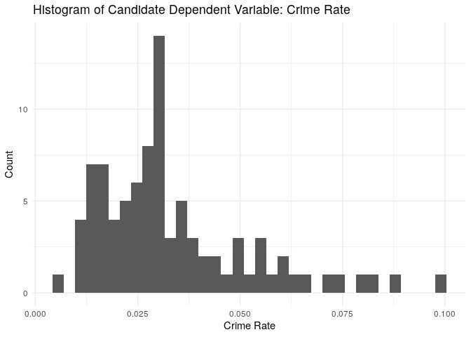<!-- -->

Our preferred variable (`crmrte`) appears to be of sufficient quality
for our analyses and thus we will use it as our dependent variable.

### Independent Variables

#### Actionable Variables

##### Economic Policy

One of the things one can affect with economic policy are wages. In
North Carolina in 1987, the minimum hourly wage was $3.35. Given that
most people work 40 hours per week, the minimum hourly wage would be
$134 per week.

In the plots below, we plot weekly wage by sector with a red vertical
line indicating this minimum weekly wage.

We can see that `wrtd` (Wholesale/Retail/Trade) wages are closest to the
minimum wage - which would suggest that wages in this sector would be
most influenced by changes to the minimum wage. The next sector that
would be influenced is `wser` (Service Industry). However, `wser`
appears to have an outlier (someone is earning over $2000 weekly, which
is well above the weekly wages for any other sector as well as `wser` in
other counties). Additionally, `wser` may be a messier measure of income
because many in that industry work in restaurants and make additional
income through tips - however, some people may not report this income.
Meanwhile, those working in Wholesale/Retail/Trade may be more likely to
work in places like malls, which would not provide additional income as
tips and would be a better measure of low-income wages.

``` r
# format data for subplots 
data_ep_long <- data2 %>% 
  select(wcon, wtuc, wtrd, wfir, wser, wmfg, wfed, wsta, wloc) %>%
  gather(key = var, value = value)

data_ep_long$var <- factor(data_ep_long$var,
                           levels = c("wcon", "wtuc", "wtrd", "wfir",
                                      "wser", "wmfg", "wfed", "wsta", "wloc"),
                           labels = c("Construction", 
                                      "Utilities/Transport", 
                                      "Wholesale/Retail/Trade",
                                      "Finance/Insurance/Real Estate",
                                      "Service Industry",
                                      "Manufacturing",
                                      "Federal Emp",
                                      "State Emp",
                                      "Local/State Emp"))
```

``` r
# plot hist subplots
ggplot(data_ep_long, aes(value)) +
  geom_histogram(bins = 50) +
  facet_wrap(~var) +
  theme_minimal() +
  ggtitle("Histogram of Economic Policy Variables: Wages by Sector") +
  geom_vline(aes(xintercept = 134, color = "red")) +
  theme(legend.position = "none")
```

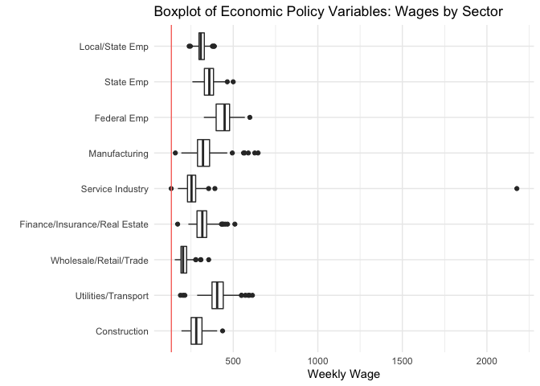<!-- -->

``` r
# plot boxplot subplots 
ggplot(data_ep_long, aes(x = var, y = value)) +
  geom_boxplot() +
  coord_flip() + 
  theme_minimal() +
  xlab("") + 
  ylab("Weekly Wage") +
  ggtitle("Boxplot of Economic Policy Variables: Wages by Sector")+
  geom_hline(aes(yintercept = 134, color = "red")) +
  theme(legend.position = "none")
```

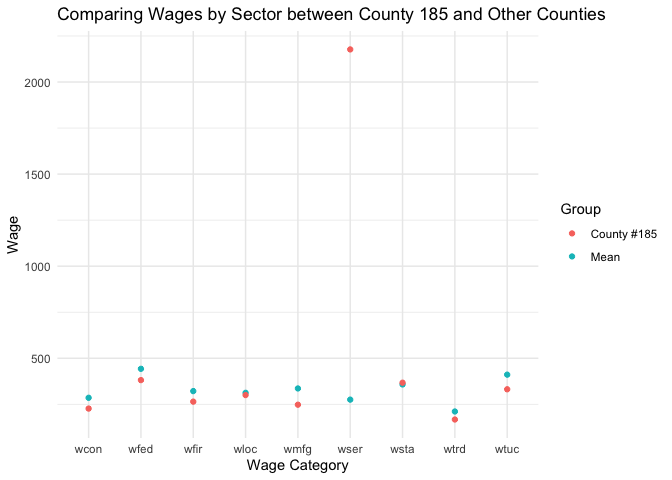<!-- -->

One can see from the plot below that `wser` for county \#185 appears to
be an incorrect value - all of the other sector wages are close to the
mean for all counties, except for this one (which is about 10x the
mean).

``` r
data_wages <- data2 %>% select(wcon, wtuc, wtrd, wfir, wser, wmfg, wfed, wsta, wloc)%>% colMeans() %>% as_tibble() %>% mutate(names = c("wcon", "wtuc", "wtrd", "wfir", "wser", "wmfg", "wfed", "wsta", "wloc"), Group = "Mean")
```

    ## Warning: Calling `as_tibble()` on a vector is discouraged, because the behavior is likely to change in the future. Use `tibble::enframe(name = NULL)` instead.
    ## This warning is displayed once per session.

``` r
wages_185 <- data2 %>%filter(wser == max(wser)) %>% select(wcon, wtuc, wtrd, wfir, wser, wmfg, wfed, wsta, wloc) %>% colMeans() %>% as_tibble() %>% mutate(names = c("wcon", "wtuc", "wtrd", "wfir", "wser", "wmfg", "wfed", "wsta", "wloc"), Group = "County #185")

wages <- bind_rows(data_wages, wages_185)

ggplot(data = wages, aes(x = names, y = value, color = Group)) + 
  geom_point() +
  xlab('Wage Category') +
  ylab('Wage') +
  theme_minimal() +
  ggtitle("Comparing Wages by Sector between County 185 and Other Counties")
```

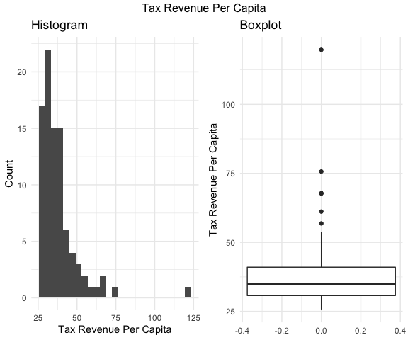<!-- -->

##### Criminal Justice Policy

As noted above, we combined our 3 core criminal justice policy variables
(`prbarr`, `prbconv`, `prbpris`) into one measure of the assertiveness
of the criminal justice system. It is a combined measure of the ratio of
arrests, convictions, and prison sentences to crimes. It could be
interesting to the policy maker to check how these criminal justice
indicators work together preventing crime.

First, we evaluated the quality of these 3 variables separately.

``` r
# format data for subplots 
data_cj_long <- data2 %>% select(prbarr, prbconv, prbpris) %>%
  gather(key = var, value = value)

# convert to factor for subplot labelling 
data_cj_long$var <- factor(data_cj_long$var, labels = c("Prob Arrest", "Prob Convicted", "Prob Sentenced"))
```

We can see that we have different distributions for these, but that they
all could be considered somewhat close to normal, with different levels
of skew.

``` r
# plot hist subplots
ggplot(data_cj_long, aes(value)) +
  geom_histogram(bins = 50) +
  facet_grid(~var) +
  theme_minimal() +
  ggtitle("Histogram of Criminal Justice Policy Variables: Assertiveness Variables")
```

<!-- -->

From our boxplots we can see that we have some extreme values for
efficiency of conviction, with multiple counties having a rate above 1.
As these are not true probabilities, but rather ratios, these values are
not necessarily spurious. However, they imply that for each arrest,
there could be multiple convictions - one county has over 2 convictions
for every arrest. Only 1 county has more than 1 arrest per crime
committed - most counties in fact have a much lower rate (and only put
someone under arrest for about one-quarter of crimes). When it comes to
setencing, counties show a much lower spread and cluster around 1
conviction resulting in a prison sentence for every 1 conviction that
does not.

``` r
# plot boxplot subplots 
ggplot(data_cj_long, aes(x = var, y = value)) +
  geom_boxplot() +
  theme_minimal() +
  xlab("") +
  ylab("Ratio") + 
  ggtitle("Boxplot of Criminal Justice Policy Variables: Assertiveness Variables")
```

<!-- -->

Which county had the highest conviction rate? This is a county in
central North Carolina. It has the highest percentage of minorities. It
also appears to have the maximum wages in the service industry
($2177.068 compared to a median of $253.12).

``` r
data2 %>% filter(prbconv == max(prbconv))
```

    ## # A tibble: 1 x 24
    ##   county crmrte prbarr prbconv prbpris avgsen   polpc density taxpc  west
    ##    <dbl>  <dbl>  <dbl>   <dbl>   <dbl>  <dbl>   <dbl>   <dbl> <dbl> <dbl>
    ## 1    185 0.0109  0.195    2.12   0.443   5.38 0.00122   0.389  40.8     0
    ## # … with 14 more variables: central <dbl>, urban <dbl>, pctmin80 <dbl>,
    ## #   wcon <dbl>, wtuc <dbl>, wtrd <dbl>, wfir <dbl>, wser <dbl>,
    ## #   wmfg <dbl>, wfed <dbl>, wsta <dbl>, wloc <dbl>, mix <dbl>,
    ## #   pctymle <dbl>

The fact that the conviction rate is so high seems odd for county \#185.
The other measures of assertiveness (for arrest and sentencing) seem
close to the mean. That of conviction rate is astronimically
high.

``` r
data_prb <- data2 %>% select(prbarr, prbconv, prbpris) %>% colMeans() %>% as_tibble() %>% mutate(names = c("prbarr", "prbconv", "prbpris"), Group = "Mean")

prb_185 <- data2 %>% filter(prbconv == max(prbconv)) %>% select(prbarr, prbconv, prbpris) %>% colMeans() %>% as_tibble() %>% mutate(names = c("prbarr", "prbconv", "prbpris"), Group = "County #185")

prbs <- bind_rows(data_prb, prb_185)

ggplot(data = prbs, aes(x = names, y = value, color = Group)) + 
  geom_point() +
  xlab('Criminal Justice Efficiency Category') +
  ylab('Efficiency') +
  theme_minimal() +
  ggtitle("Comparing Criminal Justice Efficiencies between County 185 and Other Counties")
```

<!-- -->

The analysis above suggests that the data for this county \#185 may have
been corrupted - since it has values for `wser` and `prbconv` at levels
much higher than the mean, whithout any explanation for why these might
have both been elevated. We cannot know for sure as we do not have any
other data with which to triangulate these records, thus in our modeling
we will compare models with and without this county; if it does not
affect the models, we can leave in this outlier. If it does
significantly, we may remove it since the data do not seem correct.

Our dataset has a second kind of criminal justice system indicator,
namely the average sentence of convictions (in days). While the
assertiveness indicators relate to the certainty of punishment (the
extent to which criminals expect to get caught and face punishment),
average sentence relates to the severity of the punishment. We can see
that average sentence length follows an approximately normal
distribution. We have one value well above the rest (above 20; most
cluster below 15).

``` r
# plot hist
ggplot(data2, aes(avgsen)) +
  geom_histogram(bins = 25) +
  theme_minimal() +
  ggtitle("Histogram of Criminal Justice Policy Variables: Severity") +
  xlab("Average Sentence Severity")
```

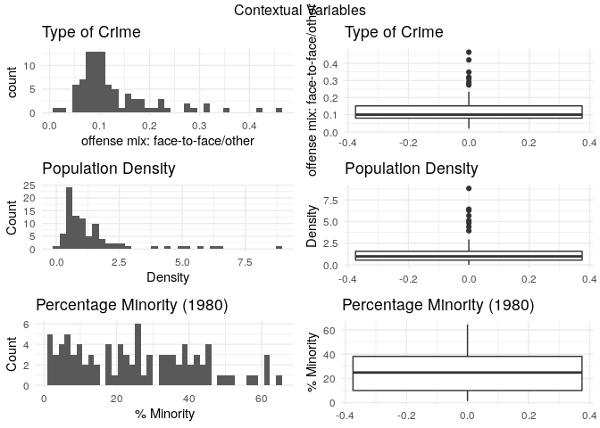<!-- -->

``` r
# plot hist
ggplot(data2, aes(y = avgsen)) +
  geom_boxplot() +
  theme_minimal() +
  ggtitle("Boxplot of Criminal Justice Policy Variables: Severity") +
  ylab("Average Sentence Severity")
```

<!-- -->

The county with the highest average sentence is in Western North
Carolina. It has the lowest percentage of minorities of any county
(1.28%). Its density is in the lowest quartile of counties but its mix
of face-to-face versus other crime is at the median. Although this
county seems to be at an extreme, there is no reason to eliminate it
from the data at this juncture.

#### Contextual Variables

##### Types of Crime

``` r
# plot barplots
ggplot(data2, aes(mix)) +
  geom_histogram(bins = 35) +
  theme_minimal() +
  ggtitle("Histogram of Contextual Variables: Type of Crime") +
  xlab("offense mix: face-to-face/other")
```

<!-- -->

##### Demographics

*Urban/rural dwellers*

``` r
ggplot(data2, aes(density)) +
  geom_histogram(bins = 35) +
  theme_minimal() +
  xlab("Density") +
  ylab("Count") +
  ggtitle("Histogram of Contextual Variables: Population Density")
```

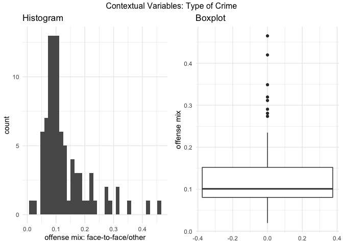<!-- -->

``` r
ggplot(data2, aes(y = density)) +
  geom_boxplot() +
  theme_minimal() +
  ylab("Density") +
  ggtitle("Boxplot of Contextual Variables: Population Density")
```

<!-- -->

*Minority status*

``` r
ggplot(data2, aes(pctmin80)) +
  geom_histogram(bins = 40) +
  theme_minimal() +
  xlab("% Minority") +
  ylab("Count") +
  ggtitle("Histogram of Contextual Variables: Percentage Minority (1980)")
```

<!-- -->

``` r
ggplot(data2, aes(y = pctmin80)) +
  geom_boxplot() +
  theme_minimal() +
  ylab("% Minority") +
  ggtitle("Boxplot of Contextual Variables: Percentage Minority (1980)")
```

<!-- -->

  - `pctmin80`: perc. minority, 1980

*Gender & Age* (young males are more likely to enter the criminal
justice system)

``` r
ggplot(data2, aes(pctymle)) +
  geom_histogram(bins = 25) +
  theme_minimal() +
  xlab("% Young Males") +
  ylab("Count") +
  ggtitle("Histogram of Contextual Variables: Percentage Young Males")
```

<!-- -->

``` r
ggplot(data2, aes(y = pctymle)) +
  geom_boxplot() +
  theme_minimal() +
  ylab("% Young Males") +
  ggtitle("Boxplot of Contextual Variables: Percentage Young Males")
```

<!-- -->

  - `pctymle`: percent young male

*Wealth*

``` r
ggplot(data2, aes(taxpc)) +
  geom_histogram(bins = 25) +
  theme_minimal() +
  xlab("Tax Revenue Per Capita") +
  ylab("Count") +
  ggtitle("Histogram of Contextual Variables: Tax Revenue Per Capita")
```

<!-- -->

``` r
ggplot(data2, aes(y = taxpc)) +
  geom_boxplot() +
  theme_minimal() +
  ylab("Tax Revenue Per Capita") +
  ggtitle("Boxplot of Contextual Variables: Tax Revenue Per Capita")
```

<!-- -->

  - `taxpc`: tax revenue per capita

##### Geography

``` r
# format data for subplots 
data_geo_long <- data2 %>% select(west, central, urban) %>%
  gather(key = var, value = value)
```

``` r
# plot barplots
ggplot(data_geo_long, aes(value)) +
  geom_bar() +
  facet_grid(~var) +
  theme_minimal() +
  ggtitle("Barplot of Contextual Variables: Geography")
```

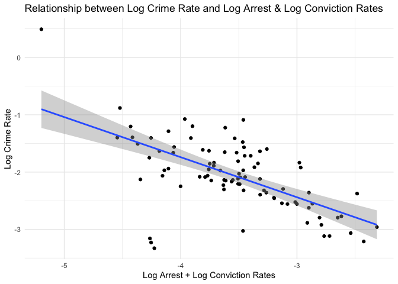<!-- -->

  - `west`: =1 if in western N.C.
  - `central`: =1 if in central N.C.
  - `urban`: =1 if in SMSA

### Relationships between Variables

One would expect variables within each of the above groups to be
correlated to each other.

This is a correlation matrix of all of our variables, using Spearman’s
due to the fact that not all variables follow a normal distribution.

Our original policy variables for economic policy – those related to
wages – appear to all be positively correlated with crime, which is
opposite our original conjecture. Rather than seeing that increased
wages are related to reduced crime, we are seeing that higher wages is
related to higher crime. This unexpected direction could be explained in
part by the strong positive relationship between the wage variables and
`density` and between `crmrte` and `density`. Thus, we will not include
the wage variables in early models - and it will be important to include
additional variables to control for other influences that could be
affecting the direction of this relationship.

``` r
data_corr <- data2 %>% select(-county) 

matrix_corr <- round(cor(data_corr, method = "spearman"), 1)
```

``` r
corrplot(matrix_corr, type = "lower", method = "ellipse", order = "alphabet")
```

<!-- -->

## Results

We will next build a set of models to investigate our research question,
documenting our decisions.

### Model 1

Based on our exploration above, our dependent variable is *crime*,
represented by the variable `crmrte`.

For our first model, we aimed to evaluate the relationship between crime
policy and crime.

We used the following independent variables to predict crime:

*Crime policy*

1)  log(`prbarr`)

2)  log(`prbconv`)

3)  log(`prbpris`)

4)  log(`avg_sen`)

#### Data Transformations

We decided to take the log of the crime policy measures and `crmrte` to
improve our model fit and interpretability. With these variables logged,
they can be interpreted as relative increases in crime rate and
assertiveness of the criminal justice system (rather than their value
alone).

#### Discussion on results

Coefficients on log(`prbpris`) and log(`avg_sen`) were not statistically
significant, thus we removed these variables to limit our total number
of variables in the model (to avoid overfitting). We already have
important variables related to crime policy, thus including them isn’t
crucial.

To make sure, here we also compare the use of arrest, conviction, and
sentencing rates (assertiveness measures) with just arrest and
conviction rates. Model fit appears to be better without the use of
sentencing rates. The sentencing rate variable has relatively lower
variation, which would limit the amount of variation it could explain in
crime rate (and thus, how much explanatory power it
has).

``` r
ggplot(data = data2, aes(x = log(crmrte), y = log(prbarr) + log(prbconv))) +
  geom_point() +
  theme_minimal()  +
  ggtitle("Relationship between Log Crime Rate and Log Arrest & Log Conviction Rates") + 
  ylab("Log Crime Rate") + xlab("Log Arrest + Log Conviction Rates") +
  geom_smooth(method='lm', formula= y~x)
```

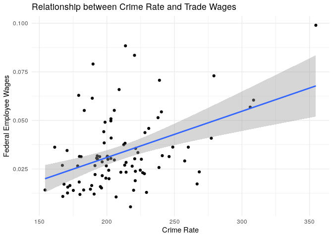<!-- -->

Approximately 40% of the variation in crime rate can be explained by the
assertiveness of the criminal justice process. Increasing the ratio of
criminal justice practices to crime (increasing arrests, convictions,
and sentencing) could help decrease the crime
rate.

``` r
mod1_1 <- lm(log(crmrte) ~ log(prbarr) + log(prbconv) + log(prbpris) + log(avgsen), data = data2)
mod1_2 <- lm(log(crmrte) ~ log(prbarr) + log(prbconv) + log(prbpris) , data = data2)
mod1 <- lm(log(crmrte) ~ log(prbarr) + log(prbconv) , data = data2)
stargazer(mod1_1, mod1_2, mod1, type = "text")
```

    ## 
    ## ========================================================================================
    ##                                             Dependent variable:                         
    ##                     --------------------------------------------------------------------
    ##                                                 log(crmrte)                             
    ##                              (1)                    (2)                    (3)          
    ## ----------------------------------------------------------------------------------------
    ## log(prbarr)               -0.724***              -0.724***              -0.726***       
    ##                            (0.115)                (0.115)                (0.114)        
    ##                                                                                         
    ## log(prbconv)              -0.473***              -0.472***              -0.472***       
    ##                            (0.083)                (0.083)                (0.082)        
    ##                                                                                         
    ## log(prbpris)                0.160                  0.148                                
    ##                            (0.206)                (0.204)                               
    ##                                                                                         
    ## log(avgsen)                 0.076                                                       
    ##                            (0.163)                                                      
    ##                                                                                         
    ## Constant                  -4.868***              -4.708***              -4.845***       
    ##                            (0.432)                (0.261)                (0.179)        
    ##                                                                                         
    ## ----------------------------------------------------------------------------------------
    ## Observations                  90                     90                     90          
    ## R2                          0.416                  0.415                  0.411         
    ## Adjusted R2                 0.389                  0.394                  0.398         
    ## Residual Std. Error    0.429 (df = 85)        0.427 (df = 86)        0.426 (df = 87)    
    ## F Statistic         15.152*** (df = 4; 85) 20.314*** (df = 3; 86) 30.374*** (df = 2; 87)
    ## ========================================================================================
    ## Note:                                                        *p<0.1; **p<0.05; ***p<0.01

#### Outliers

One can see that there is one potential outlier that also has a lot of
leverage on our model (observation \#24).

``` r
ols_plot_resid_lev(mod1)
```

<!-- -->

The outlier with leverage was in county \#11.

``` r
data2 %>% filter(county == 11)
```

    ## # A tibble: 1 x 24
    ##   county crmrte prbarr prbconv prbpris avgsen   polpc density taxpc  west
    ##    <dbl>  <dbl>  <dbl>   <dbl>   <dbl>  <dbl>   <dbl>   <dbl> <dbl> <dbl>
    ## 1     11 0.0146  0.525  0.0684     0.5     13 0.00288   0.611  35.2     1
    ## # … with 14 more variables: central <dbl>, urban <dbl>, pctmin80 <dbl>,
    ## #   wcon <dbl>, wtuc <dbl>, wtrd <dbl>, wfir <dbl>, wser <dbl>,
    ## #   wmfg <dbl>, wfed <dbl>, wsta <dbl>, wloc <dbl>, mix <dbl>,
    ## #   pctymle <dbl>

We can see that without this observation, we now explain slightly more
of the variation (~44% compared to ~40%).

``` r
data2_out <- data2 %>% filter(county != 11)

mod1_out <- lm(log(crmrte) ~ log(prbarr) + log(prbconv), data = data2_out)
stargazer(mod1, mod1_out, type = "text")
```

    ## 
    ## =================================================================
    ##                                  Dependent variable:             
    ##                     ---------------------------------------------
    ##                                      log(crmrte)                 
    ##                              (1)                    (2)          
    ## -----------------------------------------------------------------
    ## log(prbarr)               -0.726***              -0.690***       
    ##                            (0.114)                (0.110)        
    ##                                                                  
    ## log(prbconv)              -0.472***              -0.558***       
    ##                            (0.082)                (0.084)        
    ##                                                                  
    ## Constant                  -4.845***              -4.849***       
    ##                            (0.179)                (0.171)        
    ##                                                                  
    ## -----------------------------------------------------------------
    ## Observations                  90                     89          
    ## R2                          0.411                  0.456         
    ## Adjusted R2                 0.398                  0.444         
    ## Residual Std. Error    0.426 (df = 87)        0.408 (df = 86)    
    ## F Statistic         30.374*** (df = 2; 87) 36.109*** (df = 2; 86)
    ## =================================================================
    ## Note:                                 *p<0.1; **p<0.05; ***p<0.01

Eliminating the outlier has improved our fit. However, we did not spot
any data quality issues in this county during our exploratory data
analysis thus we cannot claim that it has a data quality issue.

``` r
ols_plot_resid_lev(mod1_out)
```

<!-- -->

### Model 2

For our second model, we aimed to evaluate the relationship between
crime and economic policies with crime.

We used the following independent variables to predict crime:

*Crime policy*

1)  log(`prbarr`)
2)  log(`prbconv`)

*Economic policy*

3)  log(`wtrd`)

4)  log(`wfed`)

5)  log(`taxpc`)

#### Data Transformations

We decided to take the log of our two wage variables and the tax revenue
variable to show the relationship between relative changes in these to
crime (rather than the absolute number). This improves our
interpretability since we are making policy recommendations around
changing these relative to the existing levels in these counties.

We can see that we have a somewhat linear relationship between trade
industry wages and crime.

``` r
ggplot(data = data2, aes(x = wtrd, crmrte)) +
  geom_point() +
  theme_minimal() +
  ggtitle("Relationship between Crime Rate and Trade Wages") + 
  xlab("Crime Rate") + ylab("Federal Employee Wages") +
  geom_smooth(method='lm', formula= y~x)
```

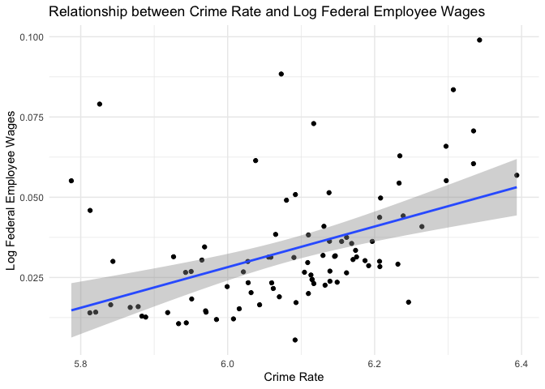<!-- -->

The fit appears slightly improved after logging these wages.

``` r
ggplot(data = data2, aes(x = log(wtrd), crmrte)) +
  geom_point() +
  theme_minimal() +
  ggtitle("Relationship between Crime Rate and Log Trade Wages") + 
  xlab("Crime Rate") + ylab("Log Trade Wages") +
  geom_smooth(method='lm', formula= y~x)
```

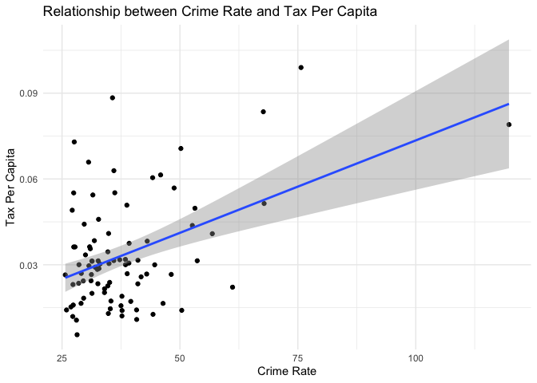<!-- -->

We can see that we have a relatively clear linear relationship between
federal wages and crime.

``` r
ggplot(data = data2, aes(x = wfed, crmrte)) +
  geom_point() +
  theme_minimal() +
  ggtitle("Relationship between Crime Rate and Federal Employee Wages") + 
  xlab("Crime Rate") + ylab("Federal Employee Wages") +
  geom_smooth(method='lm', formula= y~x)
```

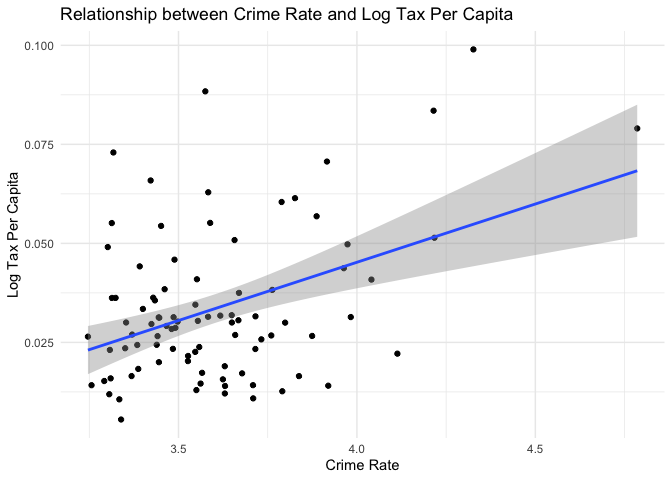<!-- -->

The fit appears slightly improved after logging these wages - especially
in terms of variability. One can see that the spread appears more even
across different logged wages (compared to wages).

``` r
ggplot(data = data2, aes(x = log(wfed), crmrte)) +
  geom_point() +
  theme_minimal() +
  ggtitle("Relationship between Crime Rate and Log Federal Employee Wages") + 
  xlab("Crime Rate") + ylab("Log Federal Employee Wages") +
  geom_smooth(method='lm', formula= y~x)
```

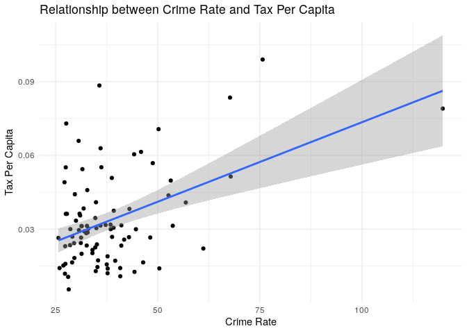<!-- -->

We can see that we do not have a very linear relationship between tax
per capita and crime. Many of the points cluster together, leaving
little variability with which to predict crime.

``` r
ggplot(data = data2, aes(x = taxpc, crmrte)) +
  geom_point() +
  theme_minimal() +
  ggtitle("Relationship between Crime Rate and Tax Per Capita") + 
  xlab("Crime Rate") + ylab("Tax Per Capita") +
  geom_smooth(method='lm', formula= y~x)
```

<!-- -->

The fit appears slightly improved after logging tax per capital.

``` r
ggplot(data = data2, aes(x = log(taxpc), crmrte)) +
  geom_point() +
  theme_minimal() +
  ggtitle("Relationship between Crime Rate and Log Tax Per Capita") + 
  xlab("Crime Rate") + ylab("Log Tax Per Capita") +
  geom_smooth(method='lm', formula= y~x)
```

<!-- -->

#### Discussion on results

All of the above variables had statistically significant relationships
to crime rate, except `wtrd`. Additionally, this variable’s relationship
was not in the expected direction - rather than seeing higher wages
related to lower levels of crime (as we had conjectured), we saw that
higher wages were related to higher levels of crime.

Additionally, the estimated relationship between `taxpc` and `wfed` with
`crmrte` was statistically significant but positive. This indicates
crime rate is larger in wealthier counties.

Since wage and wealth indicators and `density` for example are
positively correlated, we thought that perhaps omitted variables could
be influencing the direction of the estimated relationship between wage
and wealth and
`crmrte`.

``` r
mod2a <- lm(log(crmrte) ~ log(prbarr) + log(prbconv) + log(wtrd) + log(wfed) +log(taxpc), data = data2)

mod2b <- lm(log(crmrte) ~ log(prbarr) + log(prbconv) + log(wtrd) + log(wfed) +log(taxpc), data = data2)

stargazer(mod1, mod2b, mod2a, type = "text")
```

    ## 
    ## ========================================================================================
    ##                                             Dependent variable:                         
    ##                     --------------------------------------------------------------------
    ##                                                 log(crmrte)                             
    ##                              (1)                    (2)                    (3)          
    ## ----------------------------------------------------------------------------------------
    ## log(prbarr)               -0.726***              -0.563***              -0.563***       
    ##                            (0.114)                (0.099)                (0.099)        
    ##                                                                                         
    ## log(prbconv)              -0.472***              -0.423***              -0.423***       
    ##                            (0.082)                (0.071)                (0.071)        
    ##                                                                                         
    ## log(wtrd)                                          0.101                  0.101         
    ##                                                   (0.332)                (0.332)        
    ##                                                                                         
    ## log(wfed)                                         1.580***               1.580***       
    ##                                                   (0.364)                (0.364)        
    ##                                                                                         
    ## log(taxpc)                                        0.356**                0.356**        
    ##                                                   (0.148)                (0.148)        
    ##                                                                                         
    ## Constant                  -4.845***              -16.027***             -16.027***      
    ##                            (0.179)                (1.765)                (1.765)        
    ##                                                                                         
    ## ----------------------------------------------------------------------------------------
    ## Observations                  90                     90                     90          
    ## R2                          0.411                  0.607                  0.607         
    ## Adjusted R2                 0.398                  0.584                  0.584         
    ## Residual Std. Error    0.426 (df = 87)        0.354 (df = 84)        0.354 (df = 84)    
    ## F Statistic         30.374*** (df = 2; 87) 25.988*** (df = 5; 84) 25.988*** (df = 5; 84)
    ## ========================================================================================
    ## Note:                                                        *p<0.1; **p<0.05; ***p<0.01

#### Outliers

One can see that there is one potential outlier that also has a lot of
leverage on our model (observation \#24).

``` r
ols_plot_resid_lev(mod2a)
```

<!-- -->

Once again, county \#11 appears to be an outlier with leverage.

``` r
data2 %>% filter(county == 11)
```

    ## # A tibble: 1 x 24
    ##   county crmrte prbarr prbconv prbpris avgsen   polpc density taxpc  west
    ##    <dbl>  <dbl>  <dbl>   <dbl>   <dbl>  <dbl>   <dbl>   <dbl> <dbl> <dbl>
    ## 1     11 0.0146  0.525  0.0684     0.5     13 0.00288   0.611  35.2     1
    ## # … with 14 more variables: central <dbl>, urban <dbl>, pctmin80 <dbl>,
    ## #   wcon <dbl>, wtuc <dbl>, wtrd <dbl>, wfir <dbl>, wser <dbl>,
    ## #   wmfg <dbl>, wfed <dbl>, wsta <dbl>, wloc <dbl>, mix <dbl>,
    ## #   pctymle <dbl>

We can see that without this observation, we now explain slightly more
of the variation (~62% compared to ~59%).

``` r
data2_out <- data2 %>% filter(county != 11)

mod2_out <- lm(log(crmrte) ~ log(prbarr) + log(prbconv) + log(wfed) +log(taxpc), data = data2_out)
stargazer(mod2a, mod2_out, type = "text")
```

    ## 
    ## ===========================================================================
    ##                                            Dependent variable:             
    ##                               ---------------------------------------------
    ##                                                log(crmrte)                 
    ##                                        (1)                    (2)          
    ## ---------------------------------------------------------------------------
    ## log(prbarr)                         -0.563***              -0.538***       
    ##                                      (0.099)                (0.094)        
    ##                                                                            
    ## log(prbconv)                        -0.423***              -0.503***       
    ##                                      (0.071)                (0.072)        
    ##                                                                            
    ## log(wtrd)                             0.101                                
    ##                                      (0.332)                               
    ##                                                                            
    ## log(wfed)                            1.580***               1.604***       
    ##                                      (0.364)                (0.268)        
    ##                                                                            
    ## log(taxpc)                           0.356**                0.327**        
    ##                                      (0.148)                (0.140)        
    ##                                                                            
    ## Constant                            -16.027***             -15.549***      
    ##                                      (1.765)                (1.656)        
    ##                                                                            
    ## ---------------------------------------------------------------------------
    ## Observations                            90                     89          
    ## R2                                    0.607                  0.639         
    ## Adjusted R2                           0.584                  0.622         
    ## Residual Std. Error (df = 84)         0.354                  0.336         
    ## F Statistic                   25.988*** (df = 5; 84) 37.240*** (df = 4; 84)
    ## ===========================================================================
    ## Note:                                           *p<0.1; **p<0.05; ***p<0.01

Although eliminating the outlier has improved our fit and this outlier
has leverage, we do not have any reason to suspect that it has data
quality issues.

``` r
ols_plot_resid_lev(mod2_out)
```

<!-- -->

In checking our OLS assumptions for model 2, we noted that we violated
the homoskedasticity assumption. The variability of our residuals
decrease as the value of our target variable (crime) increases.

``` r
plot(mod2a, which = 3)
```

<!-- -->

We can see that log(`taxpc`), `density`, and `pctymle` are no longer
significant. Thus, we will only make conclusions regarding our crime
policy variables, wages of federal employees, and percent minorities.
However, we will continue to use these as we continue our modeling to
examine how the inclusion of additional covariates

``` r
coeftest(mod2a, vcov. = vcovHC)
```

    ## 
    ## t test of coefficients:
    ## 
    ##               Estimate Std. Error t value  Pr(>|t|)    
    ## (Intercept)  -16.02677    2.36255 -6.7837 1.537e-09 ***
    ## log(prbarr)   -0.56317    0.11745 -4.7949 6.962e-06 ***
    ## log(prbconv)  -0.42305    0.11607 -3.6448 0.0004626 ***
    ## log(wtrd)      0.10073    0.41525  0.2426 0.8089310    
    ## log(wfed)      1.57979    0.54050  2.9229 0.0044556 ** 
    ## log(taxpc)     0.35603    0.20146  1.7673 0.0808133 .  
    ## ---
    ## Signif. codes:  0 '***' 0.001 '**' 0.01 '*' 0.05 '.' 0.1 ' ' 1

### Model 3

For our third model, we added density and other control variables to
check if, controling for them, the apparent irrelevance of `wtrd` and
unexpected positive coefficient estimate for log(`wfed`) would persist.

We also we aimed to evaluate the robustness of the relationship between
crime policy, economic policy, and crime when controlling for key
contextual factors. We aimed for parsimony to avoid over-fitting, and
following the one to ten rule we should aim to have about one
independent variable for every 10 observations. We have 90 observations,
meaning that ~10 independent variables is a good number to aim for.

We used the following independent variables to predict crime:

*Crime policy*

1)  log(`prbarr`)

2)  log(`prbconv`)

*Economic policy*

3)  log(`wtrd`)

4)  log(`wfed`)

5)  log(`taxpc`)

*Contextual variables*

6)  `density` - higher density means more opportunity for crime to be
    committed and reported; denser areas also tend to have more economic
    activity and so this variable could be related to wages

7)  `mix` - different types of crime in an area may affect the
    assertiveness of the criminal justice system; a community may see
    more arrests and convictions in response to more frightening
    face-to-face crimes in an area

8)  `pctymle` - young males are more likely to commit crimes and thus
    areas with higher portions of this type of person may see more crime
    regardless of their policies

9)  `pctmin80` - minorities are likelier to be arrested and convicted
    (and from a lot of research we know that this is not always related
    to their likelihood to commit a crime)

10) `west` - Western North Carolina is potentially very different from
    other regions in North Carolina, as we noted at the beginning of
    this report. A different culture could relate to different crime
    patterns and relationships between crime and other factors. For
    example, this variable is highly related to `pctmin80` (Western
    counties have lower levels of minorities) and this could affect
    crime rate through differences in diversity.

#### Data Transformations

Many of the contextual variables (`density`, `mix`, `pctymle`) showed a
pattern where most counties clustered closely together. Logging them did
not improve their fit. This similar pattern may be an artefact of North
Carolina being a small state that may have limited variation across
counties on some elements (like density, crime patterns in terms of
their type, and percent young male).

##### Density

Taking the log of density improves its linear fit to crime rate.

``` r
ggplot(data = data2, aes(x = density, crmrte)) +
  geom_point() +
  theme_minimal() +
  ggtitle("Relationship between Crime Rate and Density") + 
  ylab("Crime Rate") + xlab("Density") +
  geom_smooth(method='lm', formula= y~x)
```

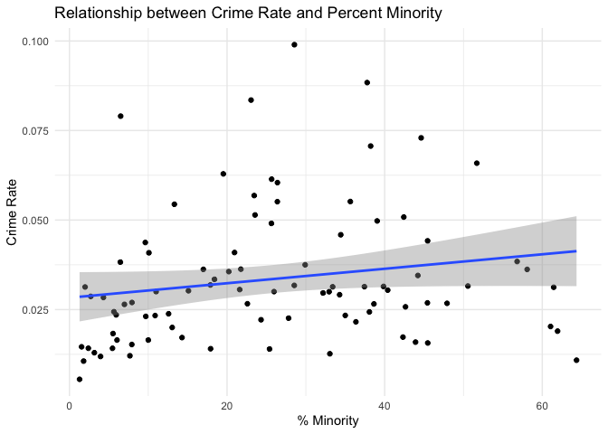<!-- -->

``` r
ggplot(data = data2, aes(x = log(density), crmrte)) +
  geom_point() +
  theme_minimal() +
  ggtitle("Relationship between Crime Rate and Log Density") + 
  ylab("Crime Rate") + xlab("Log Density") +
  geom_smooth(method='lm', formula= y~x)
```

<!-- -->

Taking the log of mix reduced the linear fit with crime rate.

``` r
ggplot(data = data2, aes(x = mix, crmrte)) +
  geom_point() +
  theme_minimal() +
  ggtitle("Relationship between Crime Rate and Mix") + 
  ylab("Crime Rate") + xlab("Mix") +
  geom_smooth(method='lm', formula= y~x)
```

<!-- -->

``` r
ggplot(data = data2, aes(x = log(density), crmrte)) +
  geom_point() +
  theme_minimal() +
  ggtitle("Relationship between Crime Rate and Log Mix") + 
  ylab("Crime Rate") + xlab("Log Mix") +
  geom_smooth(method='lm', formula= y~x)
```

<!-- -->

##### Percent Young Male

``` r
ggplot(data = data2, aes(x = pctymle, crmrte)) +
  geom_point() +
  theme_minimal() +
  ggtitle("Relationship between Crime Rate and Percent Young Male") + 
  ylab("Crime Rate") + xlab("% Young Male") +
  geom_smooth(method='lm', formula= y~x)
```

<!-- -->

``` r
ggplot(data = data2, aes(x = log(pctymle), crmrte)) +
  geom_point() +
  theme_minimal() +
  ggtitle("Relationship between Crime Rate and Log Percent Young Male") + 
  ylab("Crime Rate") + xlab("Log % Young Male") +
  geom_smooth(method='lm', formula= y~x)
```

<!-- -->

##### Percent Minority

The percent minority in 1980 does not have a strong relationship to
crime. Counties appear to have a wide range of this variable and there
is a slight positive relationship to crime rate. Logging this variable
did not improve the fit.

``` r
ggplot(data = data2, aes(x = pctmin80, crmrte)) +
  geom_point() +
  theme_minimal() +
  ggtitle("Relationship between Crime Rate and Percent Minority") + 
  ylab("Crime Rate") + xlab("% Minority") +
  geom_smooth(method='lm', formula= y~x)
```

<!-- -->

``` r
ggplot(data = data2, aes(x = log(pctmin80), crmrte)) +
  geom_point() +
  theme_minimal() +
  ggtitle("Relationship between Crime Rate and Log Percent Minority") + 
  ylab("Crime Rate") + xlab("Log % Minority") +
  geom_smooth(method='lm', formula= y~x)
```

<!-- -->

##### West

Western counties appear to have lower rates of crime than others.

``` r
ggplot(data = data2, aes(x = west, crmrte)) +
  geom_col() +
  theme_minimal() +
  ggtitle("Relationship between Crime Rate and Western Location") + 
  ylab("Crime Rate") + xlab("West (0 = no; 1 = yes)") 
```

<!-- -->

#### Discussion of results

As the coefficient estimate on log(`wfed`) and log(`taxpc`) remained
positive and the coefficient on `wtrd` remained statistically not
significant even controlling for potential ommited variables, we believe
we are not able to make any recommendations regarding economic policies
in general based on the avaiable dataset.

Still, including factors related to the demographics of an area
(density; percent young males; and percent minorities) increases our
ability to predict crime. Thus, these factors should be part of policy
considerations we recommended above. Higher rates of any of these are
related to higher levels of crime. Although we would not sensibly or
ethically craft policies to affect these, policies designed to impact
crime or economic policy should be mindful of the fact that some areas
will naturally have higher crime and may be more challenging to impact.

These were all statistically significant when we modelled them together,
except for `mix` and `west`. For the sake of parsimony, we dropped these
two from our third model. As the avaiable datase does not seen to
support the significance of a minimum wage policy, also dropped
log(`wtrd`). We decided to keep log(`wfed`) and log(`taxpc`) and read
them as controls for county wealth, rather than policy variables per
se.

``` r
mod3a<- lm(log(crmrte) ~ log(prbarr) + log(prbconv) + log(wtrd) + log(wfed) +log(taxpc) + density + pctymle + pctmin80 + mix + west, data = data2)
mod3<- lm(log(crmrte) ~ log(prbarr) + log(prbconv) + log(wfed) +log(taxpc) + density + pctymle + pctmin80, data = data2)
stargazer(mod3a, mod3, type = "text")
```

    ## 
    ## ==================================================================
    ##                                  Dependent variable:              
    ##                     ----------------------------------------------
    ##                                      log(crmrte)                  
    ##                               (1)                    (2)          
    ## ------------------------------------------------------------------
    ## log(prbarr)                -0.460***              -0.485***       
    ##                             (0.099)                (0.091)        
    ##                                                                   
    ## log(prbconv)               -0.369***              -0.374***       
    ##                             (0.068)                (0.064)        
    ##                                                                   
    ## log(wtrd)                    0.046                                
    ##                             (0.299)                               
    ##                                                                   
    ## log(wfed)                  1.146***                1.230***       
    ##                             (0.336)                (0.285)        
    ##                                                                   
    ## log(taxpc)                  0.229*                 0.265**        
    ##                             (0.134)                (0.130)        
    ##                                                                   
    ## density                     0.077**                0.078***       
    ##                             (0.031)                (0.029)        
    ##                                                                   
    ## pctymle                     3.111**                3.174**        
    ##                             (1.497)                (1.460)        
    ##                                                                   
    ## pctmin80                   0.008***                0.010***       
    ##                             (0.003)                (0.002)        
    ##                                                                   
    ## mix                         -0.046                                
    ##                             (0.490)                               
    ##                                                                   
    ## west                        -0.142                                
    ##                             (0.102)                               
    ##                                                                   
    ## Constant                  -12.998***              -13.530***      
    ##                             (2.191)                (1.871)        
    ##                                                                   
    ## ------------------------------------------------------------------
    ## Observations                  90                      90          
    ## R2                           0.748                  0.741         
    ## Adjusted R2                  0.716                  0.719         
    ## Residual Std. Error     0.292 (df = 79)        0.291 (df = 82)    
    ## F Statistic         23.426*** (df = 10; 79) 33.494*** (df = 7; 82)
    ## ==================================================================
    ## Note:                                  *p<0.1; **p<0.05; ***p<0.01

#### Outliers

One can see that there are two potential outliers that also have
leverage on our model (observations \#6 & 25). We also have one
borderline case.

``` r
ols_plot_resid_lev(mod3)
```

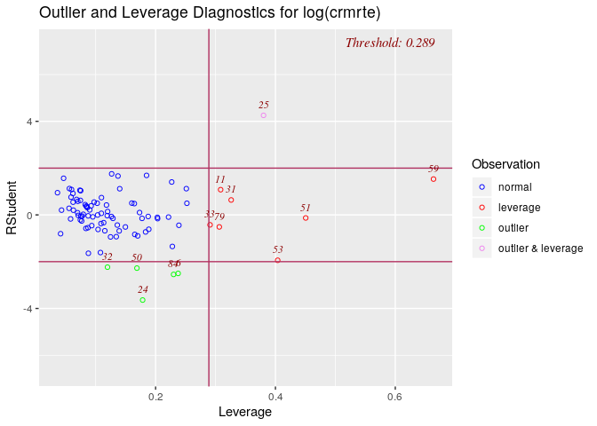<!-- -->

Once again, county \#11 appears to be an outlier with leverage. County
\#55 is new in terms of outliers. However, we previously flagged County
185 as potentially having data quality issues.

``` r
data2 %>% filter(county %in% c(11, 55, 185))
```

    ## # A tibble: 3 x 24
    ##   county crmrte prbarr prbconv prbpris avgsen   polpc density taxpc  west
    ##    <dbl>  <dbl>  <dbl>   <dbl>   <dbl>  <dbl>   <dbl>   <dbl> <dbl> <dbl>
    ## 1     11 0.0146  0.525  0.0684   0.5    13    0.00288   0.611  35.2     1
    ## 2     55 0.0790  0.225  0.208    0.304  13.6  0.00401   0.512 120.      0
    ## 3    185 0.0109  0.195  2.12     0.443   5.38 0.00122   0.389  40.8     0
    ## # … with 14 more variables: central <dbl>, urban <dbl>, pctmin80 <dbl>,
    ## #   wcon <dbl>, wtuc <dbl>, wtrd <dbl>, wfir <dbl>, wser <dbl>,
    ## #   wmfg <dbl>, wfed <dbl>, wsta <dbl>, wloc <dbl>, mix <dbl>,
    ## #   pctymle <dbl>

We can see that without this observation, we now explain a lot more of
the variation (~78% compared to ~72%). Additionally, `taxpc` is no
longer
significant.

``` r
data2_out2 <- data2 %>% filter(county != 11) %>% filter(county != 55) %>% filter(county != 185)

mod3_out <- lm(log(crmrte) ~ log(prbarr) + log(prbconv) + log(wfed) +log(taxpc) + density + pctymle + pctmin80, data = data2_out2)
stargazer(mod3, mod3_out, type = "text")
```

    ## 
    ## =================================================================
    ##                                  Dependent variable:             
    ##                     ---------------------------------------------
    ##                                      log(crmrte)                 
    ##                              (1)                    (2)          
    ## -----------------------------------------------------------------
    ## log(prbarr)               -0.485***              -0.446***       
    ##                            (0.091)                (0.078)        
    ##                                                                  
    ## log(prbconv)              -0.374***              -0.349***       
    ##                            (0.064)                (0.061)        
    ##                                                                  
    ## log(wfed)                  1.230***               1.246***       
    ##                            (0.285)                (0.248)        
    ##                                                                  
    ## log(taxpc)                 0.265**                 -0.002        
    ##                            (0.130)                (0.130)        
    ##                                                                  
    ## density                    0.078***               0.100***       
    ##                            (0.029)                (0.026)        
    ##                                                                  
    ## pctymle                    3.174**                3.204**        
    ##                            (1.460)                (1.246)        
    ##                                                                  
    ## pctmin80                   0.010***               0.012***       
    ##                            (0.002)                (0.002)        
    ##                                                                  
    ## Constant                  -13.530***             -12.668***      
    ##                            (1.871)                (1.611)        
    ##                                                                  
    ## -----------------------------------------------------------------
    ## Observations                  90                     87          
    ## R2                          0.741                  0.800         
    ## Adjusted R2                 0.719                  0.783         
    ## Residual Std. Error    0.291 (df = 82)        0.248 (df = 79)    
    ## F Statistic         33.494*** (df = 7; 82) 45.261*** (df = 7; 79)
    ## =================================================================
    ## Note:                                 *p<0.1; **p<0.05; ***p<0.01

Although eliminating the outlier has improved our fit and changed the
strength of the relationship with `taxpc`, and although counties \#11 &
55 have leverage, we do not have any reason to suspect that they have
data quality issues.

What if we only eliminate the county with data quality issues? Now our
model fit is slightly less improved (73% compared to the original 72%).
The variable `taxpc` is again signficant.

``` r
data2_out3 <- data2 %>% filter(county != 185)

mod3_out2 <- lm(log(crmrte) ~ log(prbarr) + log(prbconv) + log(wfed) +log(taxpc) + density + pctymle + pctmin80, data = data2_out3)
stargazer(mod3, mod3_out, mod3_out2, type = "text")
```

    ## 
    ## ========================================================================================
    ##                                             Dependent variable:                         
    ##                     --------------------------------------------------------------------
    ##                                                 log(crmrte)                             
    ##                              (1)                    (2)                    (3)          
    ## ----------------------------------------------------------------------------------------
    ## log(prbarr)               -0.485***              -0.446***              -0.501***       
    ##                            (0.091)                (0.078)                (0.087)        
    ##                                                                                         
    ## log(prbconv)              -0.374***              -0.349***              -0.329***       
    ##                            (0.064)                (0.061)                (0.064)        
    ##                                                                                         
    ## log(wfed)                  1.230***               1.246***               1.109***       
    ##                            (0.285)                (0.248)                (0.278)        
    ##                                                                                         
    ## log(taxpc)                 0.265**                 -0.002                0.290**        
    ##                            (0.130)                (0.130)                (0.126)        
    ##                                                                                         
    ## density                    0.078***               0.100***               0.082***       
    ##                            (0.029)                (0.026)                (0.028)        
    ##                                                                                         
    ## pctymle                    3.174**                3.204**                3.034**        
    ##                            (1.460)                (1.246)                (1.407)        
    ##                                                                                         
    ## pctmin80                   0.010***               0.012***               0.011***       
    ##                            (0.002)                (0.002)                (0.002)        
    ##                                                                                         
    ## Constant                  -13.530***             -12.668***             -12.883***      
    ##                            (1.871)                (1.611)                (1.817)        
    ##                                                                                         
    ## ----------------------------------------------------------------------------------------
    ## Observations                  90                     87                     89          
    ## R2                          0.741                  0.800                  0.754         
    ## Adjusted R2                 0.719                  0.783                  0.732         
    ## Residual Std. Error    0.291 (df = 82)        0.248 (df = 79)        0.280 (df = 81)    
    ## F Statistic         33.494*** (df = 7; 82) 45.261*** (df = 7; 79) 35.416*** (df = 7; 81)
    ## ========================================================================================
    ## Note:                                                        *p<0.1; **p<0.05; ***p<0.01

For now, we will leave all of these in our model since \#11 & 55 do not
appear to have data quality issues and \#185 does not change our model
signficantly.

### Model 4

For our fourth model, we aimed to evaluate the robustness of the
relationship between crime policy and crime when controlling for many
contextual factors.

We used the following independent variables to predict crime:

*Crime policy*

1)  log(`prbarr`)

2)  log(`prbconv`)

*Contextual variables*

3)  log(`wfed`)

4)  log(`taxpc`)

5)  `density` - higher density means more opportunity for crime to be
    committed and reported; denser areas also tend to have more economic
    activity and so this variable could be related to wages

6)  `mix` - different types of crime in an area may affect the
    assertiveness of the criminal justice system; a community may see
    more arrests and convictions in response to more frightening
    face-to-face crimes in an area

7)  `pctymle` - young males are more likely to commit crimes and thus
    areas with higher portions of this type of person may see more crime
    regardless of their policies

8)  `pctmin80` - minorities are likelier to be arrested and convicted
    (and from a lot of research we know that this is not always related
    to their likelihood to commit a crime)

9)  `west` - Western North Carolina is potentially very different from
    other regions in North Carolina, as we noted at the beginning of
    this report. A different culture could relate to different crime
    patterns and relationships between crime and other factors. For
    example, this variable is highly related to `pctmin80` (Western
    counties have lower levels of minorities) and this could affect
    crime rate through differences in diversity.

10) log(`wtrd`)

11) log(`prbpris`)

12) `central`

13) `urban`

#### Discussion on results

We can see that our additions did not improve our model
fit.

``` r
mod4 <- lm(log(crmrte) ~ log(prbarr) + log(prbconv) + log(wfed) +log(taxpc) + density + pctymle + pctmin80 + log(wtrd) +  log(`prbpris`) + avgsen + central + urban, data = data2)
stargazer(mod3, mod4, type = "text")
```

    ## 
    ## ==================================================================
    ##                                  Dependent variable:              
    ##                     ----------------------------------------------
    ##                                      log(crmrte)                  
    ##                              (1)                     (2)          
    ## ------------------------------------------------------------------
    ## log(prbarr)               -0.485***               -0.481***       
    ##                            (0.091)                 (0.093)        
    ##                                                                   
    ## log(prbconv)              -0.374***               -0.366***       
    ##                            (0.064)                 (0.065)        
    ##                                                                   
    ## log(wfed)                  1.230***               1.197***        
    ##                            (0.285)                 (0.328)        
    ##                                                                   
    ## log(taxpc)                 0.265**                 0.295**        
    ##                            (0.130)                 (0.134)        
    ##                                                                   
    ## density                    0.078***               0.130***        
    ##                            (0.029)                 (0.046)        
    ##                                                                   
    ## pctymle                    3.174**                 3.192**        
    ##                            (1.460)                 (1.511)        
    ##                                                                   
    ## pctmin80                   0.010***               0.010***        
    ##                            (0.002)                 (0.002)        
    ##                                                                   
    ## log(wtrd)                                           0.174         
    ##                                                    (0.298)        
    ##                                                                   
    ## log(prbpris)                                       -0.067         
    ##                                                    (0.145)        
    ##                                                                   
    ## avgsen                                             -0.009         
    ##                                                    (0.012)        
    ##                                                                   
    ## central                                            -0.091         
    ##                                                    (0.075)        
    ##                                                                   
    ## urban                                              -0.312         
    ##                                                    (0.204)        
    ##                                                                   
    ## Constant                  -13.530***             -14.351***       
    ##                            (1.871)                 (2.074)        
    ##                                                                   
    ## ------------------------------------------------------------------
    ## Observations                  90                     90           
    ## R2                          0.741                   0.755         
    ## Adjusted R2                 0.719                   0.717         
    ## Residual Std. Error    0.291 (df = 82)         0.292 (df = 77)    
    ## F Statistic         33.494*** (df = 7; 82) 19.748*** (df = 12; 77)
    ## ==================================================================
    ## Note:                                  *p<0.1; **p<0.05; ***p<0.01

#### Outliers

One can see that there is one potential outlier that also has a lot of
leverage on our model.

``` r
ols_plot_resid_lev(mod4)
```

<!-- -->

Once again, county \#55 appears to be an outlier with leverage.

``` r
data2 %>% filter(county == 55)
```

    ## # A tibble: 1 x 24
    ##   county crmrte prbarr prbconv prbpris avgsen   polpc density taxpc  west
    ##    <dbl>  <dbl>  <dbl>   <dbl>   <dbl>  <dbl>   <dbl>   <dbl> <dbl> <dbl>
    ## 1     55 0.0790  0.225   0.208   0.304   13.6 0.00401   0.512  120.     0
    ## # … with 14 more variables: central <dbl>, urban <dbl>, pctmin80 <dbl>,
    ## #   wcon <dbl>, wtuc <dbl>, wtrd <dbl>, wfir <dbl>, wser <dbl>,
    ## #   wmfg <dbl>, wfed <dbl>, wsta <dbl>, wloc <dbl>, mix <dbl>,
    ## #   pctymle <dbl>

We can see that without this observation, we now explain slightly more
of the variation (~74% compared to ~72%).

``` r
data2_out <- data2 %>% filter(county != 55)

mod4_out <- lm(log(crmrte) ~ log(prbarr) + log(prbconv) + log(wfed) +log(taxpc) + density + pctymle + pctmin80 + log(wtrd) +  log(`prbpris`) + avgsen + central + urban, data = data2_out)
stargazer(mod4, mod4_out, type = "text")
```

    ## 
    ## ===================================================================
    ##                                   Dependent variable:              
    ##                     -----------------------------------------------
    ##                                       log(crmrte)                  
    ##                               (1)                     (2)          
    ## -------------------------------------------------------------------
    ## log(prbarr)                -0.481***               -0.422***       
    ##                             (0.093)                 (0.085)        
    ##                                                                    
    ## log(prbconv)               -0.366***               -0.326***       
    ##                             (0.065)                 (0.060)        
    ##                                                                    
    ## log(wfed)                  1.197***                1.397***        
    ##                             (0.328)                 (0.300)        
    ##                                                                    
    ## log(taxpc)                  0.295**                 -0.008         
    ##                             (0.134)                 (0.141)        
    ##                                                                    
    ## density                    0.130***                0.143***        
    ##                             (0.046)                 (0.042)        
    ##                                                                    
    ## pctymle                     3.192**                 3.474**        
    ##                             (1.511)                 (1.369)        
    ##                                                                    
    ## pctmin80                   0.010***                0.011***        
    ##                             (0.002)                 (0.002)        
    ##                                                                    
    ## log(wtrd)                    0.174                   0.130         
    ##                             (0.298)                 (0.270)        
    ##                                                                    
    ## log(prbpris)                -0.067                  -0.042         
    ##                             (0.145)                 (0.131)        
    ##                                                                    
    ## avgsen                      -0.009                  -0.018         
    ##                             (0.012)                 (0.011)        
    ##                                                                    
    ## central                     -0.091                  -0.093         
    ##                             (0.075)                 (0.068)        
    ##                                                                    
    ## urban                       -0.312                  -0.220         
    ##                             (0.204)                 (0.186)        
    ##                                                                    
    ## Constant                  -14.351***              -14.099***       
    ##                             (2.074)                 (1.877)        
    ##                                                                    
    ## -------------------------------------------------------------------
    ## Observations                  90                      89           
    ## R2                           0.755                   0.794         
    ## Adjusted R2                  0.717                   0.762         
    ## Residual Std. Error     0.292 (df = 77)         0.264 (df = 76)    
    ## F Statistic         19.748*** (df = 12; 77) 24.428*** (df = 12; 76)
    ## ===================================================================
    ## Note:                                   *p<0.1; **p<0.05; ***p<0.01

Although eliminating the outlier has improved our fit, and although this
outlier has leverage, we do not have any reason to suspect that it has
data quality
issues.

``` r
ols_plot_resid_lev(mod4_out)
```

<!-- -->

## Checking the 6 Classical Linear Model assumptions for our perferred model (Model \#3)

### Linear population model

This assumption is automatically fulfilled because we haven’t
constrained the error term, i.e we haven’t required it to be normal. So
there’s nothing to check at this point.

## Random Sampling

North Carolina has 100 counties and our dataset has only 90 of them. To
check random sampling, we need background knowledge of how why these
remaining 10 counties were ommited. Unfortunately, the assignment
description does not explain it.

In general, we may be concerned about possible problems with
independence. For example, ommited counties are the poorest ones, for
which it’s more difficult to gather data. Perhaps, if these counties
were in the sampe, we could capture better the effect of economic policy
variables.

## No perfect collinearity

There is no need to explicitly check for perfect collinearity, because R
will alert us if this rare condition happens.

## Zero Conditional Mean

Let’s take a look at the diagnostic plots:

``` r
plot(mod3, which = 1)
```

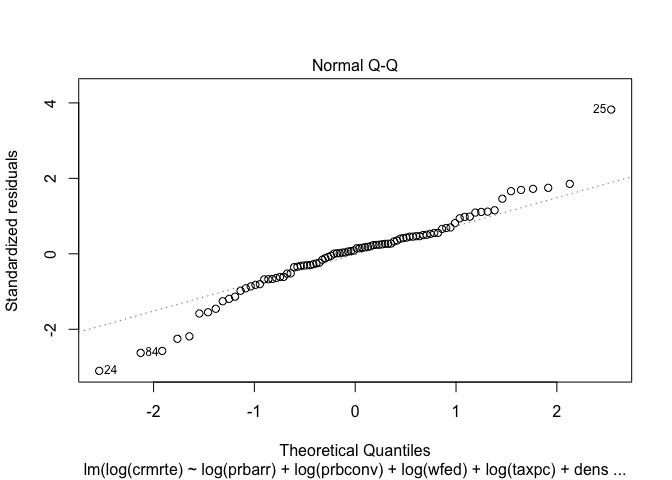<!-- -->

Notice that there is only a slight deviation from zero conditional mean,
indicated by a not perfecly flat curve. This means that our coefficients
maybe be biased. Next section, we discuss some ommited variables
candidates and the bias direction they would imply.

## Homoskedasticity

Our residuals versus fitted values plot seems to indicate
heteroskedasticity - thickness for fitted values close to the mean seems
to be larger. The scale location plot gives us another way to assess
this assumption, and tells a similar story.

``` r
plot(mod3, which = 3)
```

<!-- -->

Given this evidence, we will proceed with robust standard errors. The
code below provides a test for statistical significance of our model
weights that is robust to heteroskedasticity. We can see that the same
pattern we saw previously in model 2 for statistical signficance has
continued through model 3.

  - log(`prbarr`)
  - log(`prbconv`)
  - log(`wfed`)
  - `pctmin80`

The following were not:

  - log(`taxpc`)
  - `density`
  - `pctymle`

<!-- end list -->

``` r
coeftest(mod3, vcov. = vcovHC)
```

    ## 
    ## t test of coefficients:
    ## 
    ##                Estimate Std. Error t value  Pr(>|t|)    
    ## (Intercept)  -13.529911   2.153240 -6.2835 1.510e-08 ***
    ## log(prbarr)   -0.484719   0.109397 -4.4308 2.880e-05 ***
    ## log(prbconv)  -0.373520   0.107920 -3.4611 0.0008569 ***
    ## log(wfed)      1.229843   0.366598  3.3547 0.0012050 ** 
    ## log(taxpc)     0.265339   0.319466  0.8306 0.4086282    
    ## density        0.077905   0.039649  1.9649 0.0528146 .  
    ## pctymle        3.174034   3.317243  0.9568 0.3414661    
    ## pctmin80       0.010025   0.002312  4.3359 4.099e-05 ***
    ## ---
    ## Signif. codes:  0 '***' 0.001 '**' 0.01 '*' 0.05 '.' 0.1 ' ' 1

## Normality of Errors

To check normality of errors, we can look at the qqplot that’s part of
R’s standard diagnostics.

``` r
plot(mod3, which = 2)
```

<!-- -->

We can also visually look at the residuals
directly.

``` r
hist(mod3$residuals, breaks = 20, main = "Residuals from Linear Model Predicting log(Crime Rate)")
```

<!-- -->

Both methods suggest we have a leftward skew. However, we have a large
sample size, so the CLT tells us that our estimators will have a normal
sampling distribution. Our look at the histogram confirms that we aren’t
in a situation with an extreme skew, so n=90 should be sufficient for
the CLT.

### Model 5

Based on our correction for heteroskedasticity, we generated an
additional with only those elements with statistical signficance.
Although many of the other elements are important in real life, in an
effort towards the greatest parsimony and explanatory power we prefer
the following
model.

``` r
mod5<- lm(log(crmrte) ~ log(prbarr) + log(prbconv) + log(wfed) + pctmin80, data = data2)
stargazer(mod5, type = "text")
```

    ## 
    ## ===============================================
    ##                         Dependent variable:    
    ##                     ---------------------------
    ##                             log(crmrte)        
    ## -----------------------------------------------
    ## log(prbarr)                  -0.658***         
    ##                               (0.089)          
    ##                                                
    ## log(prbconv)                 -0.504***         
    ##                               (0.062)          
    ##                                                
    ## log(wfed)                    1.607***          
    ##                               (0.254)          
    ##                                                
    ## pctmin80                     0.010***          
    ##                               (0.002)          
    ##                                                
    ## Constant                    -14.821***         
    ##                               (1.523)          
    ##                                                
    ## -----------------------------------------------
    ## Observations                    90             
    ## R2                             0.677           
    ## Adjusted R2                    0.662           
    ## Residual Std. Error       0.319 (df = 85)      
    ## F Statistic           44.495*** (df = 4; 85)   
    ## ===============================================
    ## Note:               *p<0.1; **p<0.05; ***p<0.01

We can see that even with a test robust to heteroskedasticity, all of
our elements are statistically significant.

``` r
coeftest(mod5, vcov. = vcovHC)
```

    ## 
    ## t test of coefficients:
    ## 
    ##                 Estimate  Std. Error t value  Pr(>|t|)    
    ## (Intercept)  -14.8213442   2.3074615 -6.4232 7.344e-09 ***
    ## log(prbarr)   -0.6581133   0.0897711 -7.3310 1.232e-10 ***
    ## log(prbconv)  -0.5040201   0.1032650 -4.8808 4.889e-06 ***
    ## log(wfed)      1.6070168   0.3930400  4.0887 9.808e-05 ***
    ## pctmin80       0.0102695   0.0020237  5.0747 2.253e-06 ***
    ## ---
    ## Signif. codes:  0 '***' 0.001 '**' 0.01 '*' 0.05 '.' 0.1 ' ' 1

We ran the same assumptions tests as above (as evidence by the plots
below). We appear to meet all of our assumptions, especially with the
inclusion of robust standard
errors.

``` r
plot(mod5)
```

<!-- --><!-- --><!-- --><!-- -->

## A Regression Table

Of our models, the third appears to be our best for predicting crime. We
have included both crime and economic variables in the model, as well as
some key contextual variables.

``` r
stargazer(mod1, mod2a, mod3, mod4, mod5, type = "text")
```

    ## 
    ## =======================================================================================================================================
    ##                                                                     Dependent variable:                                                
    ##                     -------------------------------------------------------------------------------------------------------------------
    ##                                                                         log(crmrte)                                                    
    ##                              (1)                    (2)                    (3)                     (4)                    (5)          
    ## ---------------------------------------------------------------------------------------------------------------------------------------
    ## log(prbarr)               -0.726***              -0.563***              -0.485***               -0.481***              -0.658***       
    ##                            (0.114)                (0.099)                (0.091)                 (0.093)                (0.089)        
    ##                                                                                                                                        
    ## log(prbconv)              -0.472***              -0.423***              -0.374***               -0.366***              -0.504***       
    ##                            (0.082)                (0.071)                (0.064)                 (0.065)                (0.062)        
    ##                                                                                                                                        
    ## log(wtrd)                                          0.101                                          0.174                                
    ##                                                   (0.332)                                        (0.298)                               
    ##                                                                                                                                        
    ## log(prbpris)                                                                                     -0.067                                
    ##                                                                                                  (0.145)                               
    ##                                                                                                                                        
    ## avgsen                                                                                           -0.009                                
    ##                                                                                                  (0.012)                               
    ##                                                                                                                                        
    ## central                                                                                          -0.091                                
    ##                                                                                                  (0.075)                               
    ##                                                                                                                                        
    ## urban                                                                                            -0.312                                
    ##                                                                                                  (0.204)                               
    ##                                                                                                                                        
    ## log(wfed)                                         1.580***               1.230***               1.197***                1.607***       
    ##                                                   (0.364)                (0.285)                 (0.328)                (0.254)        
    ##                                                                                                                                        
    ## log(taxpc)                                        0.356**                0.265**                 0.295**                               
    ##                                                   (0.148)                (0.130)                 (0.134)                               
    ##                                                                                                                                        
    ## density                                                                  0.078***               0.130***                               
    ##                                                                          (0.029)                 (0.046)                               
    ##                                                                                                                                        
    ## pctymle                                                                  3.174**                 3.192**                               
    ##                                                                          (1.460)                 (1.511)                               
    ##                                                                                                                                        
    ## pctmin80                                                                 0.010***               0.010***                0.010***       
    ##                                                                          (0.002)                 (0.002)                (0.002)        
    ##                                                                                                                                        
    ## Constant                  -4.845***              -16.027***             -13.530***             -14.351***              -14.821***      
    ##                            (0.179)                (1.765)                (1.871)                 (2.074)                (1.523)        
    ##                                                                                                                                        
    ## ---------------------------------------------------------------------------------------------------------------------------------------
    ## Observations                  90                     90                     90                     90                      90          
    ## R2                          0.411                  0.607                  0.741                   0.755                  0.677         
    ## Adjusted R2                 0.398                  0.584                  0.719                   0.717                  0.662         
    ## Residual Std. Error    0.426 (df = 87)        0.354 (df = 84)        0.291 (df = 82)         0.292 (df = 77)        0.319 (df = 85)    
    ## F Statistic         30.374*** (df = 2; 87) 25.988*** (df = 5; 84) 33.494*** (df = 7; 82) 19.748*** (df = 12; 77) 44.495*** (df = 4; 85)
    ## =======================================================================================================================================
    ## Note:                                                                                                       *p<0.1; **p<0.05; ***p<0.01

# A Discussion of Other Possible Omitted Variables

Omitted variables can change the strength of relationships between our
independent and dependent variables. As noted above, contrary to our
expectation the wages of federal employees was *positively* related to
crime. We expected that areas with a higher cost of living (proxied by
wages of federal employees) would have less crime. However, it appears
that those have more crime. There could be other hidden or unmeasured
factors that explain this unexpected direction.

We lacked many variables related to community-level elements that would
be expected to affect crime. Could any of these have affected the
quantification of the relationships above?

**Education levels of the populace**

Although we may be able to proxy education levels by looking at which
region a county is in, we would not have a very good measure of overall
education levels. A county can have a university, but still have low
education levels overall. One would predict that education is negatively
related to crime - the more educated, the less crime one would expect to
see. Education levels would be positively correlated to wages and cost
of living. It’s unclear what direction the relationship would be to the
distribution of minorities, or to criminal justice practice. Thus, one
would guess that the bias would be towards zero (positive relationship
to wages \* negative relationship to crime = negative). This means that
if anything omitting this variable would have diminished the measure of
relationships.

**Public works & investments**

One would predict that, like education, the relationship between and
public works and investments would be negative. More nonprofits and
community organizations could strengthen ties in communities, thus
lowering crime rates. This factor would probably be inversely related to
arrest and conviction rates, since a more punitive society may invest
less in rewards to the community. It would probably be positively
related to wages, since more money means more funds available to invest
back. The direction of the relationship to the distribution of
minorities is unclear. Thus, one would guess that the bias would be
towards zero (negative relationship to arrest rate \* negative
relationship to conviction rate \* positive relationship to wages \*
negative relationship to crime = negative).

**Individual Health (mental and physical)**

Individual health - both mental and physical - would likely be related
to less crime. The healthier you are, the more mental and physical
resources you have to solve problems in ways that do not necessitate
committing a crime. One would expect this factor to be positively
related to wages but negatively related to percent minorities (racism
has negative impacts on health). The direction of the relationship to
arrest or conviction rates is unclear. The direction of the relationship
to density could go either way - people in cities may have access to
better and more accessible health care, but live in a more polluted
environment. Thus, one would guess that the bias would be away from zero
(positive relationship to wages \* negative relationship to percent
minority \* negative relationship to crime = positive). This could have
elevated the quantification of our relationships above. Could better
individual health be the hidden variable that is influencing our
relationship to federal wages (our proxy for cost of living)?

**Community Health**

Community health is about the cohesiveness of a community. If you have
good supports in your community, you would be less likely to commit
crime. The relationship to wages is unclear - communities at many income
levels can have loving, supportive relationships. It is unclear what the
relationship would be to percent minorities. This factor would probably
be inversely related to arrest and conviction rates, since a more
loving, cohesive community may be less likely to turn to punishment.
Thus, one would guess that the bias would be towards zero (negative
relationship to arrest rate \* negative relationship to conviction rate
\* negative relationship to crime = negative).

**Inequality**

We only had measures of average wage by sector in each county. We don’t
have information about the distribution within and across these sectors.
With more inequality, one would expect to see more crime - more anger &
therefore reason to commit crime combined with greater levels of
deprivation & need to commit crime would naturally lead to more crime.
The direction of the relationship between inequality and any of our
independent variables in our final model is unclear - thus it is
difficult to tell what direction this bias would be in.

# A Conclusion

Based on our dataset, our analyses suggest that acting on crime
deterrants within the criminal justice system (like arrests and
convictions) is important policy efforts to take when it comes to
preventing crime. Helpful follow-ups in this investigation would be to
leverage variation across time for conducting a
difference-in-differences test or large changes in policy that would
help with regression discontinuity. However, our findings can be used to
hone in on future policy changes that can be evaluated with more
rigorous causal analyses.

It would also be helpful to follow-up on this investigation with the
addition of health variables. These omitted variables could have
affected the relationships tested here. Specifically, areas with higher
cost of living may have people living there with better health care and
less stress, which would make them healthier and give them less reason
to commit crimes.

Other factors outside of policy - such as the distribution of minorities
- are also important when it comes to crime. Communities with higher
rates of either may require additional resources or different types of
policies to prevent crime. For example, if the actual number of crimes
is different from the number of reported crimes - for example, in a
community with a lot of racial conflict where some groups over-report
others to the police - we would see elevated measures of crime. If
policies aim to reduce actual crime (rather than just reported crime),
we would need more nuanced measures to track these and would need to
turn towards more nuanced ways to address this (perhaps through
strenghening group cohesiveness and hosting workshops to reduce racism).

Some policies could include:

  - Improved training and hiring of criminal justice staff, that could
    improve the ratio of arrest and convictions to crimes. Making sure
    that those who commit crimes are caught seems to be important in
    deterring crime - whether by keeping people off the streets,
    rehabilitating them, or scaring others away from commiting crimes

  - Even though we could not find much support for the importance of
    economic policy variables to prevent crimes, measures to improve
    living conditions locally should not detract from efforts on the
    criminal justice system front. Targeting economic development
    policies that can bring higher wages and improve the quality of life
    in a region is likely important to deter crime. We did find that the
    wages of federal employees appear positively correlated with crime -
    one would imagine that counties would not intend to enact policies
    that depress wages in their region. There are likely hidden or
    unmeasured factors (such as health, inequality, corruption, or high
    cost of living without investent back into the community) that could
    be driving this effect.

  - We found that communities with higher density of minorities have
    higher rates of crime. More follow-up would be needed to investigate
    mediators of this effect - such as racism, which could lead to
    higher rates of reported crime (even when holding actual crime
    constant) - but efforts towards community investments such as those
    related to the economic development efforts could also be used to
    fight crime.

  - Both of these streams (criminal and economic reform) could be folded
    under the umbrella of investing more in one’s community. It is not
    enough to punish and deter - one needs to also get at the root
    causes of crime and why someone may be compelled to commit a crime
    in the first place. The fact that crime is higher with high rates of
    minorities suggests that the picture is more complicated than it may
    seem when looking at crime policy variables. Are there elements of
    community cohesion that could be improved to help reduce crime? Or
    efforts to mitigate the systemic effects of racism? Perhaps more
    crimes are simply reported in those areas - so the elevate numbers
    are not truly a reflection of actual crime committed but rather
    enhanced surveillance.
