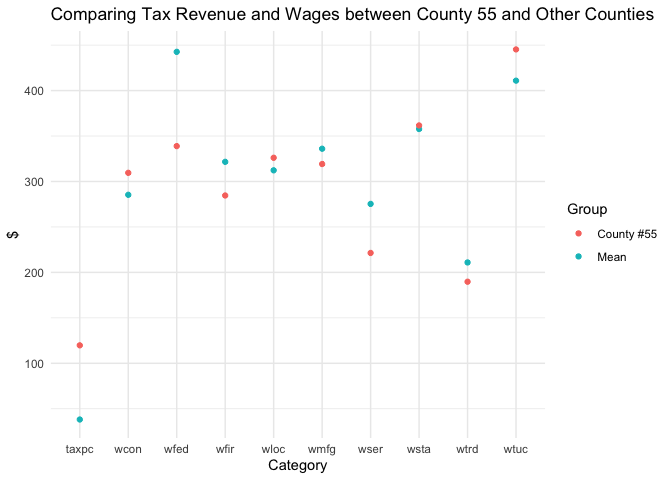
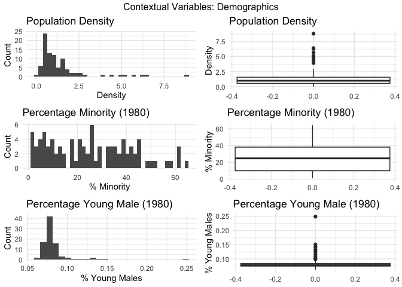

Lab 3: Draft Report
================
Priscilla Burity, Oscar Linares, Alissa Stover
3/16/2020

# An Introduction

Research Question: Which policies are most promising in reducing the
crime rate, economic (e.g., increasing wages) or classic criminal
deterrants (e.g., increasing arrests), when holding other variables
(e.g., characteristics of a population) constant? Do they work best
independently or in conjunction?

We will be modeling our dependent variable (crime rate), using the
following variables as candidate independent variables. We focus on
variables that represent different economic and criminal justice
policies, which can be influenced via various policy decisions taken by
our candidate.

We also include a range of contextual variables that help to control for
other variables that could influence the efficacy of these policies. We
aim to produce a model robust to these, that can help guide decisions at
the state level and help reduce crime across these counties.

## Actionable Variables

### Economic Policy

These variables describe things we could affect with economic policy.
For example, if increased wages are found to be related significantly to
crime, our candiate could consider strategies such as raising the
minimum wage in an attempt to lower crime. These variables speak to
wages for different sectors.

  - `wcon`: weekly wage, construction
  - `wtuc`: wkly wge, trns, util, commun
  - `wtrd`: wkly wge, whlesle, retail trade
  - `wfir`: wkly wge, fin, ins, real est
  - `wser`: wkly wge, service industry
  - `wmfg`: wkly wge, manufacturing
  - `wfed`: wkly wge, fed employees
  - `wsta`: wkly wge, state employees
  - `wloc`: wkly wge, local gov emps

The following variable represents tax policy, but it could also reflect
overall wealth in a county (holding tax rate constant, counties with
more wealth will have more tax revenue and vice versa).

  - `taxpc`: tax revenue per capita

### Criminal Justice Policy

These variables describe things we could affect with policy around the
criminal justice system. Many of these policies are used as deterrants
of crime, with the assumption being that people inherently understand
that these punishments exist and as such will be less likely to commit
crimes (in order to avoid the punishment).

Please note that the 3 “efficiency” variables below were initially
called “probabilities”. However, this is

*Efficiency of arrest*

If we find that the efficiency of arrest is associated with crime rate
(with higher punishment associted with higher crime), we may consider
stricter policies around police practice that encourage more arrests.

  - `prbarr`: number of convictions for every crime reported

*Efficiency of conviction*

If we find that the efficiency of conviction is associated with crime
rate (with higher conviction rates associted with higher crime), we may
consider stricter policies around court practices so that more arrests
lead to convictions.

  - `prbconv`: number of convictions for every arrest made

*Efficiency of sentencing*

If we find that the efficiency of sentencing is associated with crime
rate (with higher sentencing rates associted with higher crime), we may
consider stricter policies around judicial practices so that more
convictions lead to sentencing.

  - `prbpris`: number of prison sentences for every conviction

We can combine the three above variables into one variable (`eff_cj`)
that is a measure of the efficiency of the criminal justice process in
each county:

eff\_cj \<- `prbarr` \* `prbconv` \* `prbpris`

*Severity of punishment*

If we find that the severity of punishment is associated with crime rate
(with greater severity associted with lower crime), we may consider
stricter policies around judicial practices so that people receive more
severe punishments if sentenced with a crime.

  - `avgsen`: avg. sentence, days

*Number of policy officers per capita*

The number of police police officers per capita (measured by the
variable `polpc`) is a very intuitive example of crime deterrant, as it
in theory increases the likelyhood of being caught in the act of the
crime and is also a measure of the capacity of the State to enforce the
law.

As our job is to advise a policy maker, it’s very important that we feel
safe about the causal interpretation of our findings. After all, the
idea is to propose policies with a significant impact on people’s lives.
A cross section of counties tough does not allow us to link police
presence to crime rates with a causal interpretation. This is because
one can expect the counties with larger crime rates in a year t would
consider necessary to have a larger number of police officers in on the
streets in year t, which can imply a positive correlation between
presence of police and crime rates with no causal meaning.

Thus, in this exercise we opted not to include police per capita as a
candidate of policy variable - instead, we we’ll include it as a control
variable to access the effectiveness of shifts in other criminal justice
variables (probabilities of arrest, conviction and prision sentence) on
crime rates.

## Contextual Variables

Since we are aiming to produce policy recommendations, the following
variables may be helpful in our analysis but are not necessarily
actionable. They describe county characteristics that provide important
information about which policies could work across different county
contexts.

### Types of Crime

  - `mix`: offense mix: face-to-face/other

### Demographics

The following variables describe different aspects of the people that
reside in these counties.

*Urban/rural dwellers*

  - `density`: people per sq. mile

*Minority status*

  - `pctmin80`: perc. minority, 1980

*Gender & Age* (young males are more likely to enter the criminal
justice system)

  - `pctymle`: percent young male

### Geography

The following variables identify which region of the state each county
is in, with the assumption that counties cluster geographically in terms
of their culture and other characteristics we are not explicitly
measuring.

  - `west`: =1 if in western N.C.
  - `central`: =1 if in central N.C.
  - `urban`: =1 if in SMSA

Your introduction should present a research question and explain the
concept that you’re attempting to measure and how it will be
operationalized. This section should pave the way for the body of the
report, preparing the reader to understand why the models are
constructed the way that they are. It is not enough to simply say “We
are looking for determinants of crime.” Your introduction must do work
for you, focusing the reader on a specific measurement goal, making them
care about it, and propeling the narrative forward. This is also good
time to put your work into context, discuss cross-cutting issues, and
assess the overall appropriateness of the data.

# A Model Building Process

## Data Cleaning

### Environment

#### Import Libraries

``` r
library(tidyverse) # for data import, manipulation, viz
library(corrplot) # for correlation matix
library(stargazer) # visualize model fit
library(skimr) # generate summary statistics
```

#### Import Data

We are importing a CSV file into R. The argument `n_max` is set to the
number of rows of data we are provided (91).

``` r
data <- read_csv("crime_v2.csv", n_max = 91)
```

#### Exploratory Data Analysis: File-level data checks

Let’s take a visual check of our data. We have 91 observations and 25
columns. This is what we expected based on our original csv file.

``` r
head(data)
```

    ## # A tibble: 6 x 25
    ##   county  year crmrte prbarr prbconv prbpris avgsen   polpc density taxpc
    ##    <dbl> <dbl>  <dbl>  <dbl>   <dbl>   <dbl>  <dbl>   <dbl>   <dbl> <dbl>
    ## 1      1    87 0.0356  0.298  0.528    0.436   6.71 1.83e-3   2.42   31.0
    ## 2      3    87 0.0153  0.132  1.48     0.450   6.35 7.46e-4   1.05   26.9
    ## 3      5    87 0.0130  0.444  0.268    0.600   6.76 1.23e-3   0.413  34.8
    ## 4      7    87 0.0268  0.365  0.525    0.435   7.14 1.53e-3   0.492  42.9
    ## 5      9    87 0.0106  0.518  0.477    0.443   8.22 8.60e-4   0.547  28.1
    ## 6     11    87 0.0146  0.525  0.0684   0.5    13    2.88e-3   0.611  35.2
    ## # … with 15 more variables: west <dbl>, central <dbl>, urban <dbl>,
    ## #   pctmin80 <dbl>, wcon <dbl>, wtuc <dbl>, wtrd <dbl>, wfir <dbl>,
    ## #   wser <dbl>, wmfg <dbl>, wfed <dbl>, wsta <dbl>, wloc <dbl>, mix <dbl>,
    ## #   pctymle <dbl>

``` r
dim(data)
```

    ## [1] 91 25

All 25 columns are
    numeric.

``` r
str(data)
```

    ## Classes 'spec_tbl_df', 'tbl_df', 'tbl' and 'data.frame': 91 obs. of  25 variables:
    ##  $ county  : num  1 3 5 7 9 11 13 15 17 19 ...
    ##  $ year    : num  87 87 87 87 87 87 87 87 87 87 ...
    ##  $ crmrte  : num  0.0356 0.0153 0.013 0.0268 0.0106 ...
    ##  $ prbarr  : num  0.298 0.132 0.444 0.365 0.518 ...
    ##  $ prbconv : num  0.528 1.481 0.268 0.525 0.477 ...
    ##  $ prbpris : num  0.436 0.45 0.6 0.435 0.443 ...
    ##  $ avgsen  : num  6.71 6.35 6.76 7.14 8.22 ...
    ##  $ polpc   : num  0.001828 0.000746 0.001234 0.00153 0.00086 ...
    ##  $ density : num  2.423 1.046 0.413 0.492 0.547 ...
    ##  $ taxpc   : num  31 26.9 34.8 42.9 28.1 ...
    ##  $ west    : num  0 0 1 0 1 1 0 0 0 0 ...
    ##  $ central : num  1 1 0 1 0 0 0 0 0 0 ...
    ##  $ urban   : num  0 0 0 0 0 0 0 0 0 0 ...
    ##  $ pctmin80: num  20.22 7.92 3.16 47.92 1.8 ...
    ##  $ wcon    : num  281 255 227 375 292 ...
    ##  $ wtuc    : num  409 376 372 398 377 ...
    ##  $ wtrd    : num  221 196 229 191 207 ...
    ##  $ wfir    : num  453 259 306 281 289 ...
    ##  $ wser    : num  274 192 210 257 215 ...
    ##  $ wmfg    : num  335 300 238 282 291 ...
    ##  $ wfed    : num  478 410 359 412 377 ...
    ##  $ wsta    : num  292 363 332 328 367 ...
    ##  $ wloc    : num  312 301 281 299 343 ...
    ##  $ mix     : num  0.0802 0.0302 0.4651 0.2736 0.0601 ...
    ##  $ pctymle : num  0.0779 0.0826 0.0721 0.0735 0.0707 ...
    ##  - attr(*, "spec")=
    ##   .. cols(
    ##   ..   county = col_double(),
    ##   ..   year = col_double(),
    ##   ..   crmrte = col_double(),
    ##   ..   prbarr = col_double(),
    ##   ..   prbconv = col_double(),
    ##   ..   prbpris = col_double(),
    ##   ..   avgsen = col_double(),
    ##   ..   polpc = col_double(),
    ##   ..   density = col_double(),
    ##   ..   taxpc = col_double(),
    ##   ..   west = col_double(),
    ##   ..   central = col_double(),
    ##   ..   urban = col_double(),
    ##   ..   pctmin80 = col_double(),
    ##   ..   wcon = col_double(),
    ##   ..   wtuc = col_double(),
    ##   ..   wtrd = col_double(),
    ##   ..   wfir = col_double(),
    ##   ..   wser = col_double(),
    ##   ..   wmfg = col_double(),
    ##   ..   wfed = col_double(),
    ##   ..   wsta = col_double(),
    ##   ..   wloc = col_double(),
    ##   ..   mix = col_double(),
    ##   ..   pctymle = col_double()
    ##   .. )

##### The Where & When of these data

It looks like we usually have 1 observation for each of the counties –
except for county \#193. We do not have any missing values in the
`county` column.

``` r
length(unique(data$county))
```

    ## [1] 90

``` r
table(data$county, useNA = "always")
```

    ## 
    ##    1    3    5    7    9   11   13   15   17   19   21   23   25   27   33 
    ##    1    1    1    1    1    1    1    1    1    1    1    1    1    1    1 
    ##   35   37   39   41   45   47   49   51   53   55   57   59   61   63   65 
    ##    1    1    1    1    1    1    1    1    1    1    1    1    1    1    1 
    ##   67   69   71   77   79   81   83   85   87   89   91   93   97   99  101 
    ##    1    1    1    1    1    1    1    1    1    1    1    1    1    1    1 
    ##  105  107  109  111  113  115  117  119  123  125  127  129  131  133  135 
    ##    1    1    1    1    1    1    1    1    1    1    1    1    1    1    1 
    ##  137  139  141  143  145  147  149  151  153  155  157  159  161  163  165 
    ##    1    1    1    1    1    1    1    1    1    1    1    1    1    1    1 
    ##  167  169  171  173  175  179  181  183  185  187  189  191  193  195  197 
    ##    1    1    1    1    1    1    1    1    1    1    1    1    2    1    1 
    ## <NA> 
    ##    0

Having 2 observations for county \#193 is surprising. We can see that
these rows appear to be exact duplicates.

``` r
data %>% filter(county == 193)
```

    ## # A tibble: 2 x 25
    ##   county  year crmrte prbarr prbconv prbpris avgsen   polpc density taxpc
    ##    <dbl> <dbl>  <dbl>  <dbl>   <dbl>   <dbl>  <dbl>   <dbl>   <dbl> <dbl>
    ## 1    193    87 0.0235  0.266   0.589   0.423   5.86 0.00118   0.814  28.5
    ## 2    193    87 0.0235  0.266   0.589   0.423   5.86 0.00118   0.814  28.5
    ## # … with 15 more variables: west <dbl>, central <dbl>, urban <dbl>,
    ## #   pctmin80 <dbl>, wcon <dbl>, wtuc <dbl>, wtrd <dbl>, wfir <dbl>,
    ## #   wser <dbl>, wmfg <dbl>, wfed <dbl>, wsta <dbl>, wloc <dbl>, mix <dbl>,
    ## #   pctymle <dbl>

We can see that `year` appears to be constant (which is expected). We
also don’t have any missing values for this column. We can drop this
column in future data processing steps.

``` r
table(data$year, useNA = "always")
```

    ## 
    ##   87 <NA> 
    ##   91    0

Based on the explorations above, we create a new dataframe that has
dropped our superfluous column (`year`) and the superfluous row
(duplicate of county 193).

``` r
data2 <- data %>% distinct() %>% select(-year)
```

Now we have 90 rows and 24 variables, with one observation per
county.

``` r
length(unique(data2$county)) == length(data2$county) # check 1 obs per county
```

    ## [1] TRUE

``` r
str(data2) # examine dataframe 
```

    ## Classes 'spec_tbl_df', 'tbl_df', 'tbl' and 'data.frame': 90 obs. of  24 variables:
    ##  $ county  : num  1 3 5 7 9 11 13 15 17 19 ...
    ##  $ crmrte  : num  0.0356 0.0153 0.013 0.0268 0.0106 ...
    ##  $ prbarr  : num  0.298 0.132 0.444 0.365 0.518 ...
    ##  $ prbconv : num  0.528 1.481 0.268 0.525 0.477 ...
    ##  $ prbpris : num  0.436 0.45 0.6 0.435 0.443 ...
    ##  $ avgsen  : num  6.71 6.35 6.76 7.14 8.22 ...
    ##  $ polpc   : num  0.001828 0.000746 0.001234 0.00153 0.00086 ...
    ##  $ density : num  2.423 1.046 0.413 0.492 0.547 ...
    ##  $ taxpc   : num  31 26.9 34.8 42.9 28.1 ...
    ##  $ west    : num  0 0 1 0 1 1 0 0 0 0 ...
    ##  $ central : num  1 1 0 1 0 0 0 0 0 0 ...
    ##  $ urban   : num  0 0 0 0 0 0 0 0 0 0 ...
    ##  $ pctmin80: num  20.22 7.92 3.16 47.92 1.8 ...
    ##  $ wcon    : num  281 255 227 375 292 ...
    ##  $ wtuc    : num  409 376 372 398 377 ...
    ##  $ wtrd    : num  221 196 229 191 207 ...
    ##  $ wfir    : num  453 259 306 281 289 ...
    ##  $ wser    : num  274 192 210 257 215 ...
    ##  $ wmfg    : num  335 300 238 282 291 ...
    ##  $ wfed    : num  478 410 359 412 377 ...
    ##  $ wsta    : num  292 363 332 328 367 ...
    ##  $ wloc    : num  312 301 281 299 343 ...
    ##  $ mix     : num  0.0802 0.0302 0.4651 0.2736 0.0601 ...
    ##  $ pctymle : num  0.0779 0.0826 0.0721 0.0735 0.0707 ...

##### Missingness & Data Validity

We can see from the following table that we don’t have any missing data,
which is good\!

However, we can see by the max for each column (p100), that we appear to
have a few values that are extremely high.

For example, one county has an average sentence length (`avgsen`) of
20.7 years.

``` r
data2_skim <- skim(data2)
data2_skim
```

    ## Skim summary statistics
    ##  n obs: 90 
    ##  n variables: 24 
    ## 
    ## ── Variable type:numeric ─────────────────────────────────────────────────
    ##  variable missing complete  n     mean        sd          p0      p25
    ##    avgsen       0       90 90   9.69     2.83        5.38      7.38  
    ##   central       0       90 90   0.38     0.49        0         0     
    ##    county       0       90 90 100.6     58.32        1        51.5   
    ##    crmrte       0       90 90   0.034    0.019       0.0055    0.021 
    ##   density       0       90 90   1.44     1.52    2e-05         0.55  
    ##       mix       0       90 90   0.13     0.082       0.02      0.081 
    ##  pctmin80       0       90 90  25.71    16.98        1.28     10.02  
    ##   pctymle       0       90 90   0.084    0.023       0.062     0.074 
    ##     polpc       0       90 90   0.0017   0.00099     0.00075   0.0012
    ##    prbarr       0       90 90   0.3      0.14        0.093     0.2   
    ##   prbconv       0       90 90   0.55     0.35        0.068     0.34  
    ##   prbpris       0       90 90   0.41     0.081       0.15      0.36  
    ##     taxpc       0       90 90  38.16    13.11       25.69     30.73  
    ##     urban       0       90 90   0.089    0.29        0         0     
    ##      wcon       0       90 90 285.35    47.75      193.64    250.75  
    ##      west       0       90 90   0.24     0.43        0         0     
    ##      wfed       0       90 90 442.62    59.95      326.1     398.78  
    ##      wfir       0       90 90 321.62    54         170.94    285.56  
    ##      wloc       0       90 90 312.28    28.13      239.17    297.23  
    ##      wmfg       0       90 90 336.03    88.23      157.41    288.6   
    ##      wser       0       90 90 275.34   207.4       133.04    229.34  
    ##      wsta       0       90 90 357.74    43.29      258.33    329.27  
    ##      wtrd       0       90 90 210.92    33.87      154.21    190.71  
    ##      wtuc       0       90 90 410.91    77.36      187.62    374.33  
    ##       p50      p75      p100     hist
    ##    9.11    11.47     20.7    ▆▇▅▅▂▁▁▁
    ##    0        1         1      ▇▁▁▁▁▁▁▅
    ##  103      150.5     197      ▇▆▇▇▆▇▇▇
    ##    0.03     0.04      0.099  ▆▇▇▃▂▁▁▁
    ##    0.98     1.57      8.83   ▇▃▁▁▁▁▁▁
    ##    0.1      0.15      0.47   ▃▇▂▁▁▁▁▁
    ##   24.85    38.18     64.35   ▇▅▅▅▆▃▁▂
    ##    0.078    0.084     0.25   ▇▁▁▁▁▁▁▁
    ##    0.0015   0.0019    0.0091 ▇▃▁▁▁▁▁▁
    ##    0.27     0.34      1.09   ▆▇▃▁▁▁▁▁
    ##    0.45     0.59      2.12   ▃▇▂▁▁▁▁▁
    ##    0.42     0.46      0.6    ▁▁▂▅▇▇▂▁
    ##   34.92    41.01    119.76   ▇▃▁▁▁▁▁▁
    ##    0        0         1      ▇▁▁▁▁▁▁▁
    ##  281.16   314.98    436.77   ▂▇▇▇▅▃▁▁
    ##    0        0         1      ▇▁▁▁▁▁▁▂
    ##  448.85   478.26    597.95   ▃▅▅▇▆▃▂▁
    ##  317.13   342.63    509.47   ▁▁▅▇▃▁▁▁
    ##  307.65   328.78    388.09   ▁▁▃▇▅▂▁▁
    ##  321.05   359.89    646.85   ▁▃▇▅▁▁▁▁
    ##  253.12   277.65   2177.07   ▇▁▁▁▁▁▁▁
    ##  358.4    383.15    499.59   ▂▃▆▇▆▂▁▁
    ##  202.99   224.28    354.68   ▃▇▆▂▂▁▁▁
    ##  404.78   440.68    613.23   ▁▁▂▆▇▂▂▁

##### Preserve Clean Data

Save our clean dataset

``` r
save(data2, file = "data_clean.rda")
```

## Exploratory Data Analysis: Variable-level data checks

### Dependent Variable: Crime Rate

Barring extreme issues with `crmrte` (crime rate), we would recommend
focusing on this as our target variable. Although arrest, conviction,
and sentencing rates are important, what matters most to people is the
level of crime around them every day. The justice system is used to
enact justice and to deter crimes. Justice is important, and making sure
that those that commit crimes are punished is one way of going about
achieving a just society. However, justice is a moral issue and can be
seen from many different lenses. On the other hand, most people would
agree that not having a lot of crime around them - and the sense of
safety that comes from it - is very important. Thus we will use these
quantitative methods to evaluate overall crime, rather than try to
monitor the fuzzier concept of “justice”. While doing so, we will also
make sure to evaluate the arrest/conviction/sentencing variables to see
whether they are related to different levels of crime - whether they
could be having any effect as crime deterrents would be important for
policymakers to know.

We don’t have enough data points to make a strong claim about the
distribution of `crmtre`, however it appears to be approximately normal
(with a slight skew which could be an artifact of not having any values
below 0).

``` r
ggplot(data2, aes(crmrte)) +
  geom_histogram(bins = 35) +
  theme_minimal() +
  xlab("Crime Rate") +
  ylab("Count") +
  ggtitle("Histogram of Candidate Dependent Variable: Crime Rate")
```

<!-- -->

From our boxplot we can see that most values are between 0.02 and 0.04,
however we do have a range of values including some that are close to
0.10. We don’t appear to have any spurious values.

``` r
ggplot(data2, aes(y = crmrte)) +
  geom_boxplot() +
  theme_minimal() +
  ylab("Crime Rate") +
  ggtitle("Boxplot of Candidate Dependent Variable: Crime Rate")
```

<!-- -->

Our preferred variable (`crmrte`) appears to be of sufficient quality
for our analyses and thus we will use it as our dependent variable.

### Independent Variables

#### Actionable Variables

##### Economic Policy

``` r
# format data for subplots 
data_ep_long <- data2 %>% 
  select(wcon, wtuc, wtrd, wfir, wser, wmfg, wfed, wsta, wloc) %>%
  gather(key = var, value = value)

data_ep_long$var <- factor(data_ep_long$var,
                           levels = c("wcon", "wtuc", "wtrd", "wfir",
                                      "wser", "wmfg", "wfed", "wsta", "wloc"),
                           labels = c("Construction", 
                                      "Utilities/Transport", 
                                      "Wholesale/Retail/Trade",
                                      "Finance/Insurance/Real Estate",
                                      "Service Industry",
                                      "Manufacturing",
                                      "Federal Emp",
                                      "State Emp",
                                      "Local/State Emp"))
```

``` r
# plot hist subplots
ggplot(data_ep_long, aes(value)) +
  geom_histogram(bins = 50) +
  facet_wrap(~var) +
  theme_minimal() +
  ggtitle("Histogram of Economic Policy Variables: Wages by Sector")
```

<!-- -->

``` r
# plot boxplot subplots 
ggplot(data_ep_long, aes(x = var, y = value)) +
  geom_boxplot() +
  coord_flip() + 
  theme_minimal() +
  xlab("") + 
  ylab("Weekly Wage") +
  ggtitle("Boxplot of Economic Policy Variables: Wages by Sector")
```

<!-- -->

##### Criminal Justice Policy

``` r
# format data for subplots 
data_cj_long <- data2 %>% select(prbarr, prbconv, prbpris) %>%
  gather(key = var, value = value)

# convert to factor for subplot labelling 
data_cj_long$var <- factor(data_cj_long$var, labels = c("Prob Arrest", "Prob Convicted", "Prob Sentenced"))
```

We can see that we have different distributions for these, but that they
all could be considered somewhat close to normal, with different levels
of skew. efficiency of conviction appears to be closest to a normal
distribution.

``` r
# plot hist subplots
ggplot(data_cj_long, aes(value)) +
  geom_histogram(bins = 50) +
  facet_grid(~var) +
  theme_minimal() +
  ggtitle("Histogram of Criminal Justice Policy Variables: efficiency Variables")
```

<!-- -->

From our boxplots we can see that we have some extreme values for
efficiency of conviction, with multiple counties having a rate above 1.
As these are not true probabilities, but rather ratios, these values are
not necessarily spurious. However, they imply that for each arrest,
there could be multiple convictions - one county has over 2 convictions
for every arrest. Only 1 county has more than 1 arrest per crime
committed - most counties in fact have a much lower rate (and only put
someone under arrest for about one-quarter of crimes). When it comes to
setencing, counties show a much lower spread and cluster around 1
conviction resulting in a prison sentence for every 1 conviction that
does not.

``` r
# plot boxplot subplots 
ggplot(data_cj_long, aes(x = var, y = value)) +
  geom_boxplot() +
  theme_minimal() +
  xlab("") +
  ylab("Ratio") + 
  ggtitle("Boxplot of Criminal Justice Policy Variables: efficiency Variables")
```

<!-- -->

``` r
# plot hist
ggplot(data2, aes(avgsen)) +
  geom_histogram(bins = 25) +
  theme_minimal() +
  ggtitle("Histogram of Criminal Justice Policy Variables: Severity") +
  xlab("Average Sentence Severity")
```

<!-- -->

``` r
# plot hist
ggplot(data2, aes(y = avgsen)) +
  geom_boxplot() +
  theme_minimal() +
  ggtitle("Boxplot of Criminal Justice Policy Variables: Severity") +
  ylab("Average Sentence Severity")
```

<!-- -->

#### Contextual Variables

### Types of Crime

``` r
# plot barplots
ggplot(data2, aes(mix)) +
  geom_histogram(bins = 35) +
  theme_minimal() +
  ggtitle("Histogram of Contextual Variables: Type of Crime") +
  xlab("offense mix: face-to-face/other")
```

<!-- -->

##### Demographics

*Urban/rural dwellers*

``` r
ggplot(data2, aes(density)) +
  geom_histogram(bins = 35) +
  theme_minimal() +
  xlab("Density") +
  ylab("Count") +
  ggtitle("Histogram of Contextual Variables: Population Density")
```

<!-- -->

``` r
ggplot(data2, aes(y = density)) +
  geom_boxplot() +
  theme_minimal() +
  ylab("Density") +
  ggtitle("Boxplot of Contextual Variables: Population Density")
```

<!-- -->

*Minority status*

``` r
ggplot(data2, aes(pctmin80)) +
  geom_histogram(bins = 40) +
  theme_minimal() +
  xlab("% Minority") +
  ylab("Count") +
  ggtitle("Histogram of Contextual Variables: Percentage Minority (1980)")
```

<!-- -->

``` r
ggplot(data2, aes(y = pctmin80)) +
  geom_boxplot() +
  theme_minimal() +
  ylab("% Minority") +
  ggtitle("Boxplot of Contextual Variables: Percentage Minority (1980)")
```

<!-- -->

  - `pctmin80`: perc. minority, 1980

*Gender & Age* (young males are more likely to enter the criminal
justice system)

``` r
ggplot(data2, aes(pctymle)) +
  geom_histogram(bins = 25) +
  theme_minimal() +
  xlab("% Young Males") +
  ylab("Count") +
  ggtitle("Histogram of Contextual Variables: Percentage Young Males")
```

<!-- -->

``` r
ggplot(data2, aes(y = pctymle)) +
  geom_boxplot() +
  theme_minimal() +
  ylab("% Young Males") +
  ggtitle("Boxplot of Contextual Variables: Percentage Young Males")
```

<!-- -->

  - `pctymle`: percent young male

*Wealth*

``` r
ggplot(data2, aes(taxpc)) +
  geom_histogram(bins = 25) +
  theme_minimal() +
  xlab("Tax Revenue Per Capita") +
  ylab("Count") +
  ggtitle("Histogram of Contextual Variables: Tax Revenue Per Capita")
```

<!-- -->

``` r
ggplot(data2, aes(y = taxpc)) +
  geom_boxplot() +
  theme_minimal() +
  ylab("Tax Revenue Per Capita") +
  ggtitle("Boxplot of Contextual Variables: Tax Revenue Per Capita")
```

<!-- -->

  - `taxpc`: tax revenue per capita

##### Geography

``` r
# format data for subplots 
data_geo_long <- data2 %>% select(west, central, urban) %>%
  gather(key = var, value = value)
```

``` r
# plot barplots
ggplot(data_geo_long, aes(value)) +
  geom_bar() +
  facet_grid(~var) +
  theme_minimal() +
  ggtitle("Barplot of Contextual Variables: Geography")
```

<!-- -->

  - `west`: =1 if in western N.C.
  - `central`: =1 if in central N.C.
  - `urban`: =1 if in SMSA

### Relationships between Variables

One would expect variables within each of the above groups to be
correlated to each other.

``` r
data_corr <- data2 %>% select(-county) 

matrix_corr <- round(cor(data_corr), 1)
```

``` r
corrplot(matrix_corr, type = "lower", method = "ellipse", order = "alphabet")
```

<!-- -->

## Results

  - Discuss transformations
  - Discuss
results

### Priscilla

``` r
av_wage <- log(rowMeans(data2[c('wcon', 'wtuc', 'wtrd', 'wfir', 'wser', 'wmfg', 'wfed', 'wsta', 'wloc')]))

m1 <- lm(log(crmrte) ~ prbarr, data = data2) #only probs arrest, 
#here there are obvious ommited vars, as the presence of police 
m2 <- lm(log(crmrte) ~ prbarr + prbpris + log(avgsen), data = data2) #adding other law enforcement vars
m3 <- lm(log(crmrte) ~ prbarr + prbpris + log(avgsen) + log(polpc) + mix, data = data2) #also controlling for # of police p/c and offence mix
m4 <- lm(log(crmrte) ~  prbarr + prbpris + log(avgsen) + log(polpc) + mix + log(density) + 
           pctymle + pctmin80, data = data2) #adding demographic vars
m5 <- lm(log(crmrte) ~  prbarr + prbpris + log(avgsen) + log(polpc) + mix + log(density) + 
           pctymle + pctmin80 + west + central + urban, data = data2) # adding geographic data
m6 <- lm(log(crmrte) ~  prbarr + prbpris + log(avgsen) + log(polpc) + mix + log(density) + 
           pctymle + pctmin80 + west + central + urban + av_wage + log(taxpc), data = data2) # adding economic data
#m4 <- glm(fast ~ hp + drat + am, family=binomial(link="logit"), data=mydata) stargazer(m1, m2, m3, m4, type="text",
                                                                                       #dep.var.labels=c("Miles/(US) gallon","Fast car (=1)"), covariate.labels=c("Gross horsepower","Rear axle ratio","Four foward gears",
stargazer(m1, m2, m3, m4, m5, m6, type="text",
          dep.var.labels=c("ln(Crimes committed per person)"), covariate.labels=c("'efficiency' of arrest", "'efficiency' of prison sentence",   "ln(Avg. sentence, days)", "ln(Police per capita)",  "Offense mix: face-to-face/other",   "ln(People per sq. mile)",  "Percent young male", "Perc. minority, 1980", "=1 if in western N.C.", "=1 if in central N.C.",  "=1 if in SMSA", "ln(Average sector wkly wage)", "ln(Tax revenue per capita)"), out="models.txt")
```

    ## 
    ## ==========================================================================================================================================================================
    ##                                                                                            Dependent variable:                                                            
    ##                                 ------------------------------------------------------------------------------------------------------------------------------------------
    ##                                                                                      ln(Crimes committed per person)                                                      
    ##                                          (1)                    (2)                   (3)                    (4)                     (5)                     (6)          
    ## --------------------------------------------------------------------------------------------------------------------------------------------------------------------------
    ## 'efficiency' of arrest                -1.884***              -1.930***             -2.389***              -1.840***               -1.636***               -1.678***       
    ##                                        (0.374)                (0.380)               (0.383)                (0.305)                 (0.310)                 (0.317)        
    ##                                                                                                                                                                           
    ## 'efficiency' of prison sentence                                0.368                 0.171                 -1.225**                -0.942*                -1.006**        
    ##                                                               (0.649)               (0.586)                (0.492)                 (0.497)                 (0.501)        
    ##                                                                                                                                                                           
    ## ln(Avg. sentence, days)                                        0.162                 -0.131                -0.261*                -0.294**                -0.311**        
    ##                                                               (0.188)               (0.187)                (0.144)                 (0.145)                 (0.147)        
    ##                                                                                                                                                                           
    ## ln(Police per capita)                                                               0.640***               0.667***               0.601***                0.665***        
    ##                                                                                     (0.138)                (0.107)                 (0.111)                 (0.131)        
    ##                                                                                                                                                                           
    ## Offense mix: face-to-face/other                                                      0.620                 1.455***                1.171**                  0.921         
    ##                                                                                     (0.643)                (0.532)                 (0.534)                 (0.571)        
    ##                                                                                                                                                                           
    ## ln(People per sq. mile)                                                                                    0.204***               0.162***                0.177***        
    ##                                                                                                            (0.033)                 (0.037)                 (0.039)        
    ##                                                                                                                                                                           
    ## Percent young male                                                                                          1.855                   1.851                   1.470         
    ##                                                                                                            (1.575)                 (1.569)                 (1.663)        
    ##                                                                                                                                                                           
    ## Perc. minority, 1980                                                                                       0.011***                0.006*                  0.007**        
    ##                                                                                                            (0.002)                 (0.003)                 (0.003)        
    ##                                                                                                                                                                           
    ## =1 if in western N.C.                                                                                                              -0.238*                 -0.187         
    ##                                                                                                                                    (0.135)                 (0.149)        
    ##                                                                                                                                                                           
    ## =1 if in central N.C.                                                                                                              -0.078                  -0.023         
    ##                                                                                                                                    (0.091)                 (0.105)        
    ##                                                                                                                                                                           
    ## =1 if in SMSA                                                                                                                      0.303**                 0.346**        
    ##                                                                                                                                    (0.145)                 (0.156)        
    ##                                                                                                                                                                           
    ## ln(Average sector wkly wage)                                                                                                                               -0.594         
    ##                                                                                                                                                            (0.470)        
    ##                                                                                                                                                                           
    ## ln(Tax revenue per capita)                                                                                                                                  0.001         
    ##                                                                                                                                                            (0.169)        
    ##                                                                                                                                                                           
    ## Constant                              -2.985***              -3.484***               1.443                  1.798*                  1.483                   5.393         
    ##                                        (0.122)                (0.526)               (1.188)                (0.944)                 (0.984)                 (3.347)        
    ##                                                                                                                                                                           
    ## --------------------------------------------------------------------------------------------------------------------------------------------------------------------------
    ## Observations                              90                    90                     90                     90                     90                      90           
    ## R2                                      0.224                  0.232                 0.395                  0.665                   0.690                   0.697         
    ## Adjusted R2                             0.215                  0.205                 0.359                  0.631                   0.647                   0.645         
    ## Residual Std. Error                0.486 (df = 88)        0.489 (df = 86)       0.439 (df = 84)        0.333 (df = 81)         0.326 (df = 78)         0.327 (df = 76)    
    ## F Statistic                     25.330*** (df = 1; 88) 8.659*** (df = 3; 86) 10.970*** (df = 5; 84) 20.056*** (df = 8; 81) 15.819*** (df = 11; 78) 13.442*** (df = 13; 76)
    ## ==========================================================================================================================================================================
    ## Note:                                                                                                                                          *p<0.1; **p<0.05; ***p<0.01

### Alissa

**Model 1**

DV:

*Crime*

log(`crmrte`)

  - take the log because it makes intuitive sense – represents increase
    in crime

IV:

*Crime policy*

1)  log(eff\_cj) \<- log(`prbarr` \* `prbconv` \* `prbpris`)

*Economic policy*

Picked lower wages (based on boxplots)\* – would be more likely to
affect w/ min wage policy econ policy
–\>

2)  log(`wser`)
3)  log(`wtrd`)

<!-- end list -->

``` r
data2 <- data2 %>% mutate(eff_cj = prbarr*prbconv*prbpris)
```

``` r
mod1a <- lm(log(crmrte) ~ log(eff_cj) + log(wser) + log(wtrd) + log(taxpc), data = data2)
mod1b <- lm(crmrte ~ eff_cj + wser + wtrd, data = data2)
mod1c <- lm(log(crmrte) ~ log(eff_cj), data = data2)
stargazer(mod1a, mod1b, mod1c, type = "text")
```

    ## 
    ## ========================================================================================
    ##                                             Dependent variable:                         
    ##                     --------------------------------------------------------------------
    ##                          log(crmrte)               crmrte              log(crmrte)      
    ##                              (1)                    (2)                    (3)          
    ## ----------------------------------------------------------------------------------------
    ## log(eff_cj)               -0.408***                                     -0.470***       
    ##                            (0.070)                                       (0.074)        
    ##                                                                                         
    ## log(wser)                   -0.017                                                      
    ##                            (0.160)                                                      
    ##                                                                                         
    ## log(wtrd)                  1.173***                                                     
    ##                            (0.303)                                                      
    ##                                                                                         
    ## log(taxpc)                  0.333*                                                      
    ##                            (0.179)                                                      
    ##                                                                                         
    ## eff_cj                                           -0.068***                              
    ##                                                   (0.020)                               
    ##                                                                                         
    ## wser                                              -0.00000                              
    ##                                                  (0.00001)                              
    ##                                                                                         
    ## wtrd                                             0.0002***                              
    ##                                                   (0.0001)                              
    ##                                                                                         
    ## Constant                  -12.124***               -0.010               -4.937***       
    ##                            (1.693)                (0.011)                (0.225)        
    ##                                                                                         
    ## ----------------------------------------------------------------------------------------
    ## Observations                  90                     90                     90          
    ## R2                          0.453                  0.281                  0.315         
    ## Adjusted R2                 0.427                  0.256                  0.307         
    ## Residual Std. Error    0.415 (df = 85)        0.016 (df = 86)        0.457 (df = 88)    
    ## F Statistic         17.574*** (df = 4; 85) 11.197*** (df = 3; 86) 40.481*** (df = 1; 88)
    ## ========================================================================================
    ## Note:                                                        *p<0.1; **p<0.05; ***p<0.01

Try without the `avgsen` outlier.

``` r
data3 <- data2 %>% filter(avgsen != max(avgsen))
```

It actually seems to reduce the fit. Need to quantify its
pull.

``` r
mod1d <- lm(log(crmrte) ~ log(eff_cj) + log(wser) + log(wtrd) + log(taxpc), data = data3)
stargazer(mod1a, mod1d, type = "text")
```

    ## 
    ## =================================================================
    ##                                  Dependent variable:             
    ##                     ---------------------------------------------
    ##                                      log(crmrte)                 
    ##                              (1)                    (2)          
    ## -----------------------------------------------------------------
    ## log(eff_cj)               -0.408***              -0.361***       
    ##                            (0.070)                (0.079)        
    ##                                                                  
    ## log(wser)                   -0.017                 -0.034        
    ##                            (0.160)                (0.160)        
    ##                                                                  
    ## log(wtrd)                  1.173***               1.210***       
    ##                            (0.303)                (0.303)        
    ##                                                                  
    ## log(taxpc)                  0.333*                 0.338*        
    ##                            (0.179)                (0.178)        
    ##                                                                  
    ## Constant                  -12.124***             -12.103***      
    ##                            (1.693)                (1.685)        
    ##                                                                  
    ## -----------------------------------------------------------------
    ## Observations                  90                     89          
    ## R2                          0.453                  0.402         
    ## Adjusted R2                 0.427                  0.374         
    ## Residual Std. Error    0.415 (df = 85)        0.414 (df = 84)    
    ## F Statistic         17.574*** (df = 4; 85) 14.127*** (df = 4; 84)
    ## =================================================================
    ## Note:                                 *p<0.1; **p<0.05; ***p<0.01

*need to check assumptions*

**Model 2**

covariates:

`mix` – type of crime `density` – more crime if more people `pctymle` –
riskier pop `pctmin80` – minority
status

``` r
mod2a <- lm(log(crmrte) ~ log(eff_cj) + log(wser) + log(wtrd) + log(taxpc) + mix + density + pctymle + pctmin80, data = data3)
stargazer(mod2a, type = "text")
```

    ## 
    ## ===============================================
    ##                         Dependent variable:    
    ##                     ---------------------------
    ##                             log(crmrte)        
    ## -----------------------------------------------
    ## log(eff_cj)                  -0.285***         
    ##                               (0.072)          
    ##                                                
    ## log(wser)                    -0.285**          
    ##                               (0.130)          
    ##                                                
    ## log(wtrd)                     0.624**          
    ##                               (0.280)          
    ##                                                
    ## log(taxpc)                     0.227           
    ##                               (0.143)          
    ##                                                
    ## mix                          -1.014**          
    ##                               (0.443)          
    ##                                                
    ## density                      0.143***          
    ##                               (0.031)          
    ##                                                
    ## pctymle                       3.263**          
    ##                               (1.610)          
    ##                                                
    ## pctmin80                     0.012***          
    ##                               (0.002)          
    ##                                                
    ## Constant                     -7.605***         
    ##                               (1.742)          
    ##                                                
    ## -----------------------------------------------
    ## Observations                    89             
    ## R2                             0.671           
    ## Adjusted R2                    0.638           
    ## Residual Std. Error       0.314 (df = 80)      
    ## F Statistic           20.421*** (df = 8; 80)   
    ## ===============================================
    ## Note:               *p<0.1; **p<0.05; ***p<0.01

You will next build a set of models to investigate your research
question, documenting your decisions. Here are some things to keep in
mind during your model building process:

What do you want to measure? Make sure you identify one, or a few,
variables that will allow you to derive conclusions relevant to the
political campaign, and include those variables in all model
specifications.

What covariates help you correctly and accurately measure a causal
effect? What covariates are problematic, either due to
multicollinearity, or because they will absorb some of a causal effect
you want to measure?

What transformations should you apply to each variable? This is very
important because transformations can reveal linearities in the data,
make our results relevant, or help us meet model assumptions.

Are your choices supported by EDA? You will likely start with some
general EDA to detect anomalies (missing values, top-coded variables,
etc.). From then on, your EDA should be interspersed with your model
building. Use visual tools to guide your decisions. You can also
leverage statistical tests to help assess whether variables, or groups
of variables, are improving model fit.

At the same time, it is important to remember that you are not trying to
create one perfect model. You will create several specifications, giving
the reader a sense of how robust your results are (how sensitive to
modeling choices), and to show that you’re not just cherry-picking the
specification that leads to the largest effects.

At a minimum, you should include the following three specifications:

One model with only the key variables you want to measure (possibly
transformed, as determined by your EDA), and no other covariates (or
perhaps one or at more two covariates if they are so crucial that it
would be unreasonable to omit them)

One model that includes key explanatory variables and covariates that
you believe advance your modeling goals without introducing too much
multicollinearity or causing other issues. This model should strike a
balance between accuracy and parsimony and reflect your best
understanding of the relationships among key variables.

One model that includes the previous covariates, and most, if not all,
other covariates. A key purpose of this model is to demonstrate the
robustness of your results to model specification. (However, you should
still not include variables that are clearly unreasonable. For example,
don’t include outcome variables that will absorb some of the causal
effect you are interested in measuring)

Guided by your background knowledge and your EDA, other specifications
may make sense. You are trying to choose points that encircle the space
of reasonable modeling choices, to give an overall understanding of how
these choices impact results.

# An Assessment of the CLM Assumptions

For one of your model specifications, we would like to see a complete
assessment of all 6 classical linear model assumptions.

Use plots and other diagnostic tools to assess whether the assumptions
appear to be violated, and follow best practices in responding to any
violations you find.

Note that we only want to see this level of detail for one model
specification. For the other specifications, you should keep the CLM
assumptions in mind, but only discuss them in your report if you
encounter any major surprises.

Note that you may need to change your model specifications in response
to violations of the CLM.

# A Regression Table

You should display all of your model specifications in a regression
table, using a package like stargazer to format your output. It should
be easy for the reader to find the coefficients that represent key
effects near the top of the regression table, and scan horizontally to
see how they change from specification to specification. Make sure that
you display the most appropriate standard errors in your table, along
with significance stars.

In your text, comment on both statistical significance and practical
significance. You may want to include statistical tests besides the
standard t-tests for regression coefficients.

# A Discussion of Omitted Variables

Identify what you think are the 5-10 most important omitted variables
that bias results you care about. For each variable, you should estimate
what direction the bias is in. If you can argue whether the bias is
large or small, that is even better. State whether you have any
variables available that may proxy (even imperfectly) for the omitted
variable. Pay particular attention to whether each omitted variable bias
is towards zero or away from zero. You will use this information to
judge whether the effects you find are likely to be real, or whether
they might be entirely an artifact of omitted variable bias.

# A Conclusion

Make sure that you end your report with a discussion that relates your
results to concerns of the political campaign.

Submission

Submit your lab via ISVC; please do not submit via email.

Submit 2 files:

A pdf file including the summary, the details of your analysis, and all
the R codes used to produce the analysis. Please do not suppress the
code in your pdf file.

The Rmd or ipynb source file used to produce the pdf file.

Each group only needs to submit one set of files.

Be sure to include the names of all team members in your report. Place
the word ‘draft’ in the file names.

Please limit your submission to 8000 words, excluding code cells and R
output.
